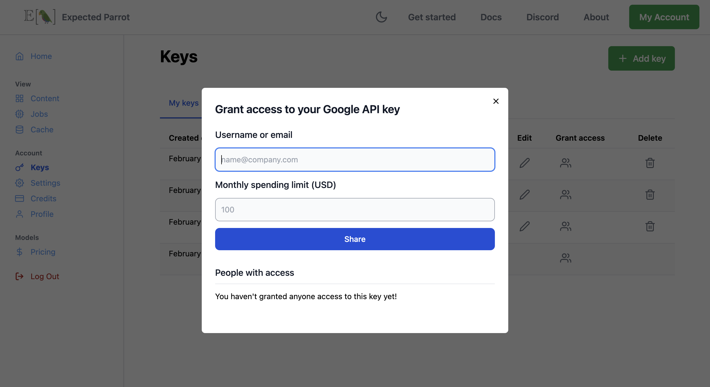
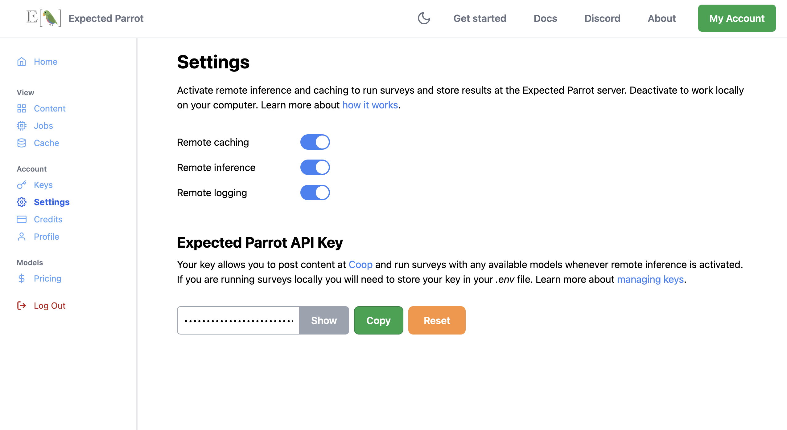

.. _api_keys:

Managing Keys
=============

API keys are required to access the services of large language models.
To use EDSL with language models you can either provide your own keys from service providers (Anthropic, Google, OpenAI, etc.) or use an Expected Parrot API key to access all available models at the Expected Parrot server. 
See the `model pricing page <http://www.expectedparrot.com/getting-started/coop-pricing>`_ for details on current available models and prices.

In addition to providing access to all available models, your Expected Parrot API key also allows you to post and share content at Coop: a free platform for AI-based research that is fully integrated with EDSL. 
Learn more about `using Coop <http://www.expectedparrot.com/getting-started/coop-how-it-works>`_ to collaborate on research.

The instructions below explain how to store and select keys to use when running surveys on your own computer or at the Expected Parrot server.

**Special note for Colab users**:
If you are using EDSL in a Colab notebook, please see `special instructions <https://docs.expectedparrot.com/en/latest/colab_setup.html>`_ on storing API keys as "secrets" (:ref:`colab_setup`).

Methods
-------

There are three methods for storing and managing keys (details on each below):

1. Manage keys in the `Keys <http://www.expectedparrot.com/home/keys>`_ page of your account. *Recommended.*

2. Store keys in a `.env` file in your EDSL working directory.

3. Include keys directly in your code. *Not recommended for security reasons.*

1. Manage keys from your account (recommended)
^^^^^^^^^^^^^^^^^^^^^^^^^^^^^^^^^^^^^^^^^^^^^^

This method provides a secure way to store your keys and the most flexibility in choosing how to use them.

Start by navigating to the `Keys <http://www.expectedparrot.com/home/keys>`_ page of your account and adding any of your own keys that you want to use:

.. image:: static/home-keys.png
  :alt: View stored keys
  :align: center
  :width: 100%
  

.. raw:: html

   

  

.. raw:: html

   

If you want other users to have access to your keys you can add their usernames and set limits on their use. 
This will allow them to make API calls using your keys without sharing the keys directly.
You can edit your keys and sharing permissions at any time.

To deactivate remote inference and caching (to run surveys on your computer instead of the Expected Parrot server), navigate to the `Settings <http://www.expectedparrot.com/home/settings>`_ page of your account and toggle off the relevant options:

  

.. raw:: html

   

When remote inference is deactivated you must provide your own keys for any models that you use with your surveys.

Learn more about how :ref:`remote_inference` and :ref:`remote_caching` work.

Store keys in a local file
^^^^^^^^^^^^^^^^^^^^^^^^^^

This method allows you to store keys in a private file on your computer and make them available for any surveys that you run.

To use this method:

1. Navigate to your EDSL working directory (replace with your actual path): `$ cd /path/to/edsl`

2. Create a file named `.env`

3. Open the file and populate it with your keys in the following format (skip any keys that you do not have or do not want to use):

  .. code-block:: python

    EXPECTED_PARROT_API_KEY = 'your_key_here'

    ANTHROPIC_API_KEY = 'your_key_here'
    DEEP_INFRA_API_KEY = 'your_key_here'
    DEEPSEEK_API_KEY = 'your_key_here'
    GOOGLE_API_KEY = 'your_key_here'
    GROQ_API_KEY = 'your_key_here'
    MISTRAL_API_KEY = 'your_key_here'
    OPENAI_API_KEY = 'your_key_here'
    PERPLEXITY_API_KEY = 'your_key_here'
    TOGETHER_API_KEY = 'your_key_here'

Your Expected Parrot API key can be found at the `Settings <http://www.expectedparrot.com/home/settings>`_ page of your account, where you can reset it at any time. 
This key allows you to access all available models at once and run surveys remotely at the Expected Parrot server. 
It also allows you to post content generated locally to Coop, and to interact with other content at Coop that is public or shared with you.

See the instructions above for turning off remote inference and caching.

Setting API keys in your Python code
^^^^^^^^^^^^^^^^^^^^^^^^^^^^^^^^^^^^

This method is not recommended for security reasons. If you include your keys in your code, they can be seen by anyone who has access to it. This is especially risky if you are sharing your code with others or if you are using a version control system like Git.

To use this method, store any keys that you want to use as strings in your code in the following format:

.. code-block:: python

  import os

  os.environ['EXPECTED_PARROT_API_KEY'] = 'your_key_here' 

  os.environ['ANTHROPIC_API_KEY'] = 'your_key_here'
  os.environ['DEEP_INFRA_API_KEY'] = 'your_key_here'
  os.environ['GOOGLE_API_KEY'] = 'your_key_here'
  os.environ['GROQ_API_KEY'] = 'your_key_here'
  os.environ['MISTRAL_API_KEY'] = 'your_key_here'
  os.environ['OPENAI_API_KEY'] = 'your_key_here'
  os.environ['REPLICATE_API_KEY'] = 'your_key_here'

Note that your keys will not persist across sessions and you will need to provide your keys each time you start a new session.

Caution
-------

Treat your API keys as sensitive information, akin to passwords. 
Never share them publicly or upload files containing your API keys to public repositories.

Remote inference 
----------------

Your Expected Parrot API key allows you to run surveys at the Expected Parrot server ("remote inference") instead of your own machine ("local inference").
Learn more about how it works at the :ref:`remote_inference` section of the documentation.

To turn off remote inference, navigate to the `Settings <http://www.expectedparrot.com/home/settings>`_ page of your account and toggle off the relevant options.

Credits 
-------

When you use your Expected Parrot API key to access models your account is charged for the costs of API calls to models.
(When you use your own keys service providers will bill you directly.)
Please see the `model pricing page <http://www.expectedparrot.com/getting-started/coop-pricing>`_ for information on available models and prices and the :ref:`credits` section for information on purchasing credits and calculating costs.

Troubleshooting
---------------

In order to use local inference, you must also have credits available on your account with a service provider in order to run surveys with some models.
If you are using remote inference, simply ensure that you have credits on your Expected Parrot account to access all available models.

When you run a survey, EDSL checks whether you are using remote or local inference and then checks for the requisite API keys for the models that you have specified to use with the survey.
If you do not specify a model to use for a survey, EDSL will attempt to run it with the default model.
You can check the current default model by running the following command:

.. code-block:: python

  from edsl import Model
  Model()

Output:

.. list-table::
   :header-rows: 1

   * - key
     - value
   * - model
     - gpt-4o
   * - parameters:temperature
     - 0.5
   * - parameters:max_tokens
     - 1000
   * - parameters:top_p
     - 1
   * - parameters:frequency_penalty
     - 0
   * - parameters:presence_penalty
     - 0
   * - parameters:logprobs
     - False
   * - parameters:top_logprobs
     - 3

To check all available models:

.. code-block:: python

  from edsl import Model
  Model.available()

To check all available models for a specific provider:

.. code-block:: python

  from edsl import Model
  Model.available(service="openai")

Learn more about available models in the :ref:`language_models` section of the documentation.

If you attempt to run a survey without storing any API keys, you will get a message with a link to log into Coop and automatically activate remote inference and store your Expected Parrot API key for you.  

If you provide an invalid API key you will receive an error message `AuthenticationError: Incorrect API key provided...`.
You may also receive an error message if you do not have credits on your account with a service provider.

Learn more about handling errors in the :ref:`exceptions` section of the documentation.

Please also feel free to reach out to us to help you troubleshoot:

* Discord channel: https://discord.com/invite/mxAYkjfy9m
* Email: info@expectedparrot.com
