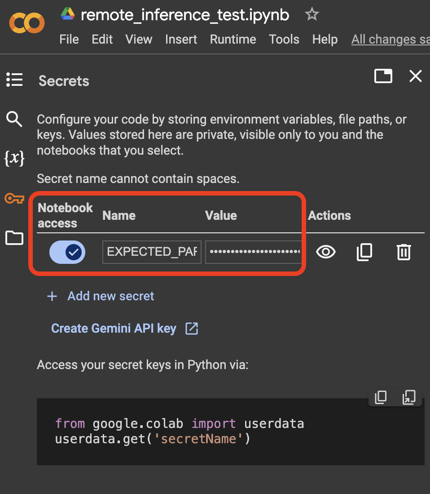

.. _colab_setup:

Colab Setup
===========

All of the examples, tutorials and demo notebooks in this documentation are designed to be executable in any type of Python notebook. 

To run them in Colab, please follow these steps for setup:

1. Store your API key as a secret
---------------------------------

In Google Colab, you can store an API key as a secret. 
This way, you can keep your API key secure and avoid exposing it in your code. 
(This is in lieu of using a `.env` file with other notebook types.)

For example, you can store your Expected Parrot API key as follows:

  

.. raw:: html

    
  

2. Install EDSL
---------------

Run the following command in a code cell to install the EDSL package:

.. code:: python

    pip install edsl

3. Access your API key
----------------------

To access your API key in your code, use the following code snippet:

.. code:: python

    import os
    from google.colab import userdata

    os.environ['EXPECTED_PARROT_API_KEY'] = userdata.get('EXPECTED_PARROT_API_KEY') # Replace with your secret key name

Here's a snapshot of how your Colab code might look.
Note that you can install EDSL using pip or Git:

.. image:: static/colab_remote_inference_annotated.png
  :alt: Storing and using API key in Google Colab
  :align: center
  :width: 80%
  

.. raw:: html

   
