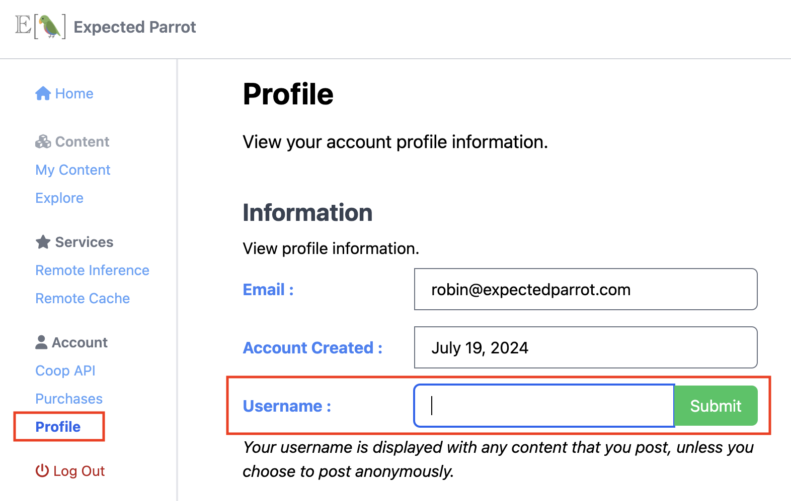
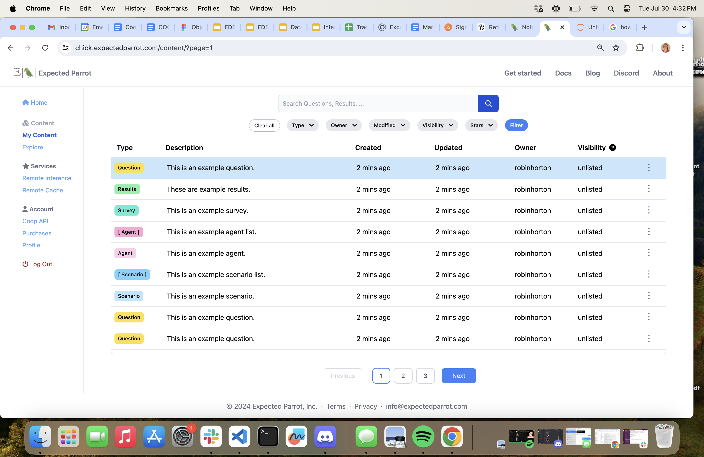

.. _coop:

Coop
====

The Coop is a platform for creating, storing and sharing AI research.
It is integrated with the EDSL library, allowing you to post, download and update objects directly from your workspace.

Coop also provides access to special features for using EDSL remotely at the Expected Parrot server.
Learn more about these features in the :ref:`remote_inference` and :ref:`remote_caching` sections.

How it works
------------

Create an account to get access to the Coop API, which allows you to:

- Post notebooks and EDSL objects at the Coop web app (surveys, agents, results, etc.) 
- Choose the visibility of your content: *public*, *private* or *unlisted*
- Share projects with your team
- View and download public and shared content
- Collaborate with other users by sharing code and examples

Choose whether to use EDSL locally or at the Expected Parrot server:

- :ref:`remote_inference`: Run surveys on the Expected Parrot server to save time and resources and avoid managing your own API keys for language models.
- :ref:`remote_caching`: Automatically store results on the Expected Parrot server to easily access and share them from anywhere. 

1. Create an account
^^^^^^^^^^^^^^^^^^^^

.. raw:: html

  Navigate to the Coop <a href="https://www.expectedparrot.com/login">login page</a> and select <b>Signup</b>.

    

Create an account with your email address and a password, or log in with your Google or Microsoft account.
If you create an account with your email address, verify it by clicking the link in the email that you receive.

.. image:: static/coop_signup.png
  :alt: Create an account at the Coop
  :align: center
  :width: 300px

.. raw:: html

    

2. Complete your profile
^^^^^^^^^^^^^^^^^^^^^^^^

.. raw:: html

  Navigate to your <a href="https://www.expectedparrot.com/home/profile">Profile</a> page and choose a username:

    

.. raw:: html

    

Your username will be associated with content that you post on the Coop.
(You can change this at any time, and also post content anonymously.)

3. Store your Expected Parrot API key
^^^^^^^^^^^^^^^^^^^^^^^^^^^^^^^^^^^^^

.. raw:: html

  Go to the <a href="https://www.expectedparrot.com/home/api">Coop API</a> page of your account and copy your API key.

You will need this key to post and manage content on the Coop, and to activate :ref:`remote_inference` and :ref:`remote_caching` features.

.. image:: static/coop_api_key.png
  :alt: Copy your Expected Parrot API key
  :align: center
  :width: 300px
  

.. raw:: html

    

Then add the following line to your `.env` file in your `edsl` working directory (the same file where you store :ref:`api_keys` for language models that you use locally with EDSL):

.. code-block:: python

  EXPECTED_PARROT_API_KEY='<your_api_key_here>'

This will save your Expected Parrot API key as an environment variable that EDSL can access.
You can regenerate your key (and update your `.env` file) at any time.

4. Create EDSL objects and notebooks
^^^^^^^^^^^^^^^^^^^^^^^^^^^^^^^^^^^^
Create notebooks and other objects in EDSL: `Agent`, `Question`, `Survey`, `Job`, `Results`, `Cache`, etc.
See documentation for each object type for more information.

5. Post content to the Coop
^^^^^^^^^^^^^^^^^^^^^^^^^^^
Post objects to the Coop using the `edsl.coop` module and object methods.
See below for details and examples of methods for uploading, downloading, updating and deleting content on the Coop.

6. Choose the visibility of your content
^^^^^^^^^^^^^^^^^^^^^^^^^^^^^^^^^^^^^^^^
You can set the visibility of an object when you post it to the Coop or update it later. 
There are 3 options:

* `public`: Visible to everyone 
* `private`: Visible to users that you grant access
* `unlisted`: Visible to anyone with the link but not listed in search results

By default, objects are posted as *unlisted*.
See below for details and examples for setting the visibility of an object.

7. Explore content
^^^^^^^^^^^^^^^^^^
Search for other users' public or privately shared content by object type, keyword, author, topic, etc.
Copy code and examples to your own workspace to modify or rerun them.

*Note:* To access an unlisted object you must have the object `uuid` or URL.

Methods 
-------

Uploading
^^^^^^^^^

There are 2 methods for posting objects to the Coop: 

**Directly**

From your workspace:

* Call the `push()` method on an object
* Optionally pass `description` and/or `visibility` parameters: `public`, `private` or `unlisted` (default) (these can be changed at any time)

Here we post the example object that is provided with the `QuestionMultipleChoice` class:

.. code-block:: python

  from edsl import QuestionMultiplechoice

  q = QuestionMultipleChoice.example()
  q.push()  

This will return information about the object that has been posted, including the URL for viewing it at the Coop and the `uuid` for the object which you can use to access it later:

.. code-block:: text

  {'description': None,
  'object_type': 'question',
  'url': 'https://www.expectedparrot.com/content/1234abcd-abcd-1234-abcd-1234abcd1234',
  'uuid': '1234abcd-abcd-1234-abcd-1234abcd1234',
  'version': '0.1.30',
  'visibility': 'unlisted'}

To post an object with a description and visibility:

.. code-block:: python

  from edsl import QuestionMultiplechoice

  q = QuestionMultipleChoice.example()
  q.push(description="This is an example question", visibility="public")

We will see the description and visibility status that we specified:

.. code-block:: text

  {'description': 'This is an example question',
  'object_type': 'question',
  'url': 'https://www.expectedparrot.com/content/1234abcd-abcd-1234-abcd-1234abcd1234',
  'uuid': '1234abcd-abcd-1234-abcd-1234abcd1234',
  'version': '0.1.30',
  'visibility': 'public'}

**Using a Coop client**

From your workspace: 

* Create a `Coop` client object
* Pass an object to upload (`Agent`, `Cache`, `Job`, `Question`, `Results`, `Survey`, `Notebook`)
* Optionally pass `description` and/or `visibility` parameters 

Example: 

.. code-block:: python

  from edsl import Coop, QuestionMultiplechoice

  q = QuestionMultipleChoice.example()
  c = Coop()
  c.create(q)

Or to post an object with a description and visibility status:

.. code-block:: python

  from edsl import Coop, QuestionMultiplechoice

  q = QuestionMultipleChoice.example()
  c = Coop()
  c.create(object=q, description="This is an example question", visibility="public")

This will return the same information about the object as above.

Updating 
^^^^^^^^

There are 3 methods for updating objects on the Coop:

**At the Coop web app**

You can manually update objects at the Coop web app:

Navigate to **My Content** and select an object: https://www.expectedparrot.com/content/ 

.. raw:: html

    

Go to the object's page (double-click on the object):

.. image:: static/coop_object_page_view.png
  :alt: Open the object's page
  :align: center
  :width: 500px

.. raw:: html

    

Select the option to change the **visibility** of the object (public, private, unlisted) or to **edit** the object:

.. image:: static/coop_object_page_view_visibility.png
  :alt: Change the visibility of an object on the Coop
  :align: center
  :width: 500px

.. raw:: html

    

.. image:: static/coop_object_page_view_edit.png
  :alt: Edit an object on the Coop
  :align: center
  :width: 500px

.. raw:: html

    

**Directly**

From your workspace: 

* Call the `patch()` method on an object
* Pass the parameter(s) that you want to update: `description` and/or `visibility`

Example:

.. code-block:: python

  from edsl import QuestionMultiplechoice

  q = QuestionMultipleChoice.example()
  q.push()  # Post the object
  q.patch(description="This is an updated question", visibility="public")  # Update the object

This will return a status message:

.. code-block:: text

  {'status': 'success'}

**Using a Coop client**

From your workspace:

* Create a `Coop` client object and call the `patch()` method on it
* Pass the `uuid` for the object to be updated and the parameter(s) that you want to update: `description` and/or `visibility`

Example: 

.. code-block:: python

  from edsl import Coop

  c = Coop()  
  c.patch(uuid="1234abcd-abcd-1234-abcd-1234abcd1234", description="This is an updated question", visibility="public")  # Update the object

This will return the same status message as above.

Downloading
^^^^^^^^^^^

There are 3 methods for downloading objects from the Coop:

**Copy code at the Coop web app**

The Coop web app provides copyable code for downloading or reconstructing an object that has been posted:

* Navigate to **Explore** (or **My Content**) and select an object: https://www.expectedparrot.com/explore/ (see image above for *Uploading* content)
* Go to the object's page (double-click on the object) (see image above for *Uploading* content)
* Select the **Code** view of the object, and then **Pull** (to get the code for pulling the object using its `uuid`) or **Raw** (to get the code for constructing the object):

.. image:: static/coop_object_page_view_code_pull.png
  :alt: Get code for pulling or reconstructing an object on the Coop
  :align: center
  :width: 500px

.. raw:: html

    

.. image:: static/coop_object_page_view_code_raw.png
  :alt: Get code for reconstructing an object on the Coop
  :align: center
  :width: 500px

.. raw:: html

    

Use this code in your workspace to download the object locally or to reconstruct it.

**Directly**

From your workspace:

* Call the `pull()` method on the class of the object that you want to download (`Notebook`, `Agent`, `Cache`, `Results`, `Survey`, etc.)
* Pass the `uuid` of the object 

Example:

.. code-block:: python

  from edsl import Question

  q = Question.pull("1234abcd-abcd-1234-abcd-1234abcd1234")
  q

This will return the object:

.. code-block:: text

  {
      "question_name": "how_feeling",
      "question_text": "How are you?",
      "question_options": [
          "Good",
          "Great",
          "OK",
          "Bad"
      ],
      "question_type": "multiple_choice"
  }

**Using a Coop client**

From your workspace:

* Create a `Coop` client object and call the `get()` method on it
* Pass the `uuid` of the object and the `object_type` (`notebook`, `agent`, `cache`, `results`, `survey`, etc.)

Example: 

.. code-block:: python

  from edsl import Coop

  c = Coop()
  q = c.get(object_type="question", uuid="1234abcd-abcd-1234-abcd-1234abcd1234")
  q

This will return the same object as above.

Deleting
^^^^^^^^

There are 3 methods for deleting objects from the Coop:

**At the Coop web app**

You can manually delete objects at the Coop web app:

* Navigate to **My Content** and select an object: https://www.expectedparrot.com/content/ (see image above for *Uploading* content)
* Go to the object's page (double-click on the object) (see image above for *Uploading* content)
* Select the option to **delete** the object:

.. image:: static/coop_object_page_view_delete.png
  :alt: Delete an object on the Coop
  :align: center
  :width: 500px

.. raw:: html

    

**Directly**

From your workspace:

* Call the `delete()` method on the class of the object that you want to delete (`Notebook`, `Agent`, `Cache`, `Results`, `Survey`, etc.)
* Pass the `uuid` of the object 

Example:

.. code-block:: python

  from edsl import Question

  Question.delete("1234abcd-abcd-1234-abcd-1234abcd1234")

This will return a status message:

.. code-block:: text

  {'status': 'success'}

**Using a Coop client**

* Create a `Coop` client object and call the `delete()` method on it
* Pass the `uuid` of the object and the `object_type` (`notebook`, `agent`, `cache`, `results`, `survey`, etc.)

Example:

.. code-block:: python

  from edsl import Coop

  c = Coop()
  c.delete(object_type="question", uuid="1234abcd-abcd-1234-abcd-1234abcd1234")

This will return the same status message as above.

Feature requests
----------------

If you have a feature request for the Coop, please let us know! 
There are several ways to do this:

- Create an issue on GitHub: https://docs.expectedparrot.com/en/latest/contributing.html#suggesting-enhancements
- Post a message at our Discord server: https://discord.com/invite/mxAYkjfy9m
- Send us an email: info@expectedparrot.com

.. automodule:: edsl.coop
  :members:
  :undoc-members:
  :show-inheritance:
  :special-members: __init__
  :exclude-members: 
