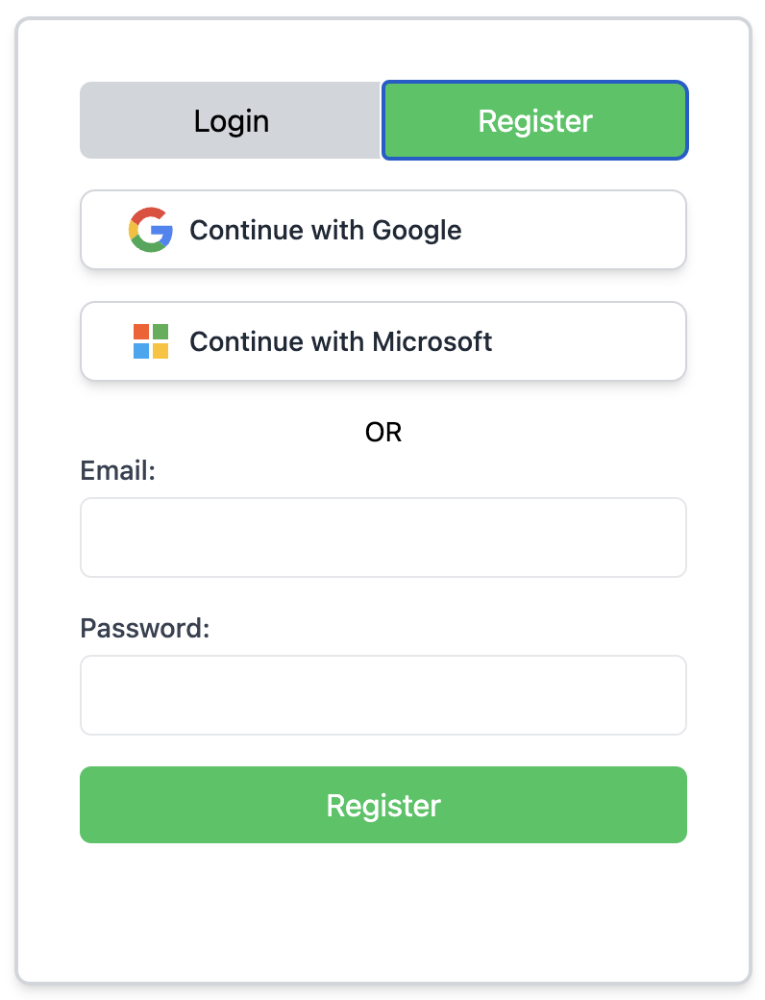

.. _coop:

Coop
====

*Coming soon!*

The <a href="https://www.expectedparrot.com/login">Coop</a> is a platform for storing, sharing and accessing research in EDSL.

How it works
------------

1. Create an account
^^^^^^^^^^^^^^^^^^^^
Go to the <a href="https://www.expectedparrot.com/">Coop login page</a> and select "Register".
Create an account with your email address and a password or log in with your Google/Microsoft account.
If you create an account with your email address you will need to verify it by clicking on the link in the email that you receive.

  

.. raw:: html

   

2. Create a username
^^^^^^^^^^^^^^^^^^^^
Go to your <a href="https://www.expectedparrot.com/home/profile">Profile</a> page and choose a username.
Your username will be associated with content that you post on the Coop.
(You can change this at any time, and you can also post content anonymously.)

3. Store your API key
^^^^^^^^^^^^^^^^^^^^^
Go to the <a href="https://www.expectedparrot.com/home/api">API</a> page of your Account and copy your API key.
You will need this key to post, download and update objects on the Coop.

.. image:: static/coop_api_key.png
  :alt: Copy your API key
  :align: center
  

.. raw:: html

   

Then add the following line to your `.env` file in your `edsl` working directory (the same file where you store API keys for language models that you use with `edsl`):

.. code-block:: python

  EXPECTED_PARROT_API_KEY='<your_api_key_here>'

This will save your Expected Parrot API key as an environment variable that `edsl` can access.
You can regenerate your API key (and update your `.env` file) at any time.

4. Create EDSL objects
^^^^^^^^^^^^^^^^^^^^^^
Create objects using the `edsl` library: `Agent`, `Cache`, `Job`, `Question`, `Results`, `Survey`
See the `edsl` documentation for more information.

*Coming soon: Features for uploading notebooks and other work product!*

5. Post objects to the Coop
^^^^^^^^^^^^^^^^^^^^^^^^^^^
Post objects to the Coop using the `edsl.coop` module and object methods.
See below for details and examples of methods for uploading, downloading and updating objects.

6. Choose the visibility of your objects
^^^^^^^^^^^^^^^^^^^^^^^^^^^^^^^^^^^^^^^^
You can set the visibility of an object when you post it to the Coop or update it later. 
There are 3 options:

* `public`: Share with everyone
* `private`: Share with no one
* `unlisted`: Share with people who have the link

By default, objects are posted as unlisted.
See below for details and examples for setting the visibility of an object.

7. Search for other users' content
^^^^^^^^^^^^^^^^^^^^^^^^^^^^^^^^^^
Search for other users' public content by object type, keyword, author, topic, etc.
Copy code and examples to your own workspace to modify or rerun them.

To access objects that are unlisted you must have the object `uuid` or the link to the object.

Feature requests
----------------

If you have a feature request for the Coop, please let us know! 
There are several ways to do this

- Create an issue on GitHub: <a href="https://docs.expectedparrot.com/en/latest/contributing.html#suggesting-enhancements">submit a request</a>
- Post a message at our <a href="https://discord.com/invite/mxAYkjfy9m">Discord</a>
- Send us an email: info@expectedparrot.com

Methods 
-------

Uploading objects
^^^^^^^^^^^^^^^^^
*API key required*

There are 2 methods for posting objects to the Coop: 

**Directly**

* Call the `push()` method on an object
* Optionally specify the `visibility`: `public`, `private` or `unlisted` (default)

Example:

.. code-block:: python

  from edsl import QuestionMultiplechoice

  q = QuestionMultipleChoice.example()
  q.push()

**Using a Coop client**

* Create a `Coop` client object
* Pass it an object to upload (`Agent`, `Cache`, `Job`, `Question`, `Results`, `Survey`)
* Optionally specify the `visibility`: `public`, `private` or `unlisted` (default)

Example: 

.. code-block:: python

  from edsl import Coop, QuestionMultiplechoice

  q = QuestionMultipleChoice.example()
  c = Coop()
  c.create(object=q)

Downloading objects
^^^^^^^^^^^^^^^^^^^
*No API key required if the object is public or unlisted*

There are 2 methods for downloading EDSL content from the Coop:

**Directly**

* Call the `pull()` method on a class
* Specify the `uuid` of the object

Example:

.. code-block:: python

  from edsl import Question

  q = Question.pull('74fd3458-ea18-4fc9-99f6-03fb76482c20')

**Using a Coop client**

* Create a `Coop` client object
* Call the `get()` method 
* Specify the `uuid` of the object and the `object_type`: `agent`, `cache`, `job`, `question`, `results`, `survey`

Example: 

.. code-block:: python

  from edsl import Coop

  c = Coop()
  q =  c.get(object_type='question', uuid='74fd3458-ea18-4fc9-99f6-03fb76482c20')

Updating objects
^^^^^^^^^^^^^^^^
*API key required*

To change the visibility of an object (of your own):

* Select an object on the Coop: https://www.expectedparrot.com/home 
* Select the button to change the visibility of an object  

Deleting objects
^^^^^^^^^^^^^^^^ 
*API key required*

There are 3 methods for deleting your objects from the Coop:

**Directly**

* Call the `delete()` method on a class
* Specify the `uuid` of the object

Example:

.. code-block:: python

  from edsl import Question

  Question.delete('74fd3458-ea18-4fc9-99f6-03fb76482c20')

**Using a Coop client**

* Create a `Coop` client object
* Call the `delete()` method 
* Specify the `uuid` of the object and the `object_type`: `agent`, `cache`, `job`, `question`, `results`, `survey`

Example:

.. code-block:: python

  from edsl import Coop

  c = Coop()
  c.delete(object_type='question', uuid='74fd3458-ea18-4fc9-99f6-03fb76482c20')

**Web app**

* Select an object on the Coop: https://www.expectedparrot.com/home 
* Select the button to delete an object  

.. automodule:: edsl.coop
   :members:
   :undoc-members:
   :show-inheritance:
   :special-members: __init__
   :exclude-members: 
