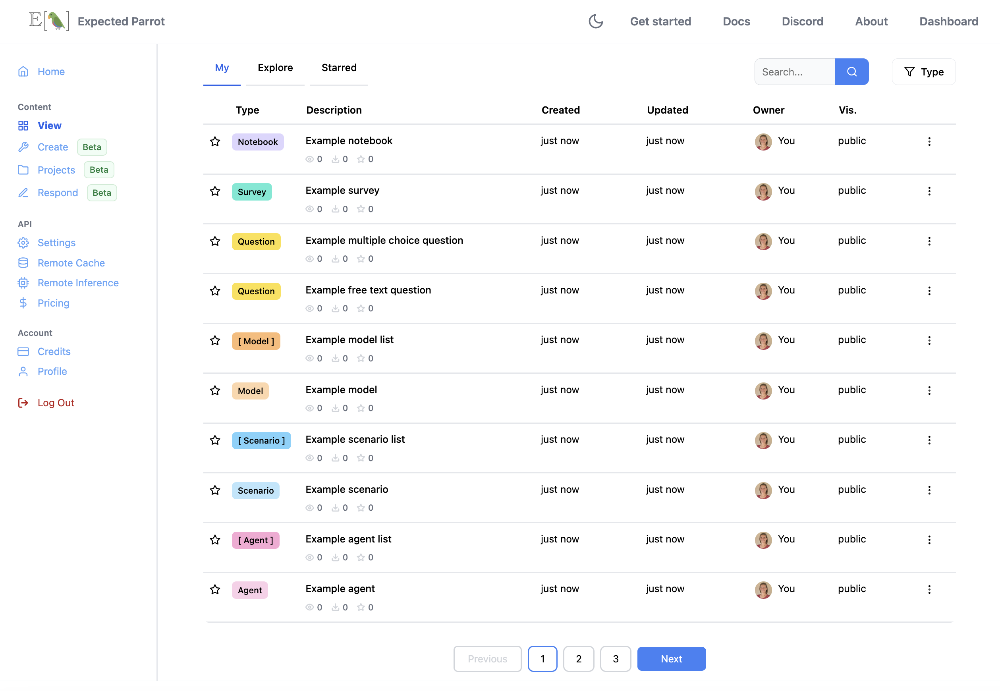
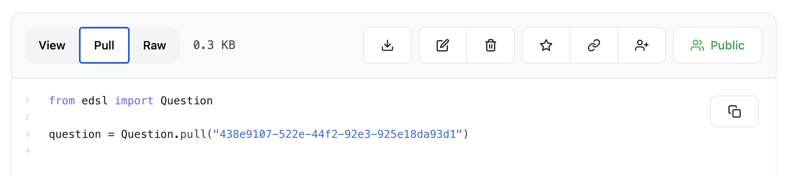

.. _coop:

Coop
====

`Coop <https://www.expectedparrot.com/content/explore>`_ is a free platform for creating, storing and sharing AI-based research, and validating it with human respondents. 
It is fully integrated with EDSL, allowing you to post, store and retrieve any objects that you've created with EDSL, together with data, notebooks and other project content. 
You can also explore public content and collaborate on projects privately with other users:

.. raw:: html

    

Your Coop account provides access to special features for running EDSL surveys and storing results remotely at the Expected Parrot server, and launching hybrid human-AI inference jobs interactively.
Learn more about these features in the :ref:`remote_inference`, :ref:`remote_caching` and :ref:`survey_builder` sections of the documentation.
  

Getting started
---------------

1. Create an account
^^^^^^^^^^^^^^^^^^^^

`Sign up <a href="https://www.expectedparrot.com/login>`_ with an email address. 

Your account comes with an **Expected Parrot API key** that allows you to:

* Post and share content at Coop
* Run surveys at the Expected Parrot server 
* Use any available models with your surveys 
* Use the universal cache of stored prompts and responses

You can inspect your key and reset it at any time at your `Keys <https://www.expectedparrot.com/home/keys>`_ page.

2. Your Expected Parrot API key
^^^^^^^^^^^^^^^^^^^^^^^^^^^^^^^^^^^^^

Remote inference is a feature that allows you to run EDSL surveys and inference jobs at the Expected Parrot server, and store results at your account.
It is activated by default when you create an account.
When remote inference is activated, your survey jobs and results are automatically stored at the Expected Parrot server and accessible at the `Results <https://www.expectedparrot.com/home/remote-inference>`_ page of your account.

You can also post any EDSL objects to Coop from your workspace, includes `Results`, `Surveys`, `Agents`, `Scenarios`, `Notebooks` and data files (using the `FileStore` module). 
To do this, you first need to store your Expected Parrot API key.
If you have activated remote inference (at your `Settings <https://www.expectedparrot.com/home/settings>`_ page), your key is automatically stored.

If you are only using EDSL locally, create a file named `.env` in your EDSL working directory and store your key in it using the following format:

.. code-block:: python

  EXPECTED_PARROT_API_KEY = 'your_key_here'

Learn more about storing API keys in the :ref:`api_keys` section of the documentation.

3. Post objects to Coop
^^^^^^^^^^^^^^^^^^^^^^^

Use the `Coop` module and methods to post and share objects (see examples below). 
You can set the visibility status of an object when you post it or update it later, from your workspace or interactively at your account. 
There are 3 status options:

* `public`: Visible to everyone 
* `private`: Visible to logged in users that you have granted access
* `unlisted`: Visible to anyone with the link but not listed in search results (default)

See details on methods for uploading, downloading, updating and deleting content at Coop below.

4. Explore content
^^^^^^^^^^^^^^^^^^

Content that you have created with remote inference or posted to Coop is available at your `Content <https://www.expectedparrot.com/content>`_ page:

.. raw:: html

    

You can access public content at the `Explore <https://www.expectedparrot.com/content/explore>`_ tab, and copy code and examples to modify or rerun at your workspace.

Methods 
-------

When remote inference is activated the results of your surveys are automatically added to your `Content <https://www.expectedparrot.com/content>`_ page.
You can modify them from your workspace or interactively at your account.

You can also post, update, download and delete any objects at Coop using the `Coop` module and methods (see examples below).

Posting
^^^^^^^

There are 2 methods for uploading/posting an object from your workspace to Coop:

1. Call the `push()` method on the object directly.
2. Call the `create()` method on a `Coop` client object and pass it the object.

You can optionally pass a `description`, a convenient `alias` for the Coop URL and a `visibility` status (`public`, `private` or `unlisted` (default)) when you create an object. 
These can be changed at any time.

**Direct method**

Here we post a question object by calling the `push()` method on it:

.. code-block:: python

  from edsl import QuestionFreeText

  q = QuestionFreeText(
    question_name = "example",
    question_text = "How are you today?"
  )

  q.push(
    description="This is an example question", # optional
    alias = "my-example-question", # optional
    visibility="public" # optional
  )

We can see the description, alias and visibility status that we specified in the information that is returned:

.. code-block:: text

  {'description': 'This is an example question',
  'object_type': 'question',
  'url': 'https://www.expectedparrot.com/content/1706e6f9-2675-4433-8b0a-080654a5cd08',
  'alias_url': 'https://www.expectedparrot.com/content/RobinHorton/my-example-question',
  'uuid': '1706e6f9-2675-4433-8b0a-080654a5cd08',
  'version': '0.1.47.dev1',
  'visibility': 'public'}

**Using a Coop client**

Here we post the same question by passing it to the `create()` method of a `Coop` client object:

.. code-block:: python

  from edsl import Coop, QuestionFreeText

  q = QuestionFreeText(
    question_name = "example",
    question_text = "How are you today?"
  )
  c = Coop()
  c.create(q)

Here we include a description and visibility status:

.. code-block:: python

  from edsl import Coop, QuestionFreeText

  q = QuestionFreeText(
    question_name = "example",
    question_text = "How are you today?"
  )
  c = Coop()
  c.create(object=q, description="This is an example question", alias = "another-example-question", visibility="public")

This will return the same information about the object as the direct method shown above (with a unique `uuid` and URL for viewing the object at the Coop web app).

Updating 
^^^^^^^^

There are 3 methods for updating/editing an object to the Coop:

1. Edit the object at the Coop web app.
2. Call the `patch()` method on the object directly.
3. Call the `patch()` method on a `Coop` client object. 

For each `patch()` method, pass the `alias_url` or the `uuid` of the object and the parameter(s) that you want to update: `description`, `visibility`, `alias` and/or `value`.

* The `description` parameter is used to update the description of an object, such as a question or survey.
* The `visibility` parameter is used to update the visibility of an object: *public*, *private* or *unlisted*.
* The `value` parameter is used to update the content of an object, such as the text of a question or the code in a notebook.

**At the Coop web app**

You can manually update the `description` or `visibility` of an object at the Coop web app.
Navigate to the `Explore <https://www.expectedparrot.com/content/explore>`_ page and open the page view for an object.
You can select options to change the **visibility** of the object (*public*, *private* or *unlisted*) or to **edit** the description.

**Direct method**

Here we update the `description` and `visibility` of the question we created and uploaded in the examples above by calling the `patch()` method on it:

.. code-block:: python

  q.patch("https://www.expectedparrot.com/content/RobinHorton/my-example-question",
          description="This is an updated question", 
          visibility="unlisted")  

This will return a status message:

.. code-block:: text

  {'status': 'success'}

Here we change the question itself by modifying the `value` parameter:

.. code-block:: python

  from edsl import QuestionMultipleChoice
  
  new_q = QuestionMultipleChoice(
    question_name = "example",
    question_text = "How are you today?",
    question_options = ["Good", "Bad", "OK"]
  )
  q.patch("https://www.expectedparrot.com/content/RobinHorton/my-example-question",
          value=new_q)  

**Using a Coop client**

Here we do the same using a `Coop` client object:

.. code-block:: python

  from edsl import Coop

  c = Coop()  
  c.patch("https://www.expectedparrot.com/content/1706e6f9-2675-4433-8b0a-080654a5cd08",
          description="This is an updated question",
          visibility="public")  

This will return the same status message as above.

Replicating / Downloading
^^^^^^^^^^^^^^^^^^^^^^^^^

There are a variety of methods for replicating or downloading an object at the Coop:

1. Selecting options to download or copy code at the Coop web app
2. Calling the `pull()` method on the class of the object
3. Calling the `get()` method on a `Coop` client object

**Copy code at the Coop web app**

The Coop web app provides copyable code for downloading or reconstructing an object that has been posted:

* Navigate to the `Explore <https://www.expectedparrot.com/content/explore>`_ page and select an object 
* Go to the object's page 
* Select the option to **Download** the object 

OR

* Select the option to **Pull** the object using its `uuid` or **Raw** to get the code for constructing the object:

.. raw:: html
  
    

.. image:: static/coop-content-object-raw.png
  :alt: Get code for reconstructing an object on the Coop
  :align: center
  :width: 100%

.. raw:: html
  
    

Use this code in your workspace to download the object locally or to reconstruct it.

**Class method**

Here we download the question posted above by calling the `pull()` method on the object class (`Question`) and passing the `uuid` of the object:

.. code-block:: python

  from edsl import Question

  q = Question.pull("1706e6f9-2675-4433-8b0a-080654a5cd08")
  q

This will return the object (the multiple choice question question that replaced the free text question):

.. list-table::
   :header-rows: 1

   * - key
     - value
   * - question_name
     - example
   * - question_text
     - How are you today?
   * - question_options:0
     - Good
   * - question_options:1
     - Bad
   * - question_options:2
     - OK
   * - question_type
     - multiple_choice

**Using a Coop client**

Here we download the question by calling the `get()` method on a `Coop` client object:

.. code-block:: python

  from edsl import Coop

  c = Coop()
  q = c.get("1706e6f9-2675-4433-8b0a-080654a5cd08")
  q

This will return the same object as above.

Deleting
^^^^^^^^

There are 3 methods for deleting an object from the Coop:

1. Selecting options to delete at the Coop web app
2. Calling the `delete()` method on the class of the object
3. Calling the `delete()` method on a `Coop` client object

**At the Coop web app**

You can manually delete objects at the Coop web app:

* Navigate to `Explore <https://www.expectedparrot.com/content/explore>`_ and open an object's page view (see image above for *Uploading* content)
* Select the option to **delete** the object:

.. image:: static/coop-content-object-delete.png
  :alt: Delete an object on the Coop
  :align: center
  :width: 100%

.. raw:: html
  
    

**Directly**

Here we delete a question object by calling the `delete()` method on the class of the object (`Question`) and passing the `uuid` of the object:

.. code-block:: python

  from edsl import Question

  Question.delete("1234abcd-abcd-1234-abcd-1234abcd1234") # mock uuid

This will return a status message:

.. code-block:: text

  {'status': 'success'}

**Using a Coop client**

Here we delete a question by calling the `delete()` method on a `Coop` client object, passing the `uuid` of the object:

.. code-block:: python

  from edsl import Coop

  c = Coop()
  c.delete(uuid="1234abcd-abcd-1234-abcd-1234abcd1234") # mock uuid

This will return the same status message as above (so long as the object was not already deleted).

Projects
^^^^^^^^

You can create a project at the Coop web app by selecting the option to **Create a project** at the top right of the page.

You can also create a project by calling the `create_project()` method on a `Coop` client object:

.. code-block:: python

  from edsl import Coop

  c = Coop()
  c.create_project(
    project_name = "My project",
    description = "This is a project",
    visibility = "public" 
  )

Special methods
^^^^^^^^^^^^^^^

There are several special methods for working with Coop objects:

Feature requests
----------------

If you have a feature request for the Coop, please let us know! 
There are several ways to do this:

- Create an issue at `GitHub <https://docs.expectedparrot.com/en/latest/contributing.html#suggesting-enhancements>`_
- Post a message at `Discord <https://discord.com/invite/mxAYkjfy9m>`_
- Send us an email: info@expectedparrot.com

.. automodule:: edsl.coop
  :members:
  :undoc-members:
  :show-inheritance:
  :special-members: __init__
  :exclude-members: 
