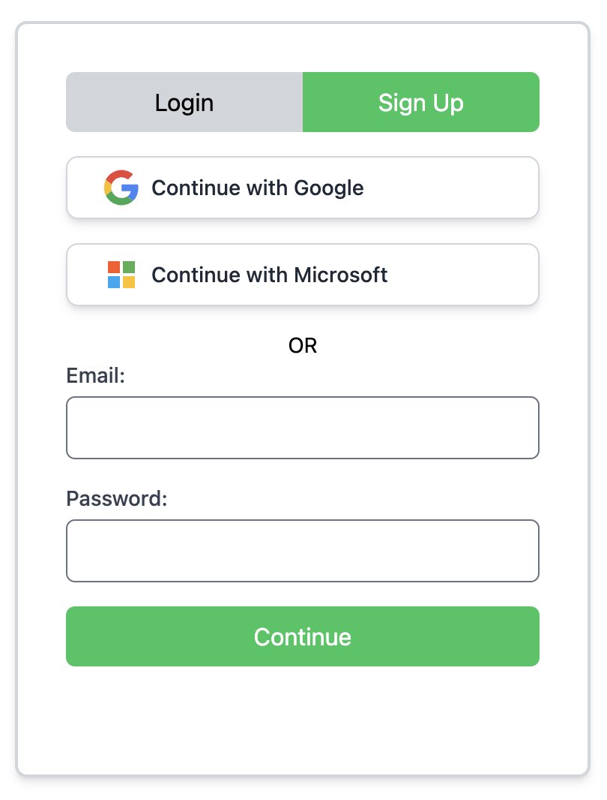
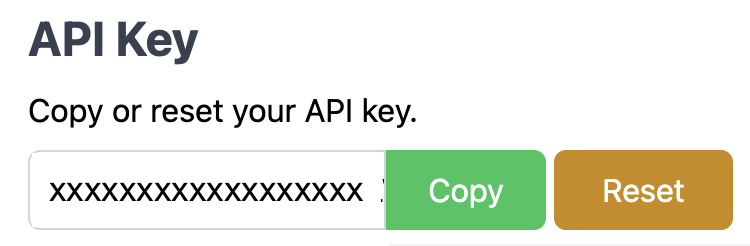
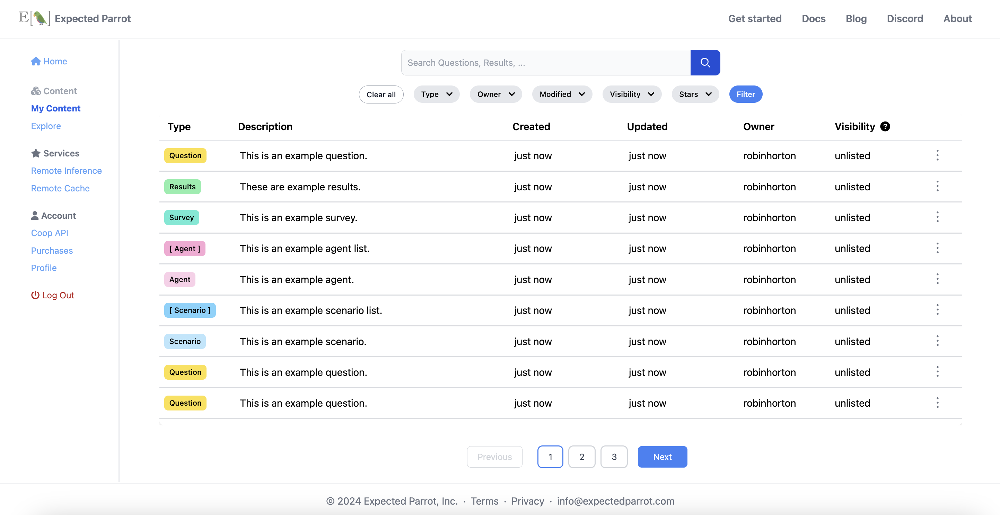
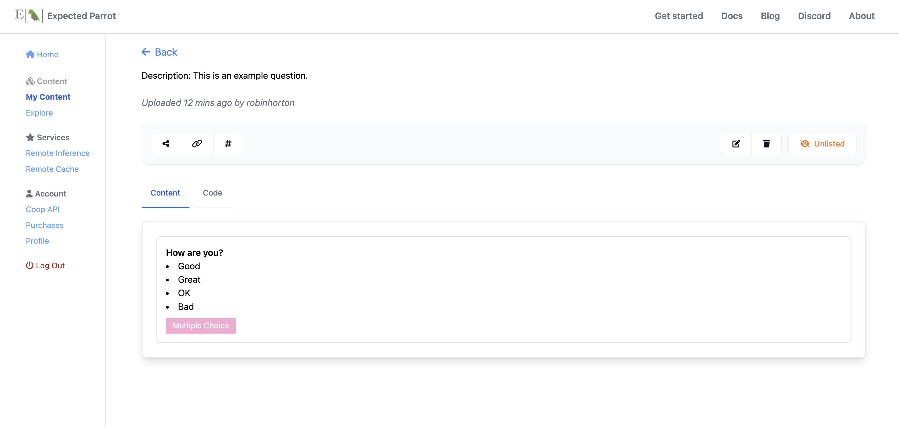
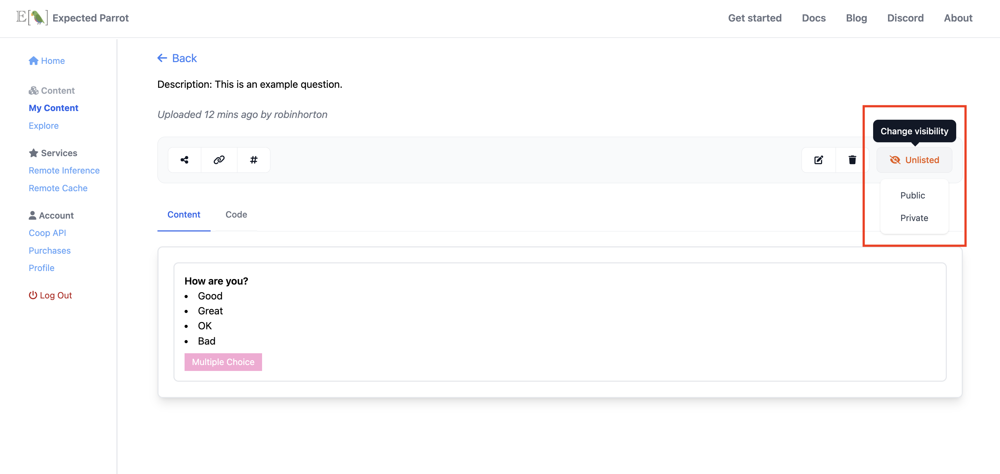
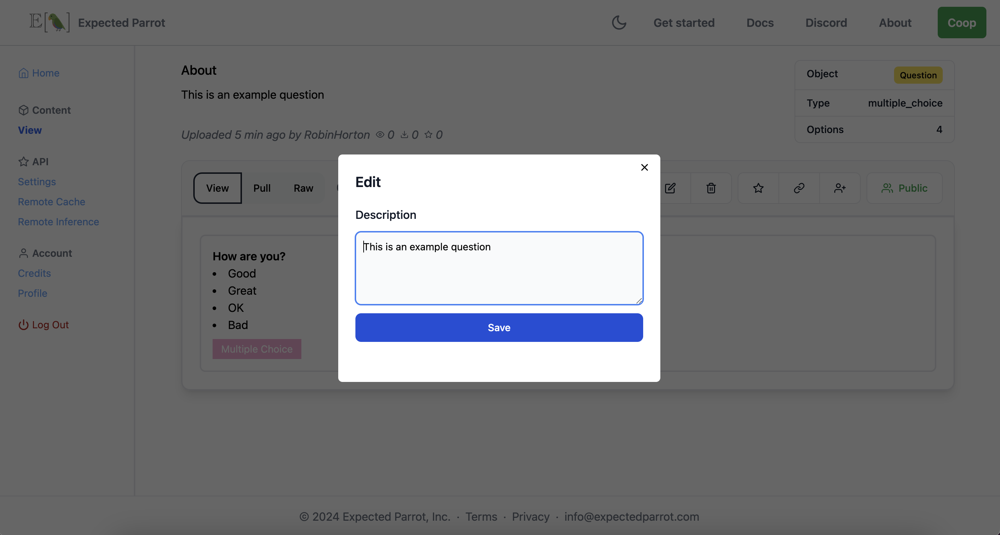
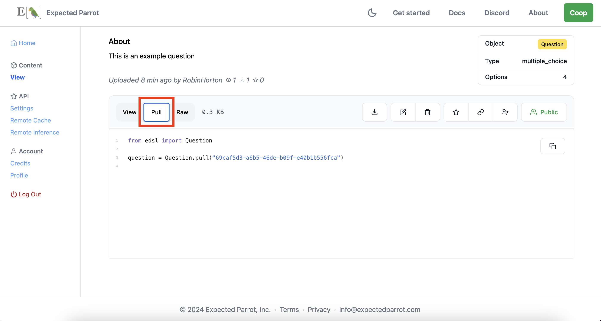
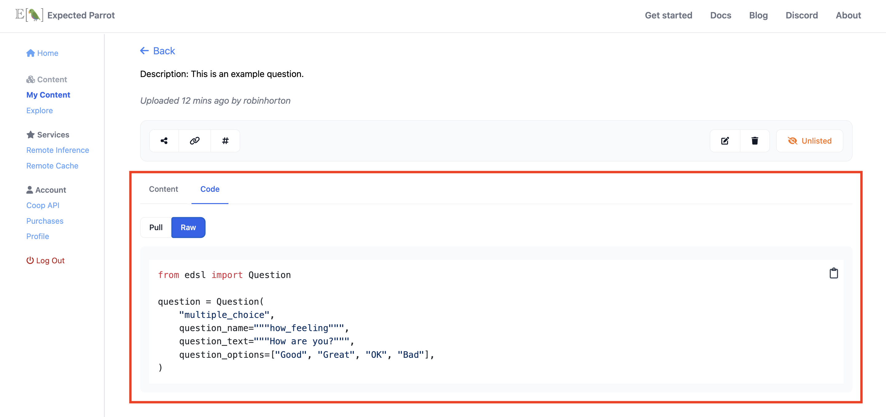
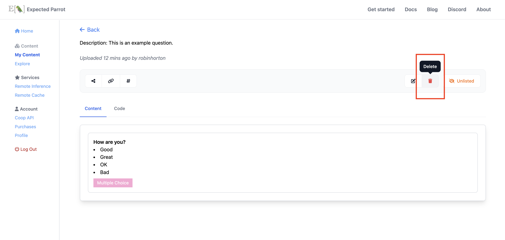

.. _coop:

Coop
====

`Coop <https://www.expectedparrot.com/explore>`_ is a platform for creating, storing and sharing AI research. 
It is fully integrated with the EDSL library, allowing you to post, download and update objects directly from your workspace or at the web app.

Coop also provides access to special features for running EDSL surveys and storing results remotely at the Expected Parrot server.
Learn more about these features in the :ref:`remote_inference` and :ref:`remote_caching` sections.

How it works
------------

`Create an account <https://www.expectedparrot.com/login>`_ to get access to the Coop API, which allows you to:

* Post notebooks and EDSL objects at the Coop web app (surveys, agents, results, etc.) 
* Choose the visibility of your content: *public*, *private* or *unlisted*
* Share projects with your team
* View and download public and shared content
* Collaborate with other users by sharing code and examples

Then choose whether to use EDSL locally or at the Expected Parrot server:

* :ref:`remote_inference`: Run surveys on the Expected Parrot server to save time and resources, and avoid needing to manage your own API keys for language models.
* :ref:`remote_caching`: Automatically store EDSL survey results on the Expected Parrot server to easily access and share them from anywhere. 

1. Create an account
^^^^^^^^^^^^^^^^^^^^

Navigate to the Coop `login page <a href="https://www.expectedparrot.com/login>`_ and select **Sign Up**.

.. raw:: html

    

Create an account with your email address and a password, or log in with your Google or Microsoft account.
If you create an account with your email address, verify it by clicking the link in the email that you receive.

2. Store your Expected Parrot API key
^^^^^^^^^^^^^^^^^^^^^^^^^^^^^^^^^^^^^

`API Settings <a href="https://www.expectedparrot.com/home/api>`_ page of your account and copy your Expected Parrot API key.

  

.. raw:: html

    

Then add the following line to your `.env` file in your `edsl` working directory (the same file where you store :ref:`api_keys` for language models that you use locally with EDSL):

.. code-block:: python

  EXPECTED_PARROT_API_KEY='<your_api_key_here>'

This will save your Expected Parrot API key as an environment variable that EDSL can access.
You can regenerate your key (and update your `.env` file) at any time.

3. Create EDSL objects and notebooks
^^^^^^^^^^^^^^^^^^^^^^^^^^^^^^^^^^^^

Create notebooks and other objects in EDSL: `Agent`, `Question`, `Survey`, `Job`, `Results`, `Cache`, etc.

See sections of the documentation for different object types for more information about creating objects in EDSL.

4. Post content to the Coop
^^^^^^^^^^^^^^^^^^^^^^^^^^^

Post objects to the Coop using the `edsl.coop` module and object methods.

See below for details and examples of methods for uploading, downloading, updating and deleting content on the Coop.

5. Choose the visibility of your content
^^^^^^^^^^^^^^^^^^^^^^^^^^^^^^^^^^^^^^^^

You can set the visibility of an object when you post it to the Coop or update it later. 

There are 3 options:

* `public`: Visible to everyone 
* `private`: Visible to logged in users that you have granted access
* `unlisted`: Visible to anyone with the link but not listed in search results

By default, objects are posted as *unlisted*.
See below for details on setting and changing the visibility of an object.

6. Explore content
^^^^^^^^^^^^^^^^^^

Search for other users' public or privately shared content by object type, keyword, author, topic, etc.
Copy code and examples to modify or rerun them.

*Note:* To access an unlisted object you must have the object `uuid` or URL.

Methods 
-------

Uploading
^^^^^^^^^

There are 2 methods for uploading/posting an object to the Coop:

1. Calling the `push()` method on the object directly
2. Calling the `create()` method on a `Coop` client object and passing it the object

You can optionally pass a `description` and/or `visibility` parameter at the same time: `public`, `private` or `unlisted` (default). 
These can be changed at any time.

**Direct method**
Here we post a question object by calling the `push()` method on it:

.. code-block:: python

  from edsl import QuestionMultipleChoice

  q = QuestionMultipleChoice.example()
  q.push()  

This will return information about the object that has been posted, including the URL for viewing it at the Coop web app and the `uuid` for the object which you can use to access it later.
We can see that the object is `unlisted` by default:

.. code-block:: text

  {'description': None,
  'object_type': 'question',
  'url': 'https://www.expectedparrot.com/content/c543744e-08a2-48a1-a021-bfc292bac1b3',
  'uuid': 'c543744e-08a2-48a1-a021-bfc292bac1b3',
  'version': '0.1.34',
  'visibility': 'unlisted'}

Here we post the same object with a description and visibility:

.. code-block:: python

  from edsl import QuestionMultipleChoice

  q = QuestionMultipleChoice.example()
  q.push(description="This is an example question", visibility="public")

We can see the description and visibility status that we specified in the information that is returned:

.. code-block:: text

  {'description': 'This is an example question',
  'object_type': 'question',
  'url': 'https://www.expectedparrot.com/content/9c628bc6-d2ec-4160-85e0-f8aa3aae4aa1',
  'uuid': '9c628bc6-d2ec-4160-85e0-f8aa3aae4aa1',
  'version': '0.1.34',
  'visibility': 'public'}

**Using a Coop client**
Here we post the same question by passing it to the `create()` method of a `Coop` client object:

.. code-block:: python

  from edsl import Coop, QuestionMultipleChoice

  q = QuestionMultipleChoice.example()
  c = Coop()
  c.create(q)

Here we include a description and visibility status:

.. code-block:: python

  from edsl import Coop, QuestionMultipleChoice

  q = QuestionMultipleChoice.example()
  c = Coop()
  c.create(object=q, description="This is an example question", visibility="public")

This will return the same information about the object as the direct method shown above (with a unique `uuid` and URL for viewing the object at the Coop web app).

Updating 
^^^^^^^^

There are 3 methods for updating/editing an object to the Coop:

1. Editing the object at the Coop web app
2. Calling the `patch()` method on the object directly
3. Calling the `patch()` method on a `Coop` client object  

For each `patch()` method, pass the `uuid` of the object and the parameter(s) that you want to update: `description`, `visibility` and/or `value`.

* The `description` parameter is used to update the description of an object, such as a question or survey.
* The `visibility` parameter is used to update the visibility of an object: *public*, *private* or *unlisted*.
* The `value` parameter is used to update the content of an object, such as the text of a question or the code in a notebook.

**At the Coop web app**
You can manually update the `description` or `visibility` of an object at the Coop web app:

Navigate to **Content** and select an object: https://www.expectedparrot.com/content/ 

.. raw:: html

    

Go to the object's page (double-click on the object):

.. raw:: html

    

Select the option to change the **visibility** of the object (*public*, *private* or *unlisted*) or to **edit** the object:

.. raw:: html

    

.. raw:: html

    

**Direct method**
Here we update the `description` and `visibility` of the question created and uploaded in the examples above by calling the `patch()` method on it:

.. code-block:: python

  q.patch(uuid="1234abcd-abcd-1234-abcd-1234abcd1234",
          description="This is an updated question", 
          visibility="public")  

This will return a status message:

.. code-block:: text

  {'status': 'success'}

Here we change the question itself by modifying the `value` parameter:

.. code-block:: python

  from edsl import QuestionFreeText
  
  new_q = QuestionFreeText.example()
  q.patch(uuid="1234abcd-abcd-1234-abcd-1234abcd1234",
          value=new_q)  

**Using a Coop client**
Here we do the same using a `Coop` client object:

.. code-block:: python

  from edsl import Coop

  c = Coop()  
  c.patch(uuid="1234abcd-abcd-1234-abcd-1234abcd1234",
          description="This is an updated question",
          visibility="public")  

This will return the same status message as above.

Replicating / Downloading
^^^^^^^^^^^^^^^^^^^^^^^^^

There are a variety of methods for replicating or downloading an object at the Coop:

1. Selecting options to download or copy code at the Coop web app
2. Calling the `pull()` method on the class of the object
3. Calling the `get()` method on a `Coop` client object

**Copy code at the Coop web app**
The Coop web app provides copyable code for downloading or reconstructing an object that has been posted:

* Navigate to **Content** and select an object: https://www.expectedparrot.com/content 
* Go to the object's page 
* Select the option to **Download** the object 
OR
* Select the **Code** view of the object, and then **Pull** (to get the code for pulling the object using its `uuid`) or **Raw** (to get the code for constructing the object):

.. raw:: html

    

.. raw:: html

    

Use this code in your workspace to download the object locally or to reconstruct it.

**Class method**
Here we download the question posted above by calling the `pull()` method on the object class (`Question`) and passing the `uuid` of the object:

.. code-block:: python

  from edsl import Question

  q = Question.pull("1234abcd-abcd-1234-abcd-1234abcd1234")
  q

This will return the object (the example free text question that replaced the example multiple choice question):

.. code-block:: text

  {
      "question_name": "how_are_you",
      "question_text": "How are you?",
      "question_type": "free_text"
  }

**Using a Coop client**
Here we download the question by calling the `get()` method on a `Coop` client object:

.. code-block:: python

  from edsl import Coop

  c = Coop()
  q = c.get(uuid="1234abcd-abcd-1234-abcd-1234abcd1234")
  q

This will return the same object as above.

Deleting
^^^^^^^^

There are 3 methods for deleting an object from the Coop:

1. Selecting options to delete at the Coop web app
2. Calling the `delete()` method on the class of the object
3. Calling the `delete()` method on a `Coop` client object

**At the Coop web app**
You can manually delete objects at the Coop web app:

* Navigate to **My Content** and select an object: https://www.expectedparrot.com/content/ (see image above for *Uploading* content)
* Go to the object's page (double-click on the object) (see image above for *Uploading* content)
* Select the option to **delete** the object:

.. raw:: html

    

**Directly**
Here we delete the question object that we posted above by calling the `delete()` method on the class of the object (`Question`) and passing the `uuid` of the object:

.. code-block:: python

  from edsl import Question

  Question.delete("1234abcd-abcd-1234-abcd-1234abcd1234")

This will return a status message:

.. code-block:: text

  {'status': 'success'}

**Using a Coop client**
Here we delete the question by calling the `delete()` method on a `Coop` client object, passing the `uuid` of the object:

.. code-block:: python

  from edsl import Coop

  c = Coop()
  c.delete(uuid="1234abcd-abcd-1234-abcd-1234abcd1234")

This will return the same status message as above (so long as the object was not already deleted).

Feature requests
----------------

If you have a feature request for the Coop, please let us know! 
There are several ways to do this:

- Create an issue on GitHub: https://docs.expectedparrot.com/en/latest/contributing.html#suggesting-enhancements
- Post a message at our Discord server: https://discord.com/invite/mxAYkjfy9m
- Send us an email: info@expectedparrot.com

.. automodule:: edsl.coop
  :members:
  :undoc-members:
  :show-inheritance:
  :special-members: __init__
  :exclude-members: 
