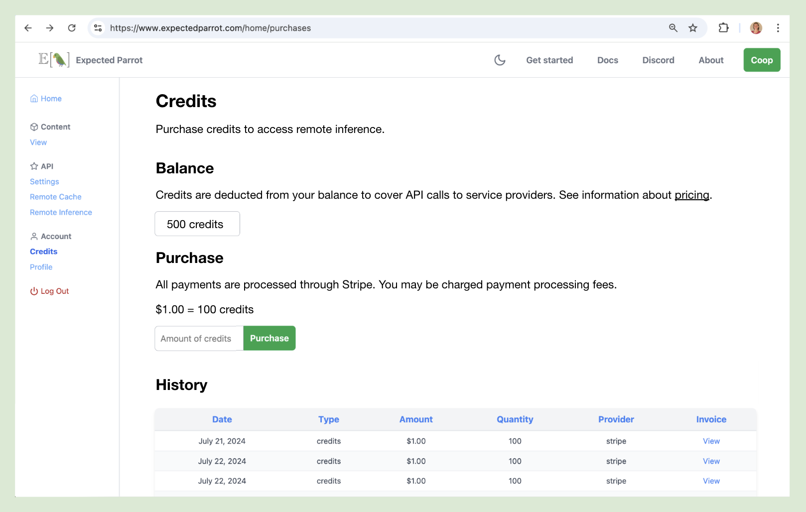
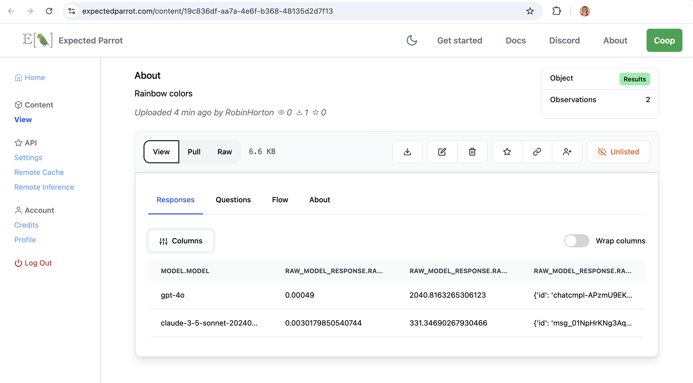
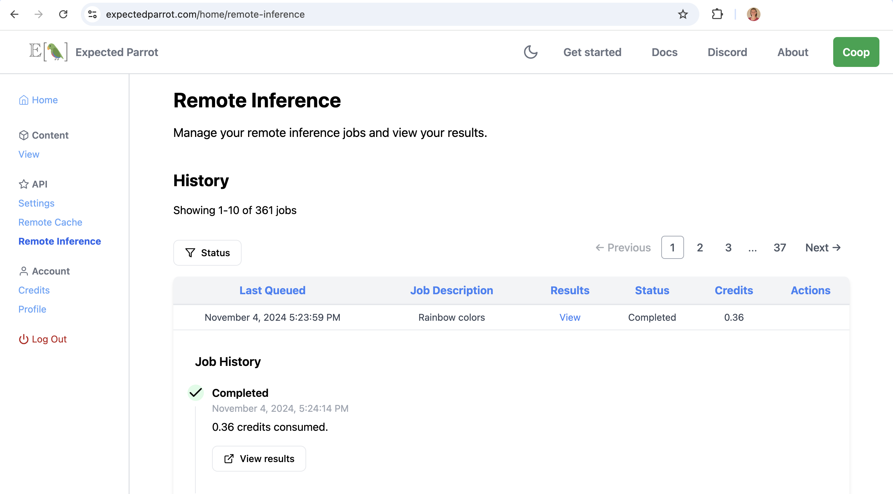

.. _credits:

Credits
=======

Credits are required in order to access certain features of the Expected Parrot server, such as running your surveys remotely using your Expected Parrot API key.
When you use remote inference, credits are deducted from your balance to cover the costs of API calls to language model service providers, which are based on token rates set by providers.
A list of token rates for different models available with remote inference can be found on the `Pricing <https://www.expectedparrot.com/getting-started/coop-pricing>`_ page.
Details on how credits are consumed are provided below. 
Credits must be purchased in advance and are consumed when surveys are run. 
If you do not have enough credits to run a survey, you will be prompted to purchase more credits.

Free credits
------------

Your Coop account comes with a balance of 100 free credits that you can use to run surveys with remote inference.

| ***Are you using EDSL for a research project?*** 
| Send an email to *info@expectedparrot.com* to request additional free credits.

Purchasing credits
------------------

To purchase credits, navigate to the `Credits <https://www.expectedparrot.com/home/purchases>`_ page of your Coop account and enter the number of credits that you would like to purchase
(1 USD buys 100 credits, and the minimum purchase amount is 1 USD):

.. html::

      

Payments are processed by Stripe. 
You may be charged payment processing feeds when purchasing credits.

Using credits
-------------

When you run a survey with remote inference, the number of credits consumed (and deducted from your balance) is displayed at the `remote inference page <https://www.expectedparrot.com/home/remote-inference>`_ of your Coop account.
This number is calculated based on the cost of each response in the results, each of which is determined by the number of tokens in the input text and the output text of the response, which can be inspected in the raw response details (see example below).

The cost in credits for each response is calculated as follows:

- The number of input tokens is multiplied by the input token rate set by the language model service provider.
- The number of output tokens is multiplied by the output token rate set by the language model service provider.
- The total cost in USD is converted to credits (1 USD = 100 credits).
- The total cost in credits is rounded up to the nearest 1/100th of a credit.

Example calculation
^^^^^^^^^^^^^^^^^^^

- Input tokens: 16
- Output tokens: 45
- Input token rate: USD 2.50 per 1M tokens
- Output token rate: USD 10.00 per 1M tokens
- Total cost: (16 * USD 2.50/1,000,000) + (45 * USD 10.00/1,000,000) = USD 0.00049 = 0.05 credits

Response details & token rates
------------------------------

Details about a model's response are stored in the `raw_model_response` fields of the results dataset.
For each question that was run, the following columns will appear in results:

* **raw_model_response.<question_name>_cost**: The cost in USD for the API call to the language model service provider. (In the example above, this is USD 0.00049.)
* **raw_model_response.<question_name>_one_usd_buys**: An estimate of the number of responses to the question that could be purchased with 1 USD (for reference).
* **raw_model_response.<question_name>_raw_model_response**: A dictionary containing the raw response for the question, which includes the input text, output text, tokens and other information about the API call.

For example, here we run a question with two models and inspect the raw model response information:

.. code-block:: python

    from edsl import QuestionFreeText, ModelList, Model

    q = QuestionFreeText(
        question_name = "rainbow",
        question_text = "What are the colors of a rainbow?"
    )

    m = ModelList(Model(m) for m in ["claude-3-5-sonnet-20240620", "gpt-4o"])

    results = q.by(m).run()

    results.select("model", "raw_model_response.*").print(format="rich")

Output:

.. code-block:: text

    ┏━━━━━━━━━━━━━━━━━━━━━━━━━━━━┳━━━━━━━━━━━━━━━━━━━━━━━┳━━━━━━━━━━━━━━━━━━━━━━━┳━━━━━━━━━━━━━━━━━━━━━━━━━━━━━━━━━━━━┓
    ┃ model                      ┃ raw_model_response    ┃ raw_model_response    ┃ raw_model_response                 ┃
    ┃ .model                     ┃ .rainbow_cost         ┃ .rainbow_one_usd_buys ┃ .rainbow_raw_model_response        ┃
    ┡━━━━━━━━━━━━━━━━━━━━━━━━━━━━╇━━━━━━━━━━━━━━━━━━━━━━━╇━━━━━━━━━━━━━━━━━━━━━━━╇━━━━━━━━━━━━━━━━━━━━━━━━━━━━━━━━━━━━┩
    │ gpt-4o                     │ 0.00049               │ 2040.8163265306123    │ {'id':                             │
    │                            │                       │                       │ 'chatcmpl-APzmU9EKGX4tHk9K685CDJf… │
    │                            │                       │                       │ 'choices': [{'finish_reason':      │
    │                            │                       │                       │ 'stop', 'index': 0, 'logprobs':    │
    │                            │                       │                       │ None, 'message': {'content': 'A    │
    │                            │                       │                       │ rainbow consists of seven colors,  │
    │                            │                       │                       │ which are typically listed in the  │
    │                            │                       │                       │ following order: red, orange,      │
    │                            │                       │                       │ yellow, green, blue, indigo, and   │
    │                            │                       │                       │ violet. These colors can be        │
    │                            │                       │                       │ remembered using the acronym       │
    │                            │                       │                       │ "ROYGBIV."', 'refusal': None,      │
    │                            │                       │                       │ 'role': 'assistant', 'audio':      │
    │                            │                       │                       │ None, 'function_call': None,       │
    │                            │                       │                       │ 'tool_calls': None}}], 'created':  │
    │                            │                       │                       │ 1730759050, 'model':               │
    │                            │                       │                       │ 'gpt-4o-2024-08-06', 'object':     │
    │                            │                       │                       │ 'chat.completion', 'service_tier': │
    │                            │                       │                       │ None, 'system_fingerprint':        │
    │                            │                       │                       │ 'fp_159d8341cc', 'usage':          │
    │                            │                       │                       │ {'completion_tokens': 45,          │
    │                            │                       │                       │ 'prompt_tokens': 16,               │
    │                            │                       │                       │ 'total_tokens': 61,                │
    │                            │                       │                       │ 'completion_tokens_details':       │
    │                            │                       │                       │ {'audio_tokens': None,             │
    │                            │                       │                       │ 'reasoning_tokens': 0,             │
    │                            │                       │                       │ 'accepted_prediction_tokens': 0,   │
    │                            │                       │                       │ 'rejected_prediction_tokens': 0},  │
    │                            │                       │                       │ 'prompt_tokens_details':           │
    │                            │                       │                       │ {'audio_tokens': None,             │
    │                            │                       │                       │ 'cached_tokens': 0}}}              │
    ├────────────────────────────┼───────────────────────┼───────────────────────┼────────────────────────────────────┤
    │ claude-3-5-sonnet-20240620 │ 0.0030179850540744415 │ 331.34690267930466    │ {'id':                             │
    │                            │                       │                       │ 'msg_01NpHrKNg3AqnNSBRyEV4kwy',    │
    │                            │                       │                       │ 'content': [{'text': 'The colors   │
    │                            │                       │                       │ of a rainbow are typically         │
    │                            │                       │                       │ described as having seven distinct │
    │                            │                       │                       │ hues, often remembered by the      │
    │                            │                       │                       │ mnemonic device "ROY G. BIV."      │
    │                            │                       │                       │ These colors are, in order:\n\n1.  │
    │                            │                       │                       │ Red\n2. Orange\n3. Yellow\n4.      │
    │                            │                       │                       │ Green\n5. Blue\n6. Indigo\n7.      │
    │                            │                       │                       │ Violet\n\nIt\'s worth noting       │
    │                            │                       │                       │ that:\n\n1. In reality, a rainbow  │
    │                            │                       │                       │ is a continuous spectrum of        │
    │                            │                       │                       │ colors, and these seven colors are │
    │                            │                       │                       │ somewhat arbitrarily               │
    │                            │                       │                       │ divided.\n\n2. Some people         │
    │                            │                       │                       │ consider indigo to be a subset of  │
    │                            │                       │                       │ blue and don\'t always include it  │
    │                            │                       │                       │ as a separate color, reducing the  │
    │                            │                       │                       │ count to six main colors.\n\n3.    │
    │                            │                       │                       │ The colors can vary slightly in    │
    │                            │                       │                       │ appearance depending on            │
    │                            │                       │                       │ atmospheric conditions and the     │
    │                            │                       │                       │ observer\'s perspective.\n\n4.     │
    │                            │                       │                       │ Beyond the visible spectrum,       │
    │                            │                       │                       │ rainbows also contain ultraviolet  │
    │                            │                       │                       │ light (beyond violet) and infrared │
    │                            │                       │                       │ light (beyond red), which are not  │
    │                            │                       │                       │ visible to the human eye.',        │
    │                            │                       │                       │ 'type': 'text'}], 'model':         │
    │                            │                       │                       │ 'claude-3-5-sonnet-20240620',      │
    │                            │                       │                       │ 'role': 'assistant',               │
    │                            │                       │                       │ 'stop_reason': 'end_turn',         │
    │                            │                       │                       │ 'stop_sequence': None, 'type':     │
    │                            │                       │                       │ 'message', 'usage':                │
    │                            │                       │                       │ {'input_tokens': 16,               │
    │                            │                       │                       │ 'output_tokens': 198}}             │
    └────────────────────────────┴───────────────────────┴───────────────────────┴────────────────────────────────────┘

In the raw model response information for the response from *gpt-4o*, we can see values for `completion_tokens` (output tokens) and `prompt_tokens` (input tokens):

.. code-block:: text

    'completion_tokens': 45, 
    'prompt_tokens': 16

The total cost is then calculated based on the token rates set by the OpenAI (at the time of writing, USD 2.50 per 1M tokens for input and USD 10.00 per 1M tokens for output):

.. code-block:: text

    (16 * USD 2.50/1,000,000) + (45 * USD 10.00/1,000,000) 
    = USD 0.00049 
    = 0.05 credits

In the raw model response information for the response from *claude-3-5-sonnet-20240620*, we can see values for `input_tokens` and `output_tokens`:

.. code-block:: text

    'input_tokens': 16, 
    'output_tokens': 198

The total cost is then calculated based on the token rates set by Anthropic (at the time of writing, USD 3.00 per 1M tokens for input and USD 15.00 per 1M tokens for output):

.. code-block:: text

    (16 * USD 3.00/1,000,000) + (198 * USD 15.00/1,000,000) 
    = USD 0.0030179850540744415 
    = 0.31 credits

This translates to a total of 0.36 credits consumed for the survey.
We can see this number of credits consumed at the remote inference page of our Coop account:

  

.. raw:: html

    

We can also navigate to the results page and select the same columns of the results to display:

  

.. raw:: html

    

Token rates 
-----------

Model token rates used to calculate costs can be viewed at the `Pricing <https://www.expectedparrot.com/getting-started/coop-pricing>`_ page.
This page is regularly updated to reflect the latest prices published by service providers.

