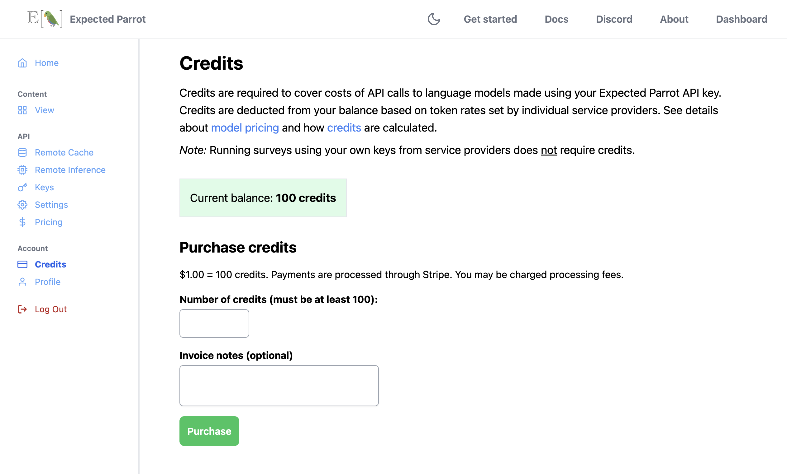
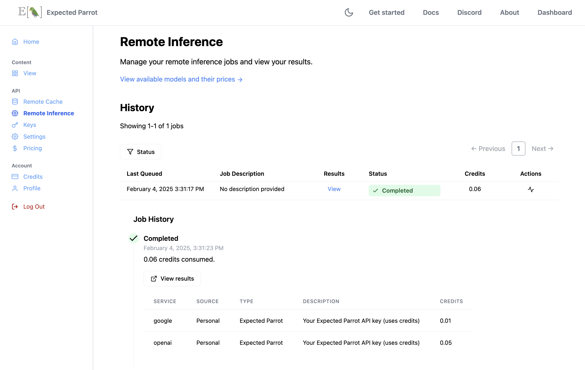
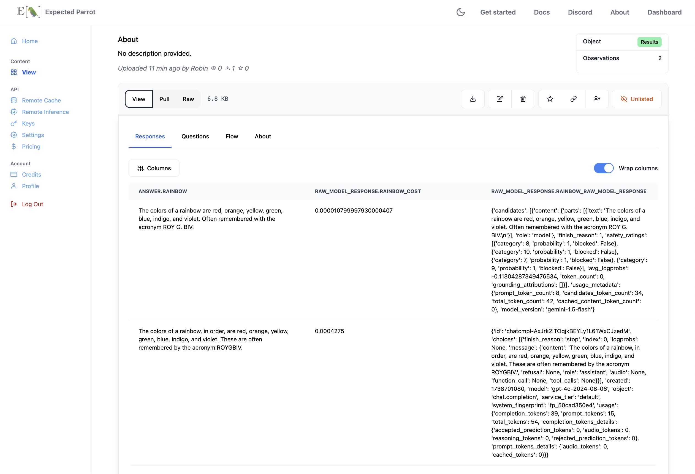

.. _credits:

Credits
=======

Credits are required in order to run surveys with models using your Expected Parrot API key.
They can be purchased at your Coop account (see details below).
Credits are deducted to cover API call costs, which depend on token rates set by language model service providers.
You can view current pricing for available models at the `model pricing page <https://www.expectedparrot.com/getting-started/coop-pricing>`_.

Credits must be purchased in advance and are consumed when surveys are run. 
If your balance is insufficient, you will be prompted to purchase more credits.
Details on credit consumption are provided below.

*Note:* Credits are *not* required to run surveys with your own keys from service providers or to post and share content at `Coop <https://www.expectedparrot.com/content/explore>`_.
When using your own keys, cost estimates are based on the prices listed in the `model pricing page <https://www.expectedparrot.com/getting-started/coop-pricing>`_, but your actual charges may vary depending on service providers' terms.

Free credits
------------

Your Coop account comes with free credits that you can use to run surveys with your Expected Parrot key.

| **Are you using EDSL for a research project?**
| Send an email to *info@expectedparrot.com* to request additional free credits!

Purchasing credits
------------------

To purchase credits, navigate to the `Credits <https://www.expectedparrot.com/home/credits>`_ page of your account and enter the number of credits that you would like to purchase
(1 USD buys 100 credits; the minimum purchase amount is 1 USD):

.. html::

     

*Note:*
Payments are processed by Stripe. 

Using credits
-------------

When you run a survey with your Expected Parrot API key, the number of credits consumed (and deducted from your balance) is displayed at the `Jobs <https://www.expectedparrot.com/home/remote-inference>`_ page of your account.
This number is equal to the sum of the cost in credits of each response in the results.

The cost in credits of a response is calculated as follows:

- The number of input tokens is multiplied by the input token rate set by the language model service provider.
- The number of output tokens is multiplied by the output token rate set by the language model service provider.
- The total cost in USD is converted to credits (1 USD = 100 credits).
- The total cost in credits is rounded up to the nearest 1/100th of a credit.

(If you use your own keys from service providers, no credits are consumed.)

Example calculation
^^^^^^^^^^^^^^^^^^^

- Input tokens: 16
- Output tokens: 45
- Input token rate: USD 2.50 per 1M tokens
- Output token rate: USD 10.00 per 1M tokens
- Total cost: (16 * USD 2.50/1,000,000) + (45 * USD 10.00/1,000,000) = USD 0.00049 
- Total credits: 0.05 credits

Response details & token rates
------------------------------

Details about a model's response are stored in the `raw_model_response` fields of the results dataset.
For each question that was run, the following columns will appear in results:

* **raw_model_response.<question_name>_cost**: The cost in USD for the API call to a language model service provider. (In the example above, this is USD 0.00049.)
* **raw_model_response.<question_name>_one_usd_buys**: The number of tokens that can be purchased with 1 USD (for reference).
* **raw_model_response.<question_name>_raw_model_response**: A dictionary containing the raw response for the question, which includes the input text and tokens, output text and tokens, and other information about the API call. This dictionary is specific to the language model service provider and may contain additional information about the response.

For example, here we run a question with two models and inspect the raw model response information (note that the raw response formats are not identical):

.. code-block:: python

    from edsl import QuestionFreeText, ModelList, Model

    q = QuestionFreeText(
        question_name = "rainbow",
        question_text = "What are the colors of a rainbow?"
    )

    m = ModelList(Model(m) for m in ["gemini-1.5-flash", "gpt-4o"])

    results = q.by(m).run()

    results.select("model", "raw_model_response.*")

Output:

.. list-table::
   :header-rows: 1

   * - model.model
     - raw_model_response.rainbow_cost
     - raw_model_response.rainbow_raw_model_response
     - raw_model_response.rainbow_one_usd_buys
   * - gemini-1.5-flash
     - 0.000018	
     - {'candidates': [{'content': {'parts': [{'text': "The colors of a rainbow are typically listed as red, orange, yellow, green, blue, indigo, and violet. However, it's important to note that these colors blend seamlessly into each other, and the number of distinct colors perceived can vary from person to person.\n"}], 'role': 'model'}, 'finish_reason': 1, 'safety_ratings': [{'category': 8, 'probability': 1, 'blocked': False}, {'category': 10, 'probability': 1, 'blocked': False}, {'category': 7, 'probability': 1, 'blocked': False}, {'category': 9, 'probability': 1, 'blocked': False}], 'avg_logprobs': -0.099734950483891, 'token_count': 0, 'grounding_attributions': []}], 'usage_metadata': {'prompt_token_count': 8, 'candidates_token_count': 57, 'total_token_count': 65, 'cached_content_token_count': 0}, 'model_version': 'gemini-1.5-flash'}	
     - 56497.186153
   * - gpt-4o	
     - 0.000438	
     - {'id': 'chatcmpl-B2OaTCPGFdNY7dju27SxmrLfSWXSE', 'choices': [{'finish_reason': 'stop', 'index': 0, 'logprobs': None, 'message': {'content': 'The colors of a rainbow, in order, are red, orange, yellow, green, blue, indigo, and violet. These colors can be remembered using the acronym ROYGBIV.', 'refusal': None, 'role': 'assistant', 'audio': None, 'function_call': None, 'tool_calls': None}}], 'created': 1739910869, 'model': 'gpt-4o-2024-08-06', 'object': 'chat.completion', 'service_tier': 'default', 'system_fingerprint': 'fp_523b9b6e5f', 'usage': {'completion_tokens': 40, 'prompt_tokens': 15, 'total_tokens': 55, 'completion_tokens_details': {'accepted_prediction_tokens': 0, 'audio_tokens': 0, 'reasoning_tokens': 0, 'rejected_prediction_tokens': 0}, 'prompt_tokens_details': {'audio_tokens': 0, 'cached_tokens': 0}}}	
     - 2285.714286

In the raw model response information for the response from *gpt-4o*, we can see values for `completion_tokens` (output tokens) and `prompt_tokens` (input tokens):

.. code-block:: text

    'completion_tokens': 40, 
    'prompt_tokens': 16 

The total cost of the response is calculated based on the token rates set by the OpenAI (at the time of writing, USD 2.50 per 1M tokens for input and USD 10.00 per 1M tokens for output):

.. code-block:: text

    (16 * USD 2.50/1,000,000) + (40 * USD 10.00/1,000,000) 
    = USD 0.00044 
    = 0.05 credits (rounded up to the nearest 1/100th credit)

In the raw model response information for the response from *gemini-1.5-flash*, we can see values for `prompt_token_count` and `candidates_token_count` (input tokens and output tokens, respectively):

.. code-block:: text

    'prompt_token_count': 8, 
    'candidates_token_count': 57

The total cost of the response is calculated based on the token rates set by Google (at the time of writing, USD 0.08 per 1M tokens for input and USD 0.30 per 1M tokens for output):

.. code-block:: text

    (8 * USD 0.08/1,000,000) + (57 * USD 0.30/1,000,000) 
    = USD 0.00001774
    = 0.01 credits (rounded up to the nearest 1/100th credit)

This translates to a total of 0.06 credits consumed for the survey.
We can see this number of credits consumed at the remote inference page of our Coop account:

  

.. raw:: html

    

We can also navigate to the results page and select the same columns of the results to display:

  

.. raw:: html

    

Token rates 
-----------

Model token rates used to calculate costs can be viewed at the `model pricing page <https://www.expectedparrot.com/getting-started/coop-pricing>`_.
This page is regularly updated to reflect the latest prices published by service providers.
If you notice a discrepancy with a listed price, please submit a report using the form at that page.

Estimating job costs
--------------------

Before running a survey, you can estimate the tokens and costs (in USD and credits) in 2 different ways:

* Call the `estimate_job_cost()` method on the `Job` object (a survey combined with one or more models).

This will return the total estimated cost in USD, the total estimated input and output tokens, and estimated costs and tokens for each inference service and model used. 

* Call the `remote_inference_cost()` method on a `Coop` client object and pass it the job.

This will return the estimated cost in credits and USD. (Credits are required to run surveys remotely.)

Example
^^^^^^^

Here we create a survey and agent, select a model and combine them to create a job. 
Then we call the above-mentioned methods for estimating costs and show the underlying calculations.
The steps below can also be accessed as a notebook at the Coop web app (`notebook view <https://www.expectedparrot.com/content/c379241a-7039-4505-8d42-4c909a54c6e0>`_).

.. code-block:: python

    from edsl import QuestionFreeText, Survey, Agent, Model

    q0 = QuestionFreeText(
        question_name = "favorite_flower",
        question_text = "What is the name of your favorite flower?"
    )
    q1 = QuestionFreeText(
        question_name = "flower_color",
        question_text = "What color is {{ favorite_flower.answer }}?"
    )

    survey = Survey(questions = [q0, q1])

    a = Agent(traits = {"persona":"You are a botanist on Cape Cod."})

    m = Model("gpt-4o")

    job = survey.by(a).by(m)

    estimated_job_cost = job.estimate_job_cost()
    estimated_job_cost

Output:

.. code-block:: text

    {'estimated_total_cost': 0.0009175000000000001,
     'estimated_total_input_tokens': 91,
     'estimated_total_output_tokens': 69,
     'model_costs': [{'inference_service': 'openai',
       'model': 'gpt-4o',
       'estimated_cost': 0.0009175000000000001,
       'estimated_input_tokens': 91,
       'estimated_output_tokens': 69}]}

The `estimated_total_cost` is the total cost in USD to run the job, and the `estimated_total_input_tokens` and `estimated_total_output_tokens` are the estimated total input and output tokens, respectively for all the prompts in the survey.

To get the estimated cost in credits to run the job remotely we can call the `remote_inference_cost()` method on a `Coop` client object and pass it the job:

.. code-block:: python

    from edsl import Coop

    coop = Coop()

    estimated_remote_inference_cost = coop.remote_inference_cost(job) # using the job object from above
    estimated_remote_inference_cost

Output:

.. code-block:: text

    {'credits': 0.1, 'usd': 0.00092}    

Formula details
^^^^^^^^^^^^^^^

Total job costs are estimated by performing the following calculation for each set of question prompts in the survey and summing the results:

1. Estimate the input tokens.

    * Compute the number of characters in the `user_prompt` and `system_prompt`, with any `Agent` and `Scenario` data piped in. (*Note:* Previous answers cannot be piped in because they are not available until the survey is run; they are left as Jinja-bracketed variables in the prompts for purposes of estimating tokens and costs.)
    * Apply a piping multiplier of 2 to the number of characters in the user prompt if it has an answer piped in from a previous question (i.e., if the question has Jinja braces that cannot be filled in before the survey is run). Otherwise, apply a multiplier of 1.
    * Convert the number of characters into the number of input tokens using a conversion factor of 4 characters per token, rounding down to the nearest whole number. (This approximation was `established by OpenAI <https://help.openai.com/en/articles/4936856-what-are-tokens-and-how-to-count-them>`_.)

2. Estimate the output tokens.

    * Apply a multiplier of 0.75 to the number of input tokens, rounding up to the nearest whole number.

3. Apply the token rates for the model and inference service.

    * Find the model and inference service for the question in the `model pricing page <https://www.expectedparrot.com/getting-started/coop-pricing>`_:

        Total cost in USD = (input tokens * input token rate) + (output tokens * output token rate)

    * If a model and inference service are not found, use the following fallback token rates (you will see a warning message that actual model rates were not found):

        * USD 1.00 per 1M input tokens
        * USD 1.00 per 1M ouput tokens

4. Convert the total cost in USD to credits.

    * Total cost in credits = total cost in USD * 100, rounded up to the nearest 1/100th credit.

Then sum the costs for all question prompts to get the total cost of the job.

Calculations
^^^^^^^^^^^^

Here we show the calculations for the examples above.

We can call the `show_prompts()` method on the job object to see the prompts for each question in the survey:

.. code-block:: python

    job.show_prompts()

Output:

.. list-table::
   :header-rows: 1

   * - user_prompt
     - system_prompt
   * - What is the name of your favorite flower?
     - You are answering questions as if you were a human. Do not break character.  
       Your traits: {'persona': 'You are a botanist on Cape Cod.'}
   * - What color is {{ answer }}?
     - You are answering questions as if you were a human. Do not break character.  
       Your traits: {'persona': 'You are a botanist on Cape Cod.'}

Here we count the characters in each user prompt and system prompt:

.. code-block:: python

    q0_user_prompt_characters = len("What is the name of your favorite flower?")
    q0_user_prompt_characters

Output:

.. code-block:: text

    41

.. code-block:: python 

    q0_system_prompt_characters = len("You are answering questions as if you were a human. Do not break character. Your traits: {'persona': 'You are a botanist on Cape Cod.'}")
    q0_system_prompt_characters

Output:

.. code-block:: text

    135

We apply the piping multiplier of 2 to the number of characters in the user prompt for q1 because the answer to q0 is piped in:

.. code-block:: python

    q1_user_prompt_characters = len("What color is {{ answer }}?") * 2
    q1_user_prompt_characters

Output:

.. code-block:: text

    54

The system prompt characters are identical for the single agent used with the questions:

.. code-block:: python

    q1_system_prompt_characters = len("You are answering questions as if you were a human. Do not break character. Your traits: {'persona': 'You are a botanist on Cape Cod.'}")
    q1_system_prompt_characters

Output:

.. code-block:: text

    135

Here we estimate the input and output tokens for each set of prompts:

.. code-block:: python

    q0_input_tokens = (q0_user_prompt_characters + q0_system_prompt_characters) // 4
    q0_input_tokens

Output:

.. code-block:: text

    44

.. code-block:: python

    q0_output_tokens = ceil(0.75 * q0_input_tokens) 
    q0_output_tokens

Output:

.. code-block:: text

    33

.. code-block:: python

    q1_input_tokens = (q1_user_prompt_characters + q1_system_prompt_characters) // 4
    q1_input_tokens

Output:

.. code-block:: text

    47

.. code-block:: python

    q1_output_tokens = ceil(0.75 * q1_input_tokens) 
    q1_output_tokens

Output:

.. code-block:: text

    36

The total input tokens and output tokens for the job are:

.. code-block:: python

    total_input_tokens = q0_input_tokens + q1_input_tokens
    total_input_tokens

Output:

.. code-block:: text

    91

.. code-block:: python

    total_output_tokens = q0_output_tokens + q1_output_tokens
    total_output_tokens

Output:

.. code-block:: text

    69

Next we apply the token rates for the model:

.. code-block:: python

    q0_tokens_cost = (2.50/1000000 * q0_input_tokens) + (10.00/1000000 * q0_output_tokens)
    q0_tokens_cost

Output:

.. code-block:: text

    0.00044000000000000007

.. code-block:: python

    q1_tokens_cost = (2.50/1000000 * q1_input_tokens) + (10.00/1000000 * q1_output_tokens)
    q1_tokens_cost

Output:

.. code-block:: text

    0.00047750000000000006

The total cost of the job is:

.. code-block:: python

    total_cost_usd = q0_tokens_cost + q1_tokens_cost
    total_cost_usd

Output:

.. code-block:: text

    0.0009175000000000001

We convert the total cost in USD to credits:

.. code-block:: python

    q0_credits = ceil(q0_tokens_cost * 100 * 100) / 100
    q0_credits

Output:

.. code-block:: text

    0.05

.. code-block:: python

    q1_credits = ceil(q1_tokens_cost * 100 * 100) / 100
    q1_credits

Output:

.. code-block:: text

    0.05

We calculate the total cost in credits:

.. code-block:: python

    total_credits = q0_credits + q1_credits
    total_credits

Output:

.. code-block:: text

    0.1

The total cost of the job is 0.00092 USD and 0.1 credits.

Refunds
-------

Please send an email to *info@expectedparrot.com* if you have any questions about credits or refunds, or need assistance with your account.