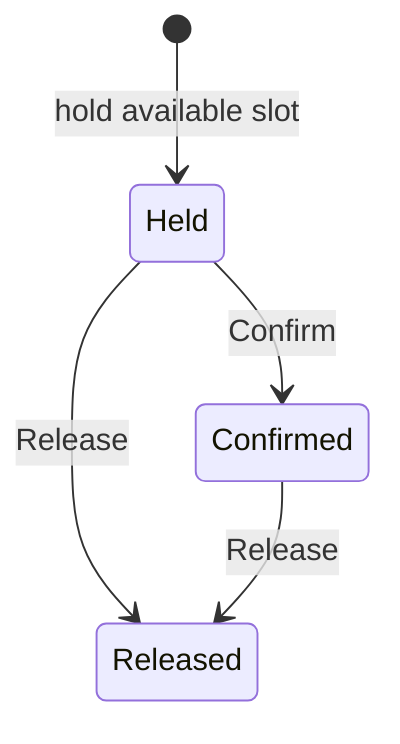

This example adds a reversible reservation lifecycle to the
[survey quota pattern](/en/latest/shared-state/survey-quotas). A slot can be
available, held, confirmed, and released. It uses ordinary Machine commands and
Survey stop rules; it makes no calendar-service calls.

## Run it

```bash
python -m examples.appointment_booking
```

The five-person local demo releases one hold, confirms three appointments, and
screens out one respondent when no slot remains. The first respondent releases
09:00; the next respondent sees and books it. No model API calls are made.

The [Machine builder](https://github.com/expectedparrot/edsl/blob/feature/shared-state-v0/examples/machine_primitives/appointment_booking.py)
and [Survey adapter](https://github.com/expectedparrot/edsl/blob/feature/shared-state-v0/examples/appointment_booking.py)
are executable source examples. Inspect Results yourself:

```python
from edsl import Model
from edsl.runner import Runner
from examples.appointment_booking import build_survey, demo_agents

survey, states, schedule = build_survey(slots=["09:00", "10:00", "11:00"])
results = Runner(interview_schedule=schedule).submit(
    survey.by(demo_agents()).by(Model("test")), cache=False
).results()
results.select("answer.slot", "answer.booking_outcome")
```

## State and commands

One state scope covers a study. The `bookings` map is keyed by a host-issued
`reservation_id`; each entry stores `respondent_id`, `slot`, and `status`.
Capacity is derived from all held and confirmed entries, so there is no separate
counter to drift. Each slot has capacity one, and each respondent may have at
most one active reservation.

| Command | Behavior |
| --- | --- |
| `hold(respondent_id, reservation_id, slot)` | Atomically checks availability and creates a held reservation. |
| `decide(..., decision="Confirm")` | Changes a held reservation to confirmed; an identical confirmation is a no-op. |
| `decide(..., decision="Release")` | Releases a held or confirmed reservation; repeated release is a no-op. |
| Close | Blocks new holds while permitting confirmation/release of existing reservations. |



A released reservation is terminal. A new booking needs a new reservation ID.
Replaying its original `hold` cannot recreate capacity consumption, and a late
confirmation is rejected. A delayed release addressed to an old ID cannot
release a newer reservation, even for the same respondent and slot.

A failed command leaves the state unchanged. Examples include
`slot_unavailable`, `already_booked`, `reservation_changed`, and
`reservation_not_owned`. Unknown slot/decision values fail input validation.
SQLite also retains completed operation outcomes: retrying a rejected operation
replays its rejection. Trying again after availability changes requires a new
operation identity, not reuse of a rejected delivery key.

## Survey routing and resumption

The survey reads available options, asks for a slot, attempts the atomic hold,
and reads again. Only a successful hold proceeds to confirmation. Thus a
concurrent respondent can take a displayed slot without causing overbooking;
the losing respondent stops at the hold-status gate. This first adapter does
not loop back to select another slot.

A respondent returning with the same held reservation sees only that slot and
can finish confirmation. The interrupted-hold test verifies this across jobs.
Returning with a confirmed or released reservation ends before another selection.
The Machine also supports post-confirmation cancellation through `Release`,
although this short survey only asks for the initial decision.

The schedule is sequential for a reproducible demonstration. Atomic writes are
also tested with concurrent SQLite writers. `complete_when` is deliberately
false: temporary fullness must not prevent a later release from reopening a slot.
Reuse the serialized state map to resume; construct a new map for an independent
study. Respondent and reservation IDs must be stable and assigned by the host.

## Tests and design findings

The [application tests](https://github.com/expectedparrot/edsl/blob/feature/shared-state-v0/tests/sharedstate/test_survey_applications.py)
cover capacity/identity invariants over randomized command streams, competing
holds, ownership checks, changed payloads, release/rebook fencing, explicit close,
SQLite restart and delivery replay, isolated scopes, fresh-process JSON execution,
actual option snapshots in Results, and interrupted confirmation.

Holds do **not** expire automatically. A trusted host must explicitly release an
abandoned hold; the Machine has no clock or abandonment detector. Production
expiry would need a host scheduling/time contract and tests for expiry racing
with confirmation. ID equality is a consistency check, not authentication.
This example establishes a reservation pattern, not hosted calendar or human-UI
integration. The other designs' concurrent-assignment policies remain separate.

The default definition is 14,824 JSON bytes; its short corpus replay peaks at
4,530 host budget steps per transition. Retained reservation history grows over
time. Reproduce measurements with `python -m examples.machine_primitives.profile_corpus`;
they are development observations, not portable cost guarantees.
