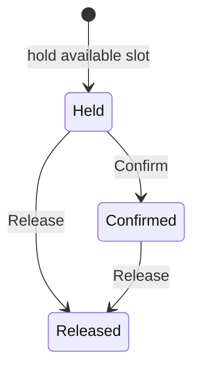

This example adds a reversible reservation lifecycle to the
[survey quota pattern](/en/latest/shared-state/survey-quotas). A slot can be
available, held, confirmed, and released. It uses ordinary Machine commands and
Survey stop rules; it makes no calendar-service calls.

## Build and run the complete example

Everything needed for this example is defined on this page. Use an EDSL build
that includes the Machine and Runner APIs documented in this manual. Execute the
following four Python blocks in order in one session, or concatenate them into
one script. They require EDSL and the Python standard library; no repository
example modules or external data files are needed. The scripted run makes no
model API calls.

The five-person local demo releases one hold, confirms three appointments, and
screens out one respondent when no slot remains. The first respondent releases
09:00; the next respondent sees and books it. No model API calls are made.

### 1. Define the Machine

The Machine below derives availability from held and confirmed reservations.
Its commands check capacity and reservation identity before writing any state.

```python
from edsl.sharedstate import (
    Command,
    Machine,
    StateType,
    assert_,
    choose,
    constant,
    current_value,
    field,
    filter_items,
    arg,
    local,
    put,
    record,
    set_,
    state_field,
    when,
)

DEFAULT_SLOTS = ("09:00", "10:00", "11:00")

def build_machine(slots=DEFAULT_SLOTS):
    if isinstance(slots, str):
        raise ValueError("slots must be a sequence")
    slots = list(slots)
    if (
        not slots
        or any(not isinstance(s, str) or not s.strip() for s in slots)
        or len(set(slots)) != len(slots)
    ):
        raise ValueError("slots must be unique nonempty labels")
    bookings = field("bookings")
    token, rid, slot = arg("reservation_id"), arg("respondent_id"), arg("slot")
    seen = bookings.contains(token)
    old = bookings.get(token, {})
    active = filter_items(
        bookings.values(), item="b", predicate=local("b").get("status") != "released"
    )
    free = filter_items(
        constant("slots"),
        item="s",
        predicate=filter_items(
            active, item="b", predicate=local("b").get("slot") == local("s")
        ).length()
        == 0,
    )
    your = bookings.get(current_value("reservation_id", ""), {})
    yours = your.get("respondent_id") == current_value("respondent_id", "")
    status = choose(yours, your.get("status", "missing"), "missing")
    identity = (
        assert_(rid.stripped().length() > 0, code="missing_respondent_id"),
        assert_(token.stripped().length() > 0, code="missing_reservation_id"),
    )
    return Machine(
        name="AppointmentBooking",
        constants={"slots": slots},
        fields={
            "bookings": state_field(
                StateType.map(
                    StateType.text(),
                    StateType.record(
                        {
                            "respondent_id": StateType.text(),
                            "slot": StateType.choice(slots),
                            "status": StateType.choice(["held", "confirmed", "released"]),
                        }
                    ),
                ),
                {},
            ),
            "closed": state_field(StateType.boolean(), False),
        },
        commands={
            "hold": Command(
                inputs={
                    "respondent_id": StateType.text(),
                    "reservation_id": StateType.text(),
                    "slot": StateType.choice(slots),
                },
                effects=(
                    *identity,
                    assert_(
                        ~seen
                        | (
                            (old.get("respondent_id") == rid)
                            & (old.get("slot") == slot)
                        ),
                        code="reservation_changed",
                    ),
                    when(~seen, assert_(~field("closed"), code="booking_closed")),
                    when(
                        ~seen,
                        assert_(
                            filter_items(
                                active,
                                item="b",
                                predicate=local("b").get("respondent_id") == rid,
                            ).length()
                            == 0,
                            code="already_booked",
                        ),
                    ),
                    when(~seen, assert_(free.contains(slot), code="slot_unavailable")),
                    put(
                        "bookings",
                        token,
                        record(respondent_id=rid, slot=slot, status="held"),
                        once=True,
                    ),
                ),
            ),
            "decide": Command(
                inputs={
                    "respondent_id": StateType.text(),
                    "reservation_id": StateType.text(),
                    "decision": StateType.choice(["Confirm", "Release"]),
                },
                effects=(
                    *identity,
                    assert_(
                        seen & (old.get("respondent_id") == rid),
                        code="reservation_not_owned",
                    ),
                    assert_(
                        (arg("decision") == "Release")
                        | (old.get("status") != "released"),
                        code="reservation_released",
                    ),
                    put(
                        "bookings",
                        token,
                        old.with_item(
                            "status",
                            choose(
                                arg("decision") == "Confirm", "confirmed", "released"
                            ),
                        ),
                    ),
                ),
            ),
        },
        # Full now does not mean finished: a release can reopen availability.
        complete_when=False,
        close_effects=(set_("closed", True),),
        view={
            "options": choose(
                (status == "held") | (status == "confirmed"),
                [your.get("slot")],
                choose(field("closed"), [], free),
            ),
            "status": status,
            "slot": choose(yours, your.get("slot"), None),
            "available": free,
        },
    )
```

### 2. Construct the Survey

The survey reads availability, asks for a slot, attempts a hold, and reads
again before offering confirmation. A stale selection cannot bypass the hold gate.

```python
from edsl import (
    Agent,
    AgentList,
    InterviewSchedule,
    Model,
    QuestionCompute,
    QuestionMultipleChoice,
    Survey,
)

from edsl.sharedstate import SharedState, SharedStateMap, current

def build_survey(*, state_id=None, slots=DEFAULT_SLOTS):
    states = SharedStateMap(
        SharedState(booking=build_machine(slots)), state_id=state_id
    )
    booking = states.by(current.agent.study_id).booking
    available = QuestionCompute(
        question_name="availability",
        question_text="{{ 'open' if shared_state.booking.options and shared_state.booking.status in ['missing', 'held'] else 'closed' }}",
    )
    slot = QuestionMultipleChoice(
        question_name="slot",
        question_text="Which appointment would you like?",
        question_options="{{ shared_state.booking.options }}",
    )
    held = QuestionCompute(
        question_name="hold_status", question_text="{{ shared_state.booking.status }}"
    )
    decision = QuestionMultipleChoice(
        question_name="confirmation",
        question_text="Confirm your held appointment or release it?",
        question_options=["Confirm", "Release"],
    )
    outcome = QuestionCompute(
        question_name="booking_outcome",
        question_text="{{ shared_state.booking.status }}",
    )
    survey = Survey(
        [
            booking.read(),
            available,
            slot,
            booking.hold(
                respondent_id=current.agent.respondent_id,
                reservation_id=current.agent.reservation_id,
                slot=slot.answer,
            ),
            booking.read(),
            held,
            decision,
            booking.decide(
                respondent_id=current.agent.respondent_id,
                reservation_id=current.agent.reservation_id,
                decision=decision.answer,
            ),
            booking.read(),
            outcome,
        ]
    )
    survey.add_stop_rule(available, "{{ availability.answer }} != 'open'")
    survey.add_stop_rule(held, "{{ hold_status.answer }} != 'held'")
    # Do not stop on temporary fullness: later cancellation may release a seat.
    schedule = InterviewSchedule.grouped_round_robin("study_id", "turn")
    return survey, states, schedule
```

### 3. Define the scripted respondents

These five local agents always choose their first available slot. The first
releases it; the others request confirmation. The final agent reaches a full calendar.

```python
def demo_answer(self, question, scenario):
    if question.question_name == "slot":
        return question.question_options[0]
    return self.traits["decision"]

def demo_agents():
    agents = AgentList()
    for i, decision in enumerate(
        ["Release", "Confirm", "Confirm", "Confirm", "Confirm"]
    ):
        agent = Agent(
            traits={
                "respondent_id": f"R{i}",
                "reservation_id": f"booking-{i}",
                "study_id": "study",
                "turn": i,
                "decision": decision,
            }
        )
        agent.add_direct_question_answering_method(demo_answer)
        agents.append(agent)
    return agents
```

### 4. Run and inspect the answers

`Model("test")` supplies the Jobs model dimension. The agents above answer locally,
and `QuestionCompute` evaluates the routing gates without a model call.

```python
from edsl import Model
from edsl.runner import Runner

survey, states, schedule = build_survey(slots=["09:00", "10:00", "11:00"])
results = Runner(interview_schedule=schedule).submit(
    survey.by(demo_agents()).by(Model("test")), cache=False
).results()
assert not results.has_unfixed_exceptions
print(results.select("answer.slot", "answer.booking_outcome").to_list())
```

## Follow five respondents through the same calendar

The follow-up Python blocks use the definitions and Results created above.
Each `build_survey()` call creates fresh state unless you explicitly reuse a
saved map. The following table is output from the scripted demo, not a
hypothetical calendar. Every respondent picks their first displayed slot.

| Respondent | Slots actually shown | Choice | Decision | Outcome |
| --- | --- | --- | --- | --- |
| R0 | 09:00, 10:00, 11:00 | 09:00 | Release | released |
| R1 | 09:00, 10:00, 11:00 | 09:00 | Confirm | confirmed |
| R2 | 10:00, 11:00 | 10:00 | Confirm | confirmed |
| R3 | 11:00 | 11:00 | Confirm | confirmed |
| R4 | Not asked | — | — | Stopped at entry |

R0 temporarily removes 09:00 from availability, then releases it. R1 can therefore
choose 09:00. Once R1 confirms, it disappears from R2's list. R4 is screened out
before the slot question: an empty list is never presented as a multiple-choice
question.

The reservation ledger still includes R0's released reservation. Availability
comes from active holds and confirmations, not from deleting history. This is
why a late action on R0's old reservation can be recognized safely.

### Check the choices against saved Results

```python
rows = {r.agent.traits["respondent_id"]: r for r in results}
assert rows["R0"].get_question_options("slot") == ["09:00", "10:00", "11:00"]
assert rows["R2"].get_question_options("slot") == ["10:00", "11:00"]
assert rows["R4"].answer["slot"] is None

attributes = rows["R2"].data["question_to_attributes"]["slot"]
reference = attributes["presentation"]["shared_state_reads"][0]
read = next(
    event
    for binding in results.shared_state["bindings"]
    for event in binding["events"]
    if event["kind"] == "read" and event["read_id"] == reference["read_id"]
)
assert read["version"] == reference["version"]
assert read["value"]["options"] == ["10:00", "11:00"]
```

This joins the answer's displayed options to the exact state read used for that
question. It does not reconstruct R2's choices from the final, fully booked state.
Save the evidence with the Results object:

```python
from edsl import Results

results.git.save("booking-results.ep")
restored = Results.git.load("booking-results.ep")
restored_r2 = next(r for r in restored if r.agent.traits["respondent_id"] == "R2")
assert restored_r2.get_question_options("slot") == ["10:00", "11:00"]
```

Use a fresh output path if that package already exists.

## State and commands

One state scope covers a study. The `bookings` map is keyed by a host-issued
`reservation_id`; each entry stores `respondent_id`, `slot`, and `status`.
Capacity is derived from all held and confirmed entries, so there is no separate
counter to drift. Each slot has capacity one, and each respondent may have at
most one active reservation.

| Command | Behavior |
| --- | --- |
| `hold(respondent_id, reservation_id, slot)` | Atomically checks availability and creates a held reservation. |
| `decide(..., decision="Confirm")` | Changes a held reservation to confirmed; an identical confirmation is a no-op. |
| `decide(..., decision="Release")` | Releases a held or confirmed reservation; repeated release is a no-op. |
| Close | Blocks new holds while permitting confirmation/release of existing reservations. |


```mermaid
stateDiagram-v2
    [*] --> Held: hold available slot
    Held --> Confirmed: Confirm
    Held --> Released: Release
    Confirmed --> Released: Release
```

A released reservation is terminal. A new booking needs a new reservation ID.
Replaying its original `hold` cannot recreate capacity consumption, and a late
confirmation is rejected. A delayed release addressed to an old ID cannot
release a newer reservation, even for the same respondent and slot.

A failed command leaves the state unchanged. Examples include
`slot_unavailable`, `already_booked`, `reservation_changed`, and
`reservation_not_owned`. Unknown slot/decision values fail input validation.
SQLite also retains completed operation outcomes: retrying a rejected operation
replays its rejection. Trying again after availability changes requires a new
operation identity, not reuse of a rejected delivery key.

## Work through a stale-read race

Two people can both see 09:00 before either has submitted a choice. The following
reproducible interleaving uses the transported Machine directly, separating the
read from the atomic write. Real concurrent SQLite writers are covered by the
application tests.

```python
from edsl.sharedstate import Machine
from edsl.sharedstate import Runtime

machine = Machine.from_json(build_machine(slots=["09:00"]).to_json())
runtime = Runtime()
state = runtime.initial_state(machine)
assert runtime.render_view(machine, state)["options"] == ["09:00"]
# A and B both observed this same availability.

a = runtime.execute(machine, state, "hold", {
    "respondent_id": "A", "reservation_id": "a1", "slot": "09:00"
})
b = runtime.execute(machine, a.state, "hold", {
    "respondent_id": "B", "reservation_id": "b1", "slot": "09:00"
})
assert a.event["status"] == "applied"
assert b.event["reason_code"] == "slot_unavailable"
assert b.state == a.state

released = runtime.execute(machine, b.state, "decide", {
    "respondent_id": "A", "reservation_id": "a1", "decision": "Release"
})
new_hold = runtime.execute(machine, released.state, "hold", {
    "respondent_id": "B", "reservation_id": "b2", "slot": "09:00"
})
late_confirmation = runtime.execute(machine, new_hold.state, "decide", {
    "respondent_id": "A", "reservation_id": "a1", "decision": "Confirm"
})
assert late_confirmation.event["reason_code"] == "reservation_released"
assert late_confirmation.state["bookings"]["b2"]["status"] == "held"
```

| Point in the interleaving | Slot occupant | Available to a new respondent? |
| --- | --- | --- |
| Both initial reads | Nobody | Yes |
| A holds; B's stale attempt rejects | A's `a1` | No |
| A releases | Nobody | Yes |
| B starts a new attempt | B's `b2` | No |
| A's delayed confirmation rejects | B's `b2` | No |

The choices shown to B were valid when read, but did not reserve capacity. The
write decides admission. In the Survey, a rejected hold leads to the status gate
and ends that interview; a UI that offers another attempt would need to add that
interaction explicitly.

## Survey routing and resumption

The survey reads available options, asks for a slot, attempts the atomic hold,
and reads again. Only a successful hold proceeds to confirmation. Thus a
concurrent respondent can take a displayed slot without causing overbooking;
the losing respondent stops at the hold-status gate. This first adapter does
not loop back to select another slot.

A respondent returning with the same held reservation sees only that slot and
can finish confirmation. The interrupted-hold test verifies this across jobs.
Returning with a confirmed or released reservation ends before another selection.
The Machine also supports post-confirmation cancellation through `Release`,
although this short survey only asks for the initial decision.

The schedule is sequential for a reproducible demonstration. Atomic writes are
also tested with concurrent SQLite writers. `complete_when` is deliberately
false: temporary fullness must not prevent a later release from reopening a slot.
Reuse the serialized state map to resume; construct a new map for an independent
study. Respondent and reservation IDs must be stable and assigned by the host.

## Tests and design findings

The [application tests](https://github.com/expectedparrot/edsl/blob/feature/shared-state-v0/tests/sharedstate/test_survey_applications.py)
cover capacity/identity invariants over randomized command streams, competing
holds, ownership checks, changed payloads, release/rebook fencing, explicit close,
SQLite restart and delivery replay, isolated scopes, fresh-process JSON execution,
actual option snapshots in Results, and interrupted confirmation.

Holds do **not** expire automatically. A trusted host must explicitly release an
abandoned hold; the Machine has no clock or abandonment detector. Production
expiry would need a host scheduling/time contract and tests for expiry racing
with confirmation. ID equality is a consistency check, not authentication.
This example establishes a reservation pattern, not hosted calendar or human-UI
integration. The other designs' concurrent-assignment policies remain separate.

The default definition is 14,824 JSON bytes; its short corpus replay peaks at
4,530 host budget steps per transition. Retained reservation history grows over
time. These are development observations, not portable cost guarantees. Maintainers
with a repository checkout can optionally reproduce the measurements using
`python -m examples.machine_primitives.profile_corpus`.
