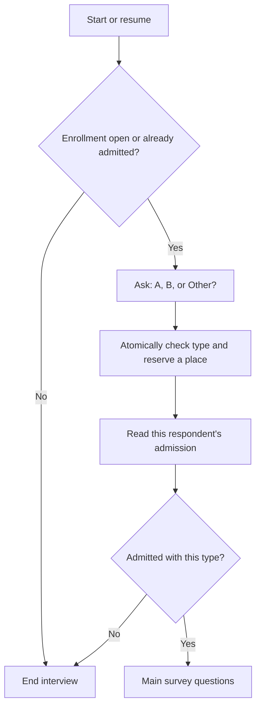

This example admits **10 distinct respondents of type A and 10 of type B**.
The survey asks each respondent their type. Admission reserves a place immediately;
completion does not increment the count again. Other types and eligible types
whose quota is full are screened out before the main questions.

The [Machine definition](https://github.com/expectedparrot/edsl/blob/feature/shared-state-v0/examples/machine_primitives/survey_quota.py)
uses existing general primitives and an empty algorithm registry. The
[survey adapter and local demo](https://github.com/expectedparrot/edsl/blob/feature/shared-state-v0/examples/survey_quota.py)
connect that definition to a multiple-choice screener and ordinary survey stop
rules. No new language operation or registered quota callback is needed.

## What respondents encounter



The enrollment check is a convenience for arrivals after the study fills. It is
not the reservation. Several respondents can all observe an open study at once;
the atomic `screen` command checks the latest state before admitting each one.
The first committed eligible submissions fill each quota. A survey launch or an
earlier read does not establish priority.

If A fills first, new A respondents stop while B respondents can still qualify.
When both quotas fill, new arrivals stop before the screener. Respondents already
admitted retain access to the main survey, including the respondent who took the
last place. A race between the initial check and the screener is harmless: the
atomic admission can still refuse the now-full quota.

## Define and run the survey

From the repository root, with the development package installed:

```bash
python -m examples.survey_quota
```

This runs actual survey branching with 27 local scripted respondents: 12 A,
12 B, and three Other. The test model makes no model calls; scripted answers
simulate respondents answering the screener and main question. Admission is
computed from the Machine, never from a model's judgement.

```json
{
  "admitted": {"A": 10, "B": 10},
  "screened_out": 7,
  "respondents": 27
}
```

Construct or transport the survey:

```python
from edsl import Survey
from examples.survey_quota import build_survey

survey, states = build_survey(quota_a=10, quota_b=10)
restored_survey = Survey.from_dict(survey.to_dict())
```

The returned `states` map identifies the durable study. Every respondent uses
the same `study` scope; creating one scope per respondent would incorrectly
create a separate quota for each person. A fresh map starts a fresh study.
Preserve the serialized survey/map to resume the existing study. Changing limits
on an existing database is a definition mismatch, not a quota-reset mechanism.

## How the Machine reserves places

The state stores one `admissions` map, from stable respondent ID to admitted type,
and an `enrollment_closed` flag for explicit early closure. The map's value type
is `T.choice(["A", "B"])`. Screened-out respondents do not add entries to this
map. Counts are derived, so there is no separately incremented counter to drift:

```python
from edsl.sharedstate import constant, field, input_, reduce_

admissions = field("admissions")
respondent = input_("respondent_id")
group = input_("group")
counts = reduce_("count_by", admissions.values())
limits = constant("limits")  # {"A": 10, "B": 10}
existing = admissions.contains(respondent)
full = (counts.get("A", 0) >= limits.get("A")) & (
    counts.get("B", 0) >= limits.get("B")
)
```

These are expression fragments in `build_machine()`. Its `screen` command
requires text inputs `respondent_id` and `group` and applies these guards in order:

1. Reject a blank ID with `missing_respondent_id`.
2. Reject changing an admitted ID's type with `respondent_type_changed`.
3. For a new ID, reject manual closure with `enrollment_closed`.
4. For a new ID, reject types outside A/B with `ineligible_type`.
5. For a new ID, reject both quotas being full with `quotas_full`.
6. For a new ID, reject its particular quota being full with `type_quota_full`.
7. Insert the ID/type using `put(..., once=True)`.

For example, the per-type check and insertion are general effects:

```python
from edsl.sharedstate import assert_, put, when

admission_effects = (
    when(
        ~existing,
        assert_(counts.get(group, 0) < limits.get(group), code="type_quota_full"),
    ),
    put("admissions", respondent, group, once=True),
)
```

This fragment follows the earlier guards in the complete definition. In
particular, eligibility must be checked before comparing an unknown type's limit.
Assertions read the same pre-command snapshot as insertion and commit atomically.
A refusal rolls back the transition; it does not consume capacity.

A repeated successful ID/type is a no-op, even when quotas subsequently fill or
enrollment closes. The host's operation identity separately makes retries of a
particular write replay its original status/reason. A new operation for the same
admitted ID still cannot reserve another place. An initially screened-out ID is
not locked to its unsuccessful answer; a later eligible attempt can qualify while
places remain. Once admitted, its type cannot change.

`complete_when=full` describes quota completion. It does not itself cancel
interviews. Explicit close sets `enrollment_closed=True` to end recruitment early
without revoking admissions. Neither closure nor completion releases places.

## Connect admission to the screener answer

The adapter creates this respondent-facing question:

```python
from edsl import QuestionMultipleChoice

screen = QuestionMultipleChoice(
    question_name="respondent_type",
    question_text="Which group describes you?",
    question_options=["A", "B", "Other"],
)
```

The host supplies the respondent's stable ID. Their group comes from their
validated answer, not an agent trait in the admission command:

```python
from edsl.sharedstate import current

quota = states.by("study").quota
write = quota.screen(
    respondent_id=current.agent.respondent_id,
    group=screen.answer,
)
```

The Machine view exposes counts and only the current respondent's admission,
using `current_value("respondent_id", "")`. It does not expose the admission
roster. After the write, an explicit read refreshes that view. A `QuestionCompute`
turns it into a survey answer that an ordinary stop rule can use:

```python
from edsl import QuestionCompute, QuestionFreeText, Survey

gate = QuestionCompute(
    question_name="quota_gate",
    question_text=(
        "{{ 'admitted' if shared_state.quota.admitted "
        "and shared_state.quota.your_group == respondent_type.answer "
        "else 'screened_out' }}"
    ),
)
main = QuestionFreeText(
    question_name="experience",
    question_text="What would you most like to improve about your experience?",
)
survey = Survey([screen, write, quota.read(), gate, main])
survey.add_stop_rule(gate, "{{ quota_gate.answer }} != 'admitted'")
```

This smaller fragment shows the essential screen/write/read/branch sequence.
`build_survey()` also puts an enrollment read and computed stop gate before the
screener, preventing new interviews from asking it after closure.

The gate checks the persisted personal admission, not whether the latest global
count is below 10 and not the advisory write acknowledgement's `accepted` flag.
The last admitted respondent must pass even though their admission filled the
quota. Matching the stored type to the answer also prevents a returning admitted
respondent from continuing after changing their type.

The adapter uses current reads. Do not run its admission gate under a schedule
that freezes state reads to a round-start snapshot: that snapshot may predate the
respondent's own admission. The write would still respect capacity, but the gate
could incorrectly screen out someone who just reserved a place.

These are computed routing answers, not eligibility questions for the respondent
to answer. This example verifies the local Runner. Deploying the same mechanism
in a hosted human survey requires server support for the serialized state steps,
computed gates, durable shared study identity, and trusted respondent IDs; a
Mintlify example does not establish that deployment support.

## Tests and deliberate limits

[test_survey_quota.py](https://github.com/expectedparrot/edsl/blob/feature/shared-state-v0/tests/sharedstate/test_survey_quota.py)
checks randomized arrivals against an independent reference, zero/full quotas,
manual closure, same-ID retries, changed types, separate studies, and the privacy
of the projected view. Concurrent tests give all 32 contenders an open snapshot
before their writes and still admit exactly 20, using independent SQLite backend
objects. Reopened databases replay both admitted and refused decisions.

Survey integration tests transport the whole survey through JSON, verify that
screened-out respondents never answer the main question, and verify that later
arrivals stop before the screener. A fresh-process test executes the Machine
without importing its authoring helper.

The quota counts **admissions, not completions**. Abandoned surveys keep their
place; tests preserve that behavior across restart. Reclaiming reservations would
need an explicit expiry/cancellation policy and reliable host events. Stable IDs
must come from the host, not respondent-entered names. The example prevents
counting an ID twice but does not prevent that admitted person from submitting
multiple completed responses. Self-reported types are not externally verified.

The admitted map has at most 20 entries at the default quotas. Event history still
grows with attempts and reads, and each event has the backend's existing storage
and access requirements. The early enrollment check is advisory; correctness
comes from transactional admission and an immutable admission record.

## What this application reveals about composition

The current definition is 8,980 JSON bytes and contains 133 expression occurrences,
with 37 distinct expression trees. The same `count_by` tree appears 11 times.
Assigning it to a Python variable makes authoring shorter but does not introduce a
shared serialized binding. `let` shares work within one expression body, not
across command assertions, views, and completion conditions.

For the deterministic Machine demo, the first successful admission uses 2,398
host budget steps and the twentieth uses 3,883. These numbers include definition
preflight and value checks; they are not milliseconds or a portable gas schedule.
Counts are recomputed from an increasingly large admitted map. The approach is
small and easy to audit for 20 places; large quota systems need profiling and a
choice between shared expressions and explicitly maintained aggregates.

Reproduce measurements for all nine examples:

```bash
python -m examples.machine_primitives.profile_corpus
```

The development profiler reports definition size, repeated expression trees, and
per-transition work from the existing host Budget. It instruments the runtime's
internal accounting without changing the serialized definition or quota policy.
Repeated subtree counts overlap, so they are not a predicted byte saving from
compression. The larger auction and matching examples provide comparison cases:

| Example | JSON bytes | Expression occurrences | Distinct trees | Maximum demo transition budget steps |
| --- | --- | --- | --- | --- |
| Survey quotas | 8,980 | 133 | 37 | 3,883 |
| Deferred acceptance | 13,199 | 190 | 106 | 18,160 |
| Continuous double auction | 17,023 | 256 | 104 | 8,144 |

The occurrence counts include type expressions and nested references. Measurements
cover each example's checked-in demo, not its worst-case input size.

A second gap is the survey adapter: state reads and `QuestionCompute` gates are
needed to bridge a Machine decision to ordinary survey branching. A direct typed
branch on a state view could reduce that glue. Neither reusable serialized
functions nor a bounded runtime trace is introduced here; those remain in
[the composition and debugging checklist](https://github.com/expectedparrot/edsl/issues/2665).
