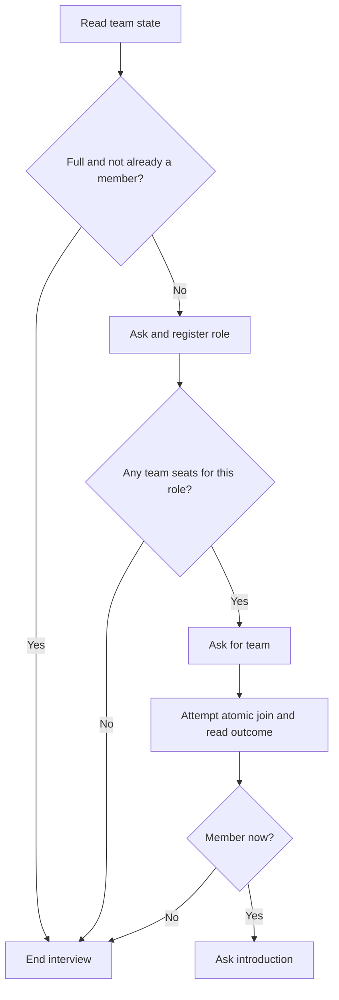

This application combines personal choice with composition constraints. Each
team needs one Designer and two Builders. Respondents choose their role, see only
teams with a seat for it, and join at most one team during a single survey pass.

## Build and run the complete example

Everything needed for this example is defined on this page. Use an EDSL build
that includes the Machine and Runner APIs documented in this manual. Execute the
following four Python blocks in order in one session, or concatenate them into
one script. They require EDSL and the Python standard library; no repository
example modules or external data files are needed. The scripted run makes no
model API calls.

The default eight-person demo fills Orion and Lyra with one Designer and two
Builders each. A third Designer cannot join even while Builder seats remain.
A final excess Builder is screened out before the role question because all
teams are full. All six admitted respondents receive their introduction question.
No model API calls are made.

### 1. Define the Machine

The Machine stores each respondent's role and membership. Eligibility is a
serialized expression over the live role counts, and joining rechecks that capacity.

```python
from edsl.sharedstate import (
    Command,
    Machine,
    StateType,
    require,
    choose,
    constant,
    current_value,
    field,
    filter_items,
    arg,
    local,
    put,
    record,
    assign,
    state_field,
    when,
)

DEFAULT_TEAMS = ("Orion", "Lyra")

DEFAULT_ROLES = {"Designer": 1, "Builder": 2}

def build_machine(teams=DEFAULT_TEAMS, role_seats=None):
    role_seats = dict(DEFAULT_ROLES if role_seats is None else role_seats)
    if isinstance(teams, str):
        raise ValueError("teams must be a sequence")
    teams = list(teams)
    if (
        not teams
        or any(not isinstance(t, str) or not t.strip() for t in teams)
        or len(set(teams)) != len(teams)
    ):
        raise ValueError("teams must be distinct nonempty labels")
    if not role_seats or any(
        not isinstance(k, str) or not k.strip() or type(v) is not int or v < 1
        for k, v in role_seats.items()
    ):
        raise ValueError("roles require nonempty labels and positive integer seats")
    rid, role, team = arg("respondent_id"), arg("role"), arg("team")
    profiles, members = field("profiles"), field("members")

    def eligible(for_role):
        return filter_items(
            constant("teams"),
            item="team",
            predicate=filter_items(
                members.values(),
                item="m",
                predicate=(local("m").get("team") == local("team"))
                & (local("m").get("role") == for_role),
            ).length()
            < constant("role_seats").get(for_role, 0),
        )

    you = current_value("respondent_id", "")
    your_team = members.get(you, {}).get("team")
    return Machine(
        name="TeamFormation",
        constants={
            "teams": teams,
            "role_seats": role_seats,
            "total_seats": len(teams) * sum(role_seats.values()),
        },
        fields={
            "profiles": state_field(StateType.map(StateType.text(), StateType.choice(list(role_seats))), {}),
            "members": state_field(
                StateType.map(
                    StateType.text(),
                    StateType.record(
                        {"team": StateType.choice(teams), "role": StateType.choice(list(role_seats))}
                    ),
                ),
                {},
            ),
            "closed": state_field(StateType.boolean(), False),
        },
        commands={
            "register": Command(
                inputs={"respondent_id": StateType.text(), "role": StateType.choice(list(role_seats))},
                effects=(
                    require(rid.stripped().length() > 0, code="missing_respondent_id"),
                    require(
                        ~profiles.contains(rid) | (profiles.get(rid) == role),
                        code="role_changed",
                    ),
                    when(
                        ~profiles.contains(rid),
                        require(~field("closed"), code="teams_closed"),
                    ),
                    put("profiles", rid, role, once=True),
                ),
            ),
            "join": Command(
                inputs={"respondent_id": StateType.text(), "team": StateType.choice(teams)},
                effects=(
                    require(profiles.contains(rid), code="role_required"),
                    require(
                        ~members.contains(rid)
                        | (members.get(rid, {}).get("team") == team),
                        code="team_changed",
                    ),
                    when(
                        ~members.contains(rid),
                        require(~field("closed"), code="teams_closed"),
                    ),
                    when(
                        ~members.contains(rid),
                        require(
                            eligible(profiles.get(rid)).contains(team), code="role_full"
                        ),
                    ),
                    put(
                        "members",
                        rid,
                        record(team=team, role=profiles.get(rid)),
                        once=True,
                    ),
                ),
            ),
        },
        complete_when=members.length() == constant("total_seats"),
        close_effects=(assign("closed", True),),
        view={
            "options": choose(
                your_team != None,
                [your_team],
                choose(field("closed"), [], eligible(profiles.get(you))),
            ),
            "team": your_team,
            "role": profiles.get(you),
            "members": members.length(),
            "complete": members.length() == constant("total_seats"),
        },
    )
```

### 2. Construct the Survey

These ordinary Survey gates distinguish full enrollment, role-specific
availability, and successful admission. The final admitted member can still finish.

```python
from edsl import (
    Agent,
    AgentList,
    InterviewSchedule,
    Model,
    QuestionCompute,
    QuestionFreeText,
    QuestionMultipleChoice,
    Survey,
)

from edsl.sharedstate import SharedState, SharedStateMap, current

def build_survey(*, state_id=None, teams=DEFAULT_TEAMS, role_seats=None):
    spec = build_machine(teams, role_seats)
    states = SharedStateMap(SharedState(teams=spec), state_id=state_id)
    teams = states.by(current.agent.study_id).teams
    enrollment = QuestionCompute(
        question_name="team_enrollment",
        question_text="{{ 'open' if not shared_state.teams.complete or shared_state.teams.team else 'closed' }}",
    )
    role = QuestionMultipleChoice(
        question_name="role",
        question_text="Which role would you fill?",
        question_options=list(spec.constants["role_seats"]),
    )
    available = QuestionCompute(
        question_name="team_availability",
        question_text="{{ 'open' if shared_state.teams.options and shared_state.teams.role == role.answer else 'closed' }}",
    )
    team = QuestionMultipleChoice(
        question_name="team",
        question_text="Which eligible team would you like to join?",
        question_options="{{ shared_state.teams.options }}",
    )
    joined = QuestionCompute(
        question_name="joined_team",
        question_text="{{ shared_state.teams.team or 'unassigned' }}",
    )
    introduction = QuestionFreeText(
        question_name="introduction",
        question_text="Introduce yourself to team {{ joined_team.answer }}.",
    )
    survey = Survey(
        [
            teams.read(),
            enrollment,
            role,
            teams.register(respondent_id=current.agent.respondent_id, role=role.answer),
            teams.read(),
            available,
            team,
            teams.join(respondent_id=current.agent.respondent_id, team=team.answer),
            teams.read(),
            joined,
            introduction,
        ]
    )
    survey.add_stop_rule(enrollment, "{{ team_enrollment.answer }} != 'open'")
    survey.add_stop_rule(available, "{{ team_availability.answer }} != 'open'")
    survey.add_stop_rule(joined, "{{ joined_team.answer }} == 'unassigned'")
    return survey, states, InterviewSchedule.grouped_round_robin("study_id", "turn")
```

### 3. Define the scripted respondents

The population has three Designers followed by five Builders. Each agent
chooses the first eligible team and supplies an introduction if admitted.

```python
def demo_answer(self, question, scenario):
    if question.question_name == "role":
        return self.traits["role"]
    if question.question_name == "team":
        return question.question_options[0]
    return "Happy to join."

def demo_agents():
    agents = AgentList()
    for i, role in enumerate(["Designer"] * 3 + ["Builder"] * 5):
        agent = Agent(
            traits={
                "respondent_id": f"R{i}",
                "study_id": "study",
                "turn": i,
                "role": role,
            }
        )
        agent.add_direct_question_answering_method(demo_answer)
        agents.append(agent)
    return agents
```

### 4. Run and inspect the answers

`Model("test")` supplies the Jobs model dimension. The agents above answer locally,
and `QuestionCompute` evaluates the routing gates without a model call.

```python
from edsl import Model
from edsl.runner import Runner

survey, states, schedule = build_survey(
    teams=["Orion", "Lyra"], role_seats={"Designer": 1, "Builder": 2}
)
results = Runner(interview_schedule=schedule).submit(
    survey.by(demo_agents()).by(Model("test")), cache=False
).results()
assert not results.has_unfixed_exceptions
print(results.select("answer.role", "answer.joined_team", "answer.introduction").to_list())
```

## Watch the roles fill, respondent by respondent

The follow-up Python blocks use the definitions and Results created above.
In this scripted population, the first three respondents choose Designer and the next
five would choose Builder. Everyone selects the first team they are shown.

| Respondent | Role answer | Teams actually shown | Joined | What happened next |
| --- | --- | --- | --- | --- |
| R0 | Designer | Orion, Lyra | Orion | Introduction answered |
| R1 | Designer | Lyra | Lyra | Introduction answered |
| R2 | Designer | Not asked | — | No Designer seat remains |
| R3 | Builder | Orion, Lyra | Orion | Introduction answered |
| R4 | Builder | Orion, Lyra | Orion | Introduction answered |
| R5 | Builder | Lyra | Lyra | Introduction answered |
| R6 | Builder | Lyra | Lyra | Introduction answered |
| R7 | Not asked | Not asked | — | All teams full at entry |

R2 encounters a closed **role**, not a full study: four Builder seats are still
open. R3 can therefore join Orion. R4 still sees both teams because Orion has
one Builder seat left; only after R4 joins does Orion disappear for later Builders.

R6 takes the final seat and still receives the introduction question. R7 stops
before being asked a role. These are two different stop points in the same Survey.



### Check the last seat and the two screened-out respondents

```python
rows = {r.agent.traits["respondent_id"]: r for r in results}
assert rows["R1"].get_question_options("team") == ["Lyra"]
assert rows["R4"].get_question_options("team") == ["Orion", "Lyra"]
assert rows["R2"].answer["role"] == "Designer"
assert rows["R2"].answer["team"] is None
assert rows["R6"].answer["joined_team"] == "Lyra"
assert rows["R6"].answer["introduction"] == "Happy to join."
assert rows["R7"].answer["role"] is None

last_join = [
    event for event in results.shared_state["bindings"][0]["events"]
    if event["kind"] == "write" and event["command"] == "join"
][-1]
members = last_join["state"]["teams"]["members"]
assert len(members) == 6
assert members["R6"] == {"team": "Lyra", "role": "Builder"}
```

The admitted membership and the completed introduction are separate facts.
Inspecting only the membership count would miss a routing mistake that stopped
R6's interview immediately after admission.

## Machine policy

A study scope stores two maps: `profiles` records one role per respondent, and
`members` records their chosen team and role. Each configured role has the same
positive seat count in every configured team.

| Command | Behavior |
| --- | --- |
| `register(respondent_id, role)` | Records the first role; identical retries are no-ops and changes reject. |
| `join(respondent_id, team)` | Requires a profile and an available seat for that role, then saves membership atomically. |
| Close | Blocks new registrations and memberships while preserving valid retries. |

The view derives available team IDs by counting members with the respondent's
role in each team. An existing member sees their own team even when it is full.
A respondent with no profile sees no eligible options. A new join rechecks live
capacity; an earlier view is not an admission guarantee. Concurrent attempts for
the last role seat cannot overfill it.

Membership is immutable. A changed team or role is rejected rather than silently
moving someone. Completion means that all configured role seats across all teams
are filled. Lacking applicants for one role can therefore leave the study
incomplete even when many other applicants have been screened out.

## Survey routing

The adapter uses ordinary reads, computed gates, and Survey stop rules:

1. Stop new respondents at entry if all teams are full; let existing members resume.
2. Ask and register the role, then read role-specific availability.
3. Stop if there are no options or the reported role conflicts with a saved profile.
4. Ask for a team and attempt the atomic join.
5. Read the outcome; only an admitted member receives the introduction question.

The grouped schedule serializes the demo but does **not** use a schedule-wide
`stop_when=teams.is_complete()` rule. Such a condition can become true immediately
after the last join and suppress that member's remaining questions. The entry
gate prevents new admissions while allowing the last member to finish. This
behavior has a dedicated end-to-end regression test and illustrates the difference
between closing enrollment and stopping all remaining tasks.

A race can invalidate a displayed option. The post-join gate stops the losing
interview; this adapter does not implement a reselection loop. Results preserves
the options actually shown, so a rejected join can still be audited against its
[read-version-linked presentation](/en/latest/shared-state/scopes-and-surveys#which-options-did-this-respondent-see).

## Try a population with no Builders

Population exhaustion is different from Machine completion. Reuse the adapter
with only the first three scripted respondents, all Designers, and a fresh state
map:

```python
from edsl import AgentList

small_survey, _, small_schedule = build_survey()
designers = AgentList(list(demo_agents())[:3])
small_results = Runner(interview_schedule=small_schedule).submit(
    small_survey.by(designers).by(Model("test")), cache=False
).results()
assert sum(r.answer.get("introduction") is not None for r in small_results) == 2
assert all(r.answer.get("role") == "Designer" for r in small_results)

last_read = [
    event for event in small_results.shared_state["bindings"][0]["events"]
    if event["kind"] == "read"
][-1]
assert last_read["value"]["members"] == 2
assert last_read["value"]["complete"] is False
```

The run ends because there are no more respondents. Each team has its Designer
and still needs two Builders. The Machine does not lower the role requirements,
move a Designer into a Builder seat, or declare completion to accommodate the
available pool. Those would be additional policies to specify explicitly.

## Tests and design findings

The [application tests](https://github.com/expectedparrot/edsl/blob/feature/shared-state-v0/tests/sharedstate/test_survey_applications.py)
cover role exhaustion with other seats still available, immutable profiles and
teams, missing roles, explicit close, competing joins, SQLite restart/replay,
isolated scopes, fresh-process serialization, changed reports across jobs,
actual displayed choices, and completion of the final admitted interview.

This example enforces role composition, not skill verification or interpersonal
compatibility. The host supplies stable identities and authenticates actions;
self-reported roles are accepted as given. There is no departure/replacement
policy, waitlist, automatic relaxation of missing roles, or global matching
objective. Those are distinct mechanisms to specify before extending the example.

The definition is 10,516 JSON bytes; its six-member corpus replay peaks at 5,581
host budget steps per transition. The profiler reproduces these development
measurements, which do not establish hosted human-survey support or a portable
execution-cost bound.
