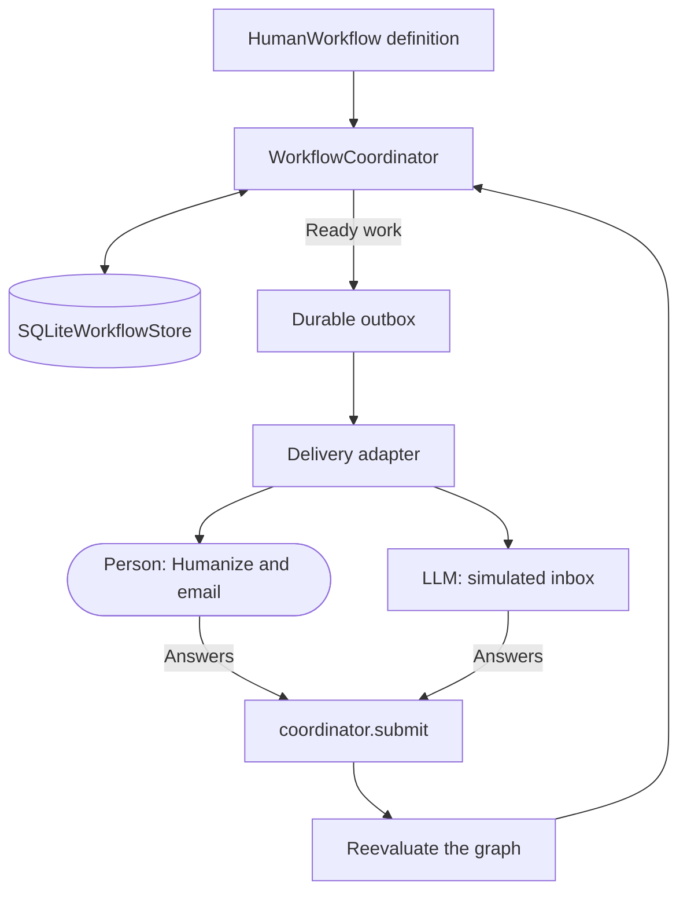

<Note>
This is the canonical workflow manual. The API is experimental. Read the [execution contracts](/en/latest/coordinated-research/execution-contracts) for current persistence, visibility, and compatibility guarantees.
</Note>

## Purpose and scope

An EDSL workflow coordinates work performed by people, language-model agents, or
a mixture of both. It decides who receives each task, when a task becomes
available, which earlier answers it may observe, how results are combined, and
what happens after failures or restarts.

The workflow layer is deliberately separate from delivery. Humanize can create
private surveys, send invitations, and collect responses. A simulated inbox can
deliver the same work to EDSL agents. The workflow coordinator remains the
authority that decides what becomes ready next.

This manual describes the implementation in `edsl.workflows`. It covers:

* dependency graphs and work-item lifecycles;
* participant selection, fan-out, and fan-in;
* typed answer, output, and submission references;
* serializable conditions and deterministic derived values;
* bounded repeat blocks;
* visibility and anonymity boundaries;
* shared-state reads and writes;
* human delivery and LLM simulation;
* durable retries, leases, and process recovery;
* SQLite persistence and DAG visualization; and
* reusable design patterns and current limitations.

The workflow API is experimental. The serialized form and behavior described
here are the current implementation, not a promise of permanent compatibility.
The detailed recovery, visibility, and migration guarantees are documented in
[Workflow and shared-state execution contracts](/en/latest/coordinated-research/execution-contracts).

## The central idea

A workflow turns a declarative graph into durable, respondent-specific work:



The key invariant is:

> Delivery systems do not decide workflow order. They deliver ready work and
> return answers. Only the coordinator evaluates dependencies and conditions.

This separation allows the same definition to run with real respondents during
fieldwork and with LLM respondents during design, testing, and stress analysis.

### Who performs the work?

The workflow definition says who is eligible for a step by selecting a
participant role. It does **not** currently say whether that participant is a
person or an LLM. That choice belongs to execution:

| Execution path | Performer | Mechanism |
|---|---|---|
| Human fieldwork | **PERSON** | A Humanize delivery adapter emails a private survey and imports the response. |
| Simulation | **LLM** | `WorkflowSimulation` opens ready items and an `EDSLAgentAnswerer` runs their surveys with a model. |
| Deterministic test | **SCRIPT** | A scripted answerer supplies known responses without a person or model. |

This neutrality is useful: one serialized protocol can be rehearsed with LLMs
and later deployed unchanged to people. It also means that diagrams in this
manual mark the **execution path**, not a property embedded in `HumanStep`.
Diagrams label human and simulated respondents explicitly.

Performer routing is declared separately from the scientific workflow:

```python
from edsl.workflows import ExecutionPlan, human, llm, role

plan = (
    ExecutionPlan()
    .bind(role("field-researcher"), human(channel="humanize-email"))
    .bind(role("coder"), llm(model_policy="research-coder"))
)
```

The plan round-trips through `to_dict()` and `from_dict()`, requires exactly one
matching binding per participant, and lets `WorkflowSimulation` select distinct
answerers by executor kind. Production still needs an adapter registry that
dispatches the human bindings to Humanize and persists the resolved executor on
each attempt. Step metadata may describe the intended performer for diagrams,
but it is not the routing authority.

### Waiting for optional work

Normal `after=` dependencies propagate a predecessor's skip. Use
`after_settled=` when a downstream step must wait for optional work but should
still run if that work is skipped:

```python
builder.step(
    "draft-report",
    report_survey,
    assigned_to=role("report-writer"),
    after_settled=human_adjudication,
)
```

Both dependency modes wait for the predecessor to settle under its completion
policy, including accepted responses still `committing`. A successful quorum
supersedes outstanding unaccepted assignments; it is not a branch skip. Only
`after=` propagates a genuine predecessor skip to the consumer.

## A first workflow

Suppose one person proposes a weekend activity and a second person approves it.

```python
from edsl import Agent, QuestionFreeText, QuestionYesNo, Survey
from edsl.workflows import Workflow, role

builder = Workflow("Weekend activity approval")

activity = QuestionFreeText(
    question_name="activity",
    question_text="Suggest a weekend activity.",
)
proposal = builder.step(
    "propose",
    Survey([activity]),
    assigned_to=role("proposer"),
)

approved = QuestionYesNo(
    question_name="approved",
    question_text=(
        "The proposed activity is "
        f"{proposal.answer(activity).template}. Do you approve?"
    ),
)
builder.step(
    "approve",
    Survey([approved]),
    assigned_to=role("approver"),
    after=proposal,
)

workflow = builder.compile()
```

The second task is not merely listed after the first in Python. Its serialized
definition contains an explicit dependency on `propose`. The question also
contains a typed reference to the proposal answer.

Participants are ordinary EDSL agents whose traits determine their roles:

```python
participants = [
    Agent(
        name="proposer@example.com",
        traits={"role": "proposer", "email": "proposer@example.com"},
    ),
    Agent(
        name="approver@example.com",
        traits={"role": "approver", "email": "approver@example.com"},
    ),
]
```


## Launch and complete work

Use a SQLite store for durable local execution. A stable scientific seed makes
workflow chance expressions reproducible independently of the generated
instance ID.

```python
from edsl.workflows import SQLiteWorkflowStore, WorkflowCoordinator

store = SQLiteWorkflowStore("weekend-workflow.sqlite")
coordinator = WorkflowCoordinator(workflow, store)
instance_id = coordinator.launch(participants, random_seed="pilot-1")

proposal_item = store.items(instance_id, step_name="propose")[0]
coordinator.open(proposal_item["id"])
coordinator.submit(
    proposal_item["id"],
    {"activity": "Hiking"},
    idempotency_key=f"response:{proposal_item['id']}",
)

approval_item = store.items(instance_id, step_name="approve")[0]
opened = coordinator.open(approval_item["id"])
assert "Hiking" in opened.survey.questions[0].question_text
coordinator.submit(
    approval_item["id"],
    {"approved": "Yes"},
    idempotency_key=f"response:{approval_item['id']}",
)
```

An idempotency key identifies one immutable response. Repeating the same
submission is safe; reusing the key with different content is an error.

Inspect the completed instance and its assignments:

```python
assert store.instance_status(instance_id) == "completed"
print([(item["step_name"], item["status"]) for item in store.items(instance_id)])
# [('propose', 'completed'), ('approve', 'completed')]
```

This walkthrough submits scripted answers locally; it makes no model or Humanize
calls. Each `launch()` creates a new instance. The response keys include the work
item ID, so rerunning the walkthrough in the same database is safe. To continue
an existing instance after a restart, save its `instance_id`, reopen the same
store, and [restore and recover](/en/latest/workflows/recovery-and-portability)
instead of calling `launch()` again.

## Manual chapters

- [Lifecycle, assignment, and dependencies](/en/latest/workflows/lifecycle-and-assignment) — Understand definitions, instances, work items, participant selection, fan-out, and fan-in.
- [References, conditions, and quorum](/en/latest/workflows/references-and-conditions) — Pass answers between steps, compose conditions, and set completion policies.
- [Derived values and economic settlement](/en/latest/workflows/derived-values) — Compute deterministic aggregates, allocations, and payoffs within a serialized workflow.
- [Response contracts and repetition](/en/latest/workflows/response-contracts-and-repetition) — Validate structured answers and build bounded revision or repeated-game loops.
- [Visibility and shared state](/en/latest/workflows/visibility-and-shared-state) — Control respondent observations and integrate explicit shared-state reads and effects.
- [Persistence, delivery, and simulation](/en/latest/workflows/persistence-and-delivery) — Persist work in SQLite and deliver it through the outbox, Humanize, or simulated respondents.
- [Recovery and portability](/en/latest/workflows/recovery-and-portability) — Recover durable attempts, manage leases and retries, and serialize workflow definitions.
- [Workflow patterns and testing](/en/latest/workflows/patterns-and-testing) — Inspect audit evidence and develop protocols using reusable patterns and deterministic tests.
- [API reference and limitations](/en/latest/workflows/reference-and-limitations) — Review the compact API, implementation boundaries, and responsibility model.
