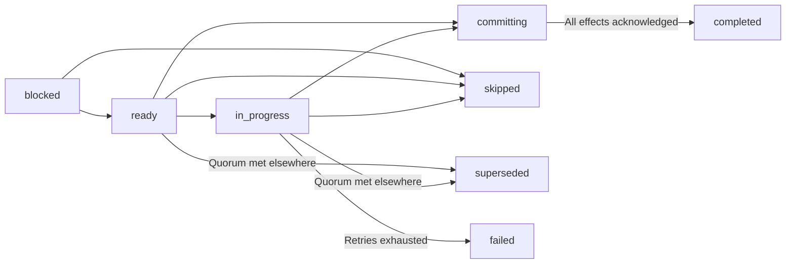

This chapter continues the [workflow manual](/en/latest/workflows).

## Definitions, instances, steps, and work items

Four terms should remain distinct.

### Workflow definition

A `HumanWorkflow` is treated as immutable, serializable data. Construction and
coordinator binding detach it from mutable authoring objects. It contains steps,
metadata, derived-value declarations, and repeat-block declarations. It does not
contain a database connection, model client, active respondent, or Python
callback.

### Workflow instance

Launching a definition creates one instance with a unique identifier, a saved
copy of the definition, a participant roster, and an execution status.

```python
store = SQLiteWorkflowStore("workflow.sqlite")
coordinator = WorkflowCoordinator(workflow, store)
instance_id = coordinator.launch(participants)
```

### Step

A `HumanStep` describes one kind of task: its survey, assignee selector,
dependencies, enable condition, completion policy, visibility, and optional
shared-state operations.

### Work item

A work item is the assignment of one step to one participant in one instance.
If a step selects six experts, launch creates six work items. The step is the
graph node in the definition; the work items are its respondent-specific
realizations.

## Work-item lifecycle

The normal lifecycle is:



**`blocked`**: The dependencies have not reached terminal states.

**`ready`**: Dependencies are terminal and the enable condition is true. A durable outbox
  record exists for delivery.

**`in_progress`**: The survey was opened or an execution attempt acquired a lease.

**`committing`**: An immutable response and its effects have been accepted. Recovery finishes
  those effects without asking the respondent or model for another answer.

**`completed`**: The accepted answer and all of its state effects have completed.

**`skipped`**: A dependency was skipped, a condition evaluated false, or a repeat terminated
  before this iteration.

**`superseded`**: Quorum succeeded before this assignment accepted a response. This does not
  propagate a branch skip to ordinary downstream dependencies.

**`failed`**: The configured retry budget was exhausted or an error was classified as
  non-retryable.

A dependency is settled when all of its work items are `completed`, `skipped`,
or `superseded`. A failed item instead fails its workflow instance. Accepted `committing` responses finish their effects before a step settles.

## Participant selection and fan-out

`role(name)` constructs an exact trait selector:

```python
review = builder.step(
    "review",
    review_survey,
    assigned_to=role("reviewer"),
)
```

Every participant with `traits["role"] == "reviewer"` receives an independent
work item. This is fan-out.

The underlying selector can match several traits:

```python
from edsl.workflows import ParticipantSelector

senior_economists = ParticipantSelector(
    {"role": "reviewer", "discipline": "economics", "seniority": "senior"}
)
```

Matching is exact and conjunctive. There is not yet an expression language for
inequalities, membership, or arbitrary roster queries.

Every step must match at least one participant at launch. Duplicate participant
names are rejected because the name is the durable participant identifier.

## Dependencies and fan-in

Pass a step handle through `after`:

```python
draft = builder.step("draft", draft_survey, assigned_to=role("author"))
review = builder.step(
    "review",
    review_survey,
    assigned_to=role("reviewer"),
    after=draft,
)
```

Multiple prerequisites form an AND dependency:

```python
builder.step(
    "release",
    release_survey,
    assigned_to=role("publisher"),
    after=(legal_review, technical_review),
)
```

When a dependency has many assigned participants, the dependent step waits for
the dependency's completion policy. The default is all assigned participants.
This produces fan-in without a separate join node.

Conditions automatically add the steps they reference to `after`. Explicit
`after` declarations are still recommended when they explain the graph.
