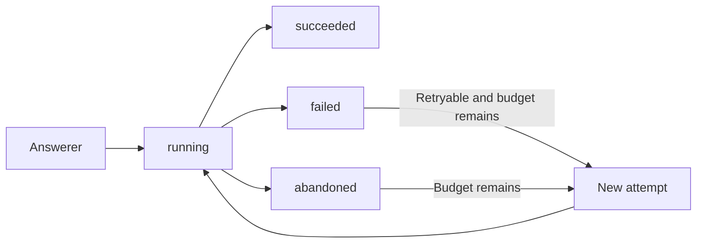

This chapter continues the [workflow manual](/en/latest/workflows).

## Durable attempts and recovery

Remote inference and external delivery fail in several distinguishable places:
submission, model execution, result retrieval, process shutdown, and network
timeout. A durable workflow must resume rather than restart completed work.

Configure simulation recovery with `RetryPolicy`:

```python
from edsl.workflows import RetryPolicy

simulation.run(
    instance_id,
    resume=True,
    retry_policy=RetryPolicy(
        max_attempts=3,
        lease_seconds=300,
        retryable=("remote_error", "timeout", "exception"),
    ),
)
```

### Attempt lifecycle

Before an answerer runs, the store creates a numbered attempt with a lease:



Every attempt records its start, lease expiration, finish, status, error kind,
and a bounded error message.

### Leases

A lease prevents two healthy workers from claiming the same in-progress item.
If the process disappears, another process can reclaim the item after the lease
expires. Recovery marks the old attempt `abandoned` with
`error_kind="lease_expired"` before scheduling the next attempt.

Choose a lease comfortably longer than ordinary answer latency. Automatic lease
heartbeats are not yet implemented.

### Error classification

The simulator currently classifies:

**`timeout`**: Python `TimeoutError`.

**`remote_error`**: Exception type identities containing `remote` or `coop`.

**`exception`**: Other exceptions.

Only listed classes are retried. Classification is intentionally conservative
and should eventually become a typed exception protocol rather than a naming
heuristic.

### Retry exhaustion

After `max_attempts`, the item becomes `failed` and the workflow instance becomes
`failed`. The simulator raises a `RuntimeError` naming the failed steps. Failed
instances do not silently masquerade as completed runs.

### Restarting in a fresh process

Restore the pinned definition and coordinator, then resume against the same file:

```python
store = SQLiteWorkflowStore("workflow.sqlite")
coordinator = WorkflowCoordinator.restore(
    instance_id, store, state_backends=state_backends
)
simulation = WorkflowSimulation(coordinator, agents, answerer)
simulation.run(instance_id, resume=True, retry_policy=policy)
```

Recovery first finishes accepted `committing` responses without another answerer
call. It then requeues:

* ready items whose earlier delivery record is no longer pending;
* in-progress items with no active attempt; and
* items whose running attempt lease expired.

It does not reclaim an item with an unexpired lease.

## Serialization and portability

Round-trip a workflow with:

```python
payload = workflow.to_dict()
restored = HumanWorkflow.from_dict(payload)
assert restored.to_dict() == payload
```

The serialized object includes:

```json
{
  "type": "human_workflow",
  "version": 2,
  "name": "Example",
  "steps": [],
  "metadata": {},
  "derived_values": [],
  "repeat_blocks": []
}
```

Surveys, selectors, conditions, completion policies, visibility selectors,
state reads and writes, derived expressions, and repeat declarations all
round-trip as data.

Execution policy such as a `RetryPolicy` is separately serializable but is not
currently embedded in `HumanWorkflow`. This lets one deployment use a different
operational retry budget without changing the research design.
The saved workflow definition must match when resuming. Version-1 definition
files can be imported for a new run, but existing version-1 instances require an
explicit migration or a new instance; they are not silently upgraded.
