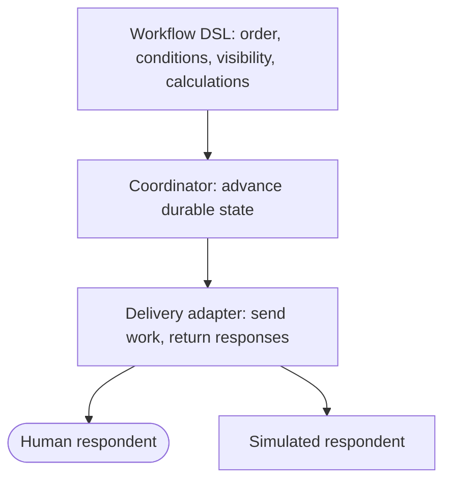

This chapter continues the [workflow manual](/en/latest/workflows).

## Current limitations

The following are important but not yet first-class:

* runtime or unbounded repeat materialization;
* lease heartbeat and active renewal;
* a typed provider-error protocol;
* provider-side recall or invalidation of already delivered external work after
  quorum or branch supersession (local work items are canceled);
* deadlines, reminders, priorities, and escalation schedules;
* explicit anonymous-panel and pseudonym policies;
* general-purpose projection and declassification policies beyond the supported
  participant submission and own-derived-value views;
* persisted snapshots of every derived value and condition evaluation;
* weighted quorum and richer participant selectors;
* deterministic quantiles, variance, standard deviation, and frequency tables;
* one `on_termination` step for every possible repeat exit; and
* transactional atomicity spanning workflow and separate shared-state databases.

These limitations are design boundaries, not invitations to hide behavior in
Python callbacks or LLM prompts. New capabilities should extend the serializable
DSL and coordinator evaluator.

## Compact API reference

### Authoring

```python
Workflow(name, metadata=None)
builder.step(name, survey, assigned_to=..., after=..., when=...,
             completion=..., visible_to=..., reads=..., writes=..., metadata=...)
builder.derive(name, **workflow_expressions)
builder.repeat(name, min_iterations=1, max_iterations=N,
               build=authoring_callback, after=None)
builder.compile() -> HumanWorkflow
```

### Selectors and policies

```python
role(name)
ParticipantSelector(mapping)
all_assigned()
quorum(count)
```

### Conditions

```python
answer.equals(value)
step.completed
all_of(*conditions)
any_of(*conditions)
not_(condition)
if_(condition)
chance(probability, key=stable_key)
seeded_uniform(low=0, high=1, key=stable_key)  # expression, not a condition
seeded_integer(low, high, key=stable_key)       # inclusive expression draw
outputs.count(value).at_least(count)
outputs.has_disagreement
outputs.majority_is(value)
outputs.range_at_most(maximum)
derived_field.at_most(value)
derived_field.at_least(value)
derived_field.equals(value)
```

### Execution

```python
SQLiteWorkflowStore(path)
WorkflowCoordinator(workflow, store, state_backends=None)
coordinator.launch(participants, instance_id=None)
WorkflowCoordinator.restore(instance_id, store, state_backends=None)
coordinator.recover(instance_id, max_attempts=1)
coordinator.open(work_item_id)
coordinator.submit(work_item_id, answers, idempotency_key=...)
OutboxDispatcher(store, adapter).dispatch()
WorkflowSimulation(coordinator, agents, answerer).run(
    instance_id,
    resume=False,
    retry_policy=RetryPolicy(),
)
```

### Inspection

```python
store.items(instance_id)
store.item_answers(work_item_id)
store.step_answers(instance_id, step_name)
store.events(instance_id)
store.attempts(work_item_id)
WorkflowDAGVisualization(coordinator, instance_id).save(path)
```

## Closing principle

A trustworthy workflow keeps four responsibilities separate:



When arithmetic, routing, retries, or confidentiality matter, they belong in
the first two layers. Human and LLM respondents should receive well-defined
work, not responsibility for enforcing the protocol that assigned it.
