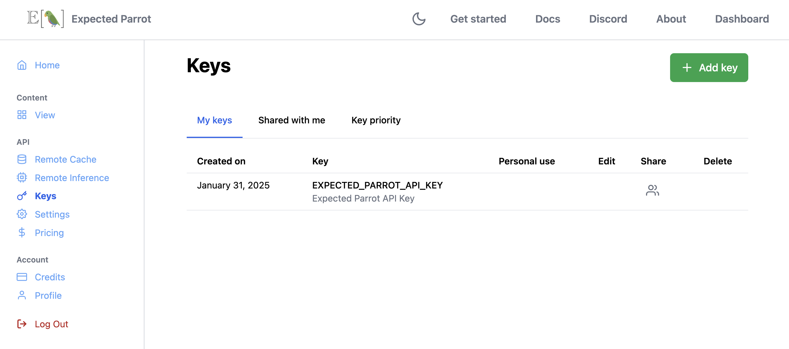
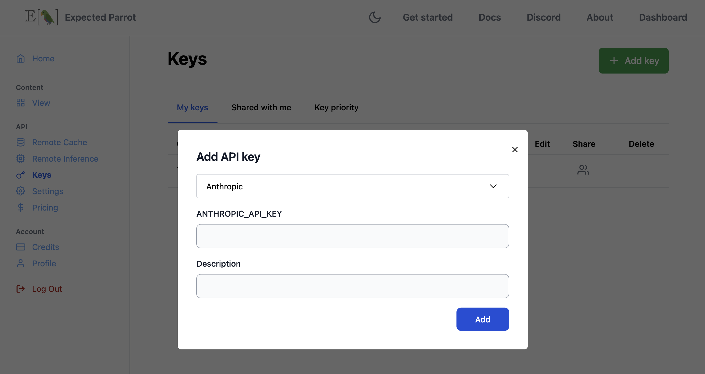

Getting Started
===============

To use EDSL, you need to install the package and choose how you want to access language models.
Please see links to sections below for more details on each step.

1. Installation
---------------
   
Run the following command to install the EDSL package:

.. code:: 

   pip show edsl

If you have previously installed EDSL, you can update it with the following command:

.. code:: 

   pip install --upgrade edsl

See :ref:`installation` instructions for more details and troubleshooting tips. 
If you are using EDSL with Google Colab, see the :ref:`colab_setup` section for special instructions.

2. Create an account
--------------------

`Log in / Sign up <https://www.expectedparrot.com/login>`_ with an email address.
Your account lets you access the Expected Parrot server to run surveys, use remote caching and collaborate with other users.
Enjoy free storage and credits for running surveys, and special features and tools.

See the `Coop <https://docs.expectedparrot.com/en/latest/coop.html>`_ section for more details on using the Expected Parrot platform to create and share projects, and the :ref:`remote_inference` and :ref:`remote_caching` sections for more details on account features for running surveys and storing results at the Expected Parrot server.

3. Manage API keys for language models
--------------------------------------

EDSL works with hundreds of language models of popular service providers, including Anthropic, Azure, Bedrock, DeepInfra, DeepSeek, Google, Mistral, OpenAI, Perplexity and Together.
Your account comes with an **Expected Parrot API key** that lets you run surveys with all available models at the Expected Parrot server and access a free universal cache of stored responses.

If you have your own keys from service providers you can add them to your `Keys <https://www.expectedparrot.com/home/keys>`_ page and choose whether to provide access to other users and prioritizing them to use with your surveys:

.. raw:: html

      

.. raw:: html

    

Using your own keys does not require credits; service providers will bill you directly for your usage.
See the :ref:`api_keys` section for more details and options for managing keys.

4. Choose where to run surveys
------------------------------

You can use EDSL to run surveys locally on your own machine or remotely at the Expected Parrot server.
To activate remote inference and caching for your surveys and results, navigate to the `Settings <https://www.expectedparrot.com/home/settings>`_ page of your account and toggle on *remote inference*:

.. raw:: html

    

To run surveys locally you must provide your own keys from service providers.

See the :ref:`remote_inference` and :ref:`remote_caching` sections for details on using remote inference and caching.

5. Run a survey
---------------

Read the :ref:`starter_tutorial` and `download a notebook <https://www.expectedparrot.com/content/179b3a78-2505-4568-acd9-c09d18953288>`_ to create a survey and run it.
See examples for many other use cases and `tips <https://docs.expectedparrot.com/en/latest/checklist.html>`_ on using EDSL effectively in the documentation.

Support
-------

If you have any questions or need help, please send a message to `info@expectedparrot.com`.
You can also `open at issue at GitHub <https://github.com/expectedparrot/edsl/issues/new?template=Blank+issue>`_ to report bugs or request new features.

Please also join our `Discord channel <https://discord.com/invite/mxAYkjfy9m>`_ to ask questions and chat with other users!
