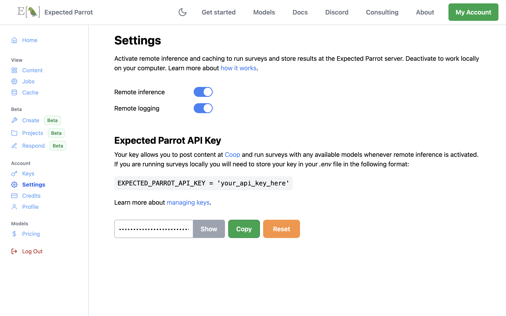

Getting Started
===============

To use EDSL, you need to install the package and choose how to access language models.
Please see links to sections below for more details on each step.

1. Installation
---------------
   
Run the following command to install the EDSL package:

.. code:: 

   pip show edsl

You can also use `uv` for a faster installation:

.. code:: 

   !pip install uv && uv pip install edsl
   
   
If you have previously installed EDSL, you can update it with the following command:

.. code:: 

   pip install --upgrade edsl

You can also access the source code at `GitHub <https://github.com/expectedparrot/edsl>`_. If you are using EDSL with Google Colab, see the :ref:`colab_setup` section for special instructions.

See :ref:`installation` instructions for more details and troubleshooting tips. 

2. Create an account
--------------------

`Sign up <https://www.expectedparrot.com/login>`_ for a free account with your email address.
This allows you to run surveys at the Expected Parrot server and collaborate with other users at Coop.
Your account comes with $25 in credits for running surveys with any available models.

3. Choose where to run surveys
------------------------------

You can use EDSL to run surveys locally on your own machine or remotely at the Expected Parrot server.
To activate remote inference, navigate to the `Settings <https://www.expectedparrot.com/home/settings>`_ page of your account and toggle on *remote inference*:

.. raw:: html

    

This allows you to use remote caching features and automatically store all your survey results.
See the :ref:`remote_inference` and :ref:`remote_caching` sections for details.

To run surveys locally you must provide your own keys from service providers.
See the next step below for details.

4. Manage API keys for language models
--------------------------------------

API keys are required to run surveys with language models.
EDSL works with many language models from popular service providers, including Anthropic, Azure, Bedrock, DeepInfra, DeepSeek, Google, Mistral, OpenAI, Perplexity, Together and Xai.
Current model pricing and performance information is available `here <https://www.expectedparrot.com/getting-started/coop-pricing>`_.

When you run a survey you can choose whether to use your own keys from service providers and/or an **Expected Parrot API key** to access all available models at once.
There are several ways to manage your keys:

* Manage keys at your Coop account (*recommended*)

* Store keys in a `.env` file on your computer

* Store keys directly in your EDSL code (*not recommended for security reasons*)

If you have your own keys from service providers you can add them to your `Keys <https://www.expectedparrot.com/home/keys>`_ page.
You can also choose whether to grant access to other users and set usage limits:

.. image:: static/home-keys.png
   :alt: Keys page view showing stored keys
   :align: center
   :width: 100%

.. raw:: html

      

.. image:: static/home-keys-add-key.png
   :alt: Keys page view for adding a key
   :width: 100%

.. raw:: html

    

If you are running surveys locally, or only want to post and retrieve content at Coop without running your surveys remotely, you can store your keys in a `.env` file on your computer.
This file should be in the same directory as your EDSL code and contain the following lines:

.. code:: 

   EXPECTED_PARROT_API_KEY=your_expected_parrot_key # required for remote inference and caching and posting content at Coop

   ANTHROPIC_API_KEY=your_anthropic_key
   GOOGLE_API_KEY=your_google_key
   OPENAI_API_KEY=your_openai_key
   
   # etc.

See the :ref:`api_keys` section for details on this method of managing keys.

Note that if you use your own keys, you will be charged directly by the service provider for API calls.
If you use your Expected Parrot API key, :ref:`credits` are deducted from your account based on the model and number of tokens used in the survey.

5. Run a survey
---------------

Read the :ref:`starter_tutorial` and `download a notebook <https://www.expectedparrot.com/content/179b3a78-2505-4568-acd9-c09d18953288>`_ to create a survey and run it.
See examples for many other use cases and `tips <https://docs.expectedparrot.com/en/latest/checklist.html>`_ on using EDSL effectively in the documentation.

Support
-------

If you have any questions or need help, please send a message to `info@expectedparrot.com`.
You can also `open at issue at GitHub <https://github.com/expectedparrot/edsl/issues/new?template=Blank+issue>`_ to report bugs or request new features.

Please also join our `Discord channel <https://discord.com/invite/mxAYkjfy9m>`_ to ask questions and chat with other users!
