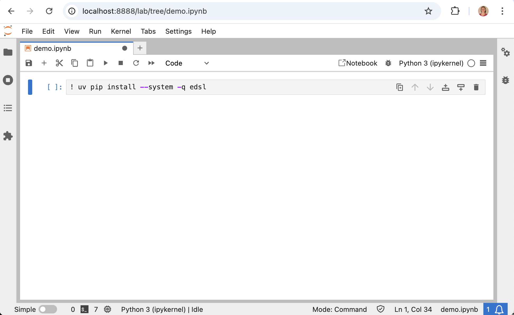
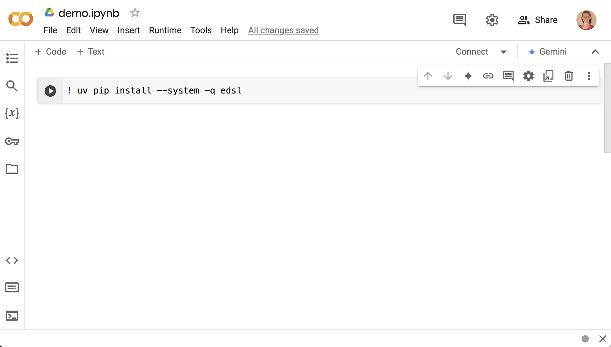

.. _installation:

Installation
============

EDSL is an open-source Python library. 
It is compatible with Python 3.9 - 3.12 and available at `PyPI <https://pypi.org/project/edsl/>`_ and `GitHub <https://github.com/expectedparrot/edsl>`_.

.. note::

    EDSL is in development. 
    We recommend that you continually check for and install the latest version of EDSL to access the most recent features and bug fixes.

Prerequisites
-------------

Please ensure that Python is installed on your system before you install EDSL. 
You can download Python from the `official website <https://www.python.org/downloads/>`_.

You can use `pip <https://pip.pypa.io/en/stable/installation/>`_ to install EDSL on your system (a package installer for Python).

Quickstart Installation
-----------------------

Open your terminal and verify that you have not previously installed EDSL by running the following command:

.. code:: 

    pip show edsl

You can also use `uv` for a faster installation:

.. code:: 

    !pip install uv && uv pip install edsl

If EDSL is already installed, you will see the following output, including the actual version number:

.. code:: 

    Name: edsl
    Version: 0.1.###
    ...

If EDSL is not installed (`WARNING: Package(s) not found: edsl`), you can run either of the following commands to install the latest version using pip:

.. code::  

    pip install edsl

Or:

.. code:: 

    ! uv pip install --system -q edsl

This is how the code looks in a Jupyter notebook and in Colab:

Installing from source
----------------------

If you want to install EDSL from source, you can clone the repository from GitHub:

.. code:: 

    pip install git+https://github.com/expectedparrot/edsl.git@main

This allows you to pull the latest changes from the repository (which may not be in the latest version available at PyPI) and install them on your system.

Updating your version
---------------------

To confirm that your version is up to date, compare your version number with the latest version on the `EDSL PyPI page <https://pypi.org/project/edsl/>`_.

To update your EDSL version to the latest one:

.. code-block:: python 

    pip install --upgrade edsl

Advanced installation
---------------------

The steps above will install EDSL globally on your system. 
Sometimes, you may face problems with conflicts between EDSL and other libraries. 
To avoid such problems, we recommend that you use a virtual environment.

To create a virtual environment, open your terminal and run the following command:

.. code::  

    python -m venv myenv

This will create a folder called myenv. Next, activate your virtual environment:

.. code:: 

    source myenv/bin/activate

You can now install EDSL through pip within your virtual environment:

.. code:: 

    pip install edsl

Or:

.. code:: 

    ! uv pip install --system -q edsl

You will have access to EDSL while your virtual environment is activated.

You can deactivate the virtual environment at any time by running:

.. code:: 

    deactivate

To delete the virtual environment, simply delete the myenv folder.

