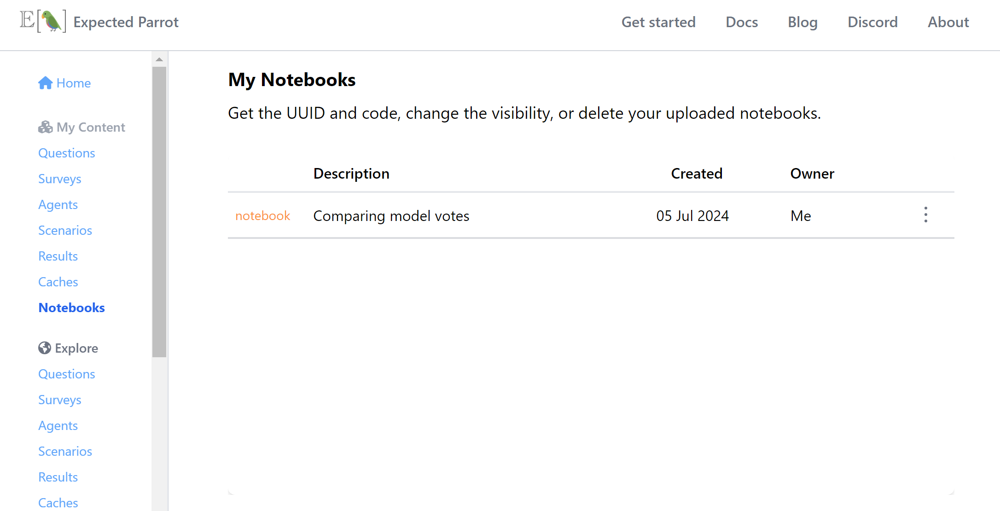

.. _notebooks:

Notebooks
===============

The ``Notebook`` object allows you to share your .ipynb files with others by uploading them to Coop.
You can also view and pull notebooks that other users have uploaded.

Creating a notebook
--------------------

There are three ways to create a ``Notebook`` object:

1. From file
^^^^^^^^^^^^^^^^^

.. code-block:: python

    from edsl import Notebook

    notebook = Notebook(path="notebooks/test-notebook.ipynb")

2. From data
^^^^^^^^^^^^^^^^^

Your data must be a Python ``dict`` that conforms to the official Jupyter 
notebook format. You can learn more about the format `here <https://nbformat.readthedocs.io/en/latest/format_description.html>`_.

.. code-block:: python

    from edsl import Notebook

    data = {
        "metadata": dict(),
        "nbformat": 4,
        "nbformat_minor": 4,
        "cells": [
            {
                "cell_type": "markdown",
                "metadata": dict(),
                "source": "# Test notebook",
            },
        ],
    }

    notebook = Notebook(data=data)

3. From self
^^^^^^^^^^^^^^^^^

If you're currently working within a notebook and want to share it,
you can do so as follows:

.. warning::
    For now, this method only works if you are using the VS Code IDE. 

.. code-block:: python

    from edsl import Notebook

    # Don't pass any arguments to the constructor
    notebook = Notebook()

Pushing a notebook to Coop
---------------------------

You can push a notebook to Coop like this:

.. code-block:: python

    from edsl import Coop, Notebook

    coop = Coop()

    notebook = Notebook(path="model_votes.ipynb")

    coop.create(notebook, description="Comparing model votes", visibility="unlisted")

Afterwards, you should see your notebook on the `My Notebooks  <https://www.expectedparrot.com/home/notebooks>`_ page.

.. raw:: html

   

Saving a Coop notebook to file
-------------------------------

You can explore notebooks that other users have uploaded on the 
`Explore Notebooks  <https://www.expectedparrot.com/explore/notebooks>`_ page.

.. image:: static/coop_public_notebooks.png
  :alt: "Public Notebooks" page on Coop with one notebook called "Grading experiment"
  :align: center
  :width: 650px

.. raw:: html

   

If you see a notebook you want to work with, click on the **Get by UUID** button
to get its pull code.

You can then save the notebook as follows:

.. code-block:: python

    from edsl import Notebook

    notebook = Notebook.pull("05dbaf7c-1f82-44e1-9aef-d67a3108915c")

    notebook.to_file("grading_experiment.ipynb")

You can now edit and run the notebook on your local machine.
