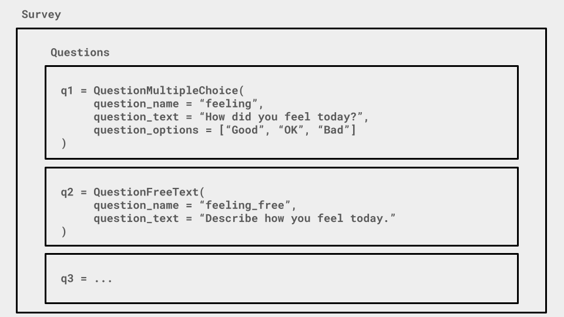
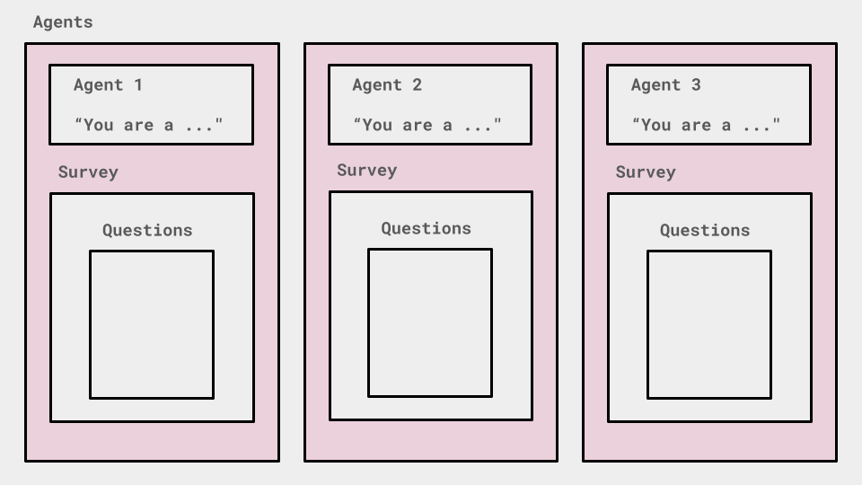

Overview
========

What is EDSL? 
-------------
EDSL is an open source python package for creating and running AI-powered research. 
It is designed to make it easy to create and run surveys, experiments, data labeling tasks and other research with a large number of AI agents and language models. 

Why EDSL?
---------
Many new LLM packages are focused on providing tools for building agents and real-time systems (e.g., "build a chatbot"). 
Less attention is being paid to the idea of using large numbers of constructed agents to perform large numbers of "tasks", such as answering surveys or labeling data.
With these kinds of tasks, we specifically want to vary the agents and model parameters in order to collect data. 
We also want to perform the tasks as effciently as possible, but they often involve complex interdependencies such as agent memory or skip-logic that make job running non-trivial.
What's needed are tools for creating and running complex tasks competently, and managing the data that results.

We began building the EDSL package for conducting our own research, but quickly realized there were many common tasks in this "domain" of using LLMs for social science research. 
Rather than working procedurally (*"for agent in agent, for question in survey, for model in model list…"*), we realized a better approach would be a declarative domain-specific language, to provide expressiveness (i.e., make it easy to do a lot with very little code). 

Key concepts
------------
EDSL is built around the concept of a `Question` that is answered by an AI `Agent` using a large language `Model`, generating a `Result` that can be analyzed, visualized and shared, or used to inform other questions.
Questions of various types (free text, multiple choice, etc.) can be combined into a `Survey` and run in parallel or according to specified rules or skip logic (e.g., answer the next question based on a responses to a prior question).
Questions can also be parameterized with a `Scenario` that provides context or data to the questions when they are run (e.g., for data labeling tasks, where a question is "asked" about each piece of data).
Surveys can be run with different agents and models to provide different kinds of responses.

Key components
--------------
These concepts are also the key classes of the package, and are described in detail in the following sections of the docs:

:ref:`questions`: A `Question` is a building block for designing a research project in EDSL. Select among various types of questions based on the desired form of results (free text, multiple choice, etc.). 

:ref:`surveys`: A `Survey` is a collection of questions that can be run in parallel or according to specified rules. Surveys can be run with different agents and models to provide different kinds of responses, and with different "scenarios" that provide context and data to the questions.

:ref:`agents`: An `Agent` is an AI agent that "answer" the questions. Agents can have different traits that affect their behavior, such as background or expertise, or "memory" of prior survey responses.

:ref:`models`: A `Model` is a large language model that generate the responses. EDSL is mode-agnostic, so questions can be delivered to multiple models for comparison.

:ref:`scenarios`: A `Scenario` is context or data that is passed to questions when they are run. The parameterization of question allows for the same question to be asked in different contexts at scale.

:ref:`results`: A `Result` is the output of running a question. Results can be analyzed, visualized and shared, and can be used to inform further questions or surveys.

We can visualize the interplay of the components in the following illustrations:

1. Construct questions of various types:

2. Optionally parameterize questions with content or data:

.. image:: static/survey_graphic2.png
   :alt: Optionally parameterize questions
   :align: center

3. Create AI agents to answer the questions:

4. Select AI models to simulate results:

.. image:: static/survey_graphic4.png
   :alt: Select AI models to simulate results
   :align: center

Key operations
--------------
The running of a job--administering a question or survey to an agent and model and simulating a result--is the central operation in EDSL. 
It is initiated by calling the `run()` method on a question or survey object after it has been optionally configured with agents, models and scenarios using the `by()` method.
This will deliver each question to each of the agents, which will generate a response using each of the specified models, and return a result object for each question/agent/model combination.
This operation takes the following general form:

.. code-block:: python

    results = survey.by(scenarios).by(agents).by(models).run()

Key features 
------------
EDSL is designed to be used in a notebook context, where you can easily run and analyze the results of your research.
It has built-in methods for analysis and visualization of results, and can be readily extended with custom methods.

Coop
^^^^
EDSL is also designed to facilitate sharing of research, code and results. 
The `Coop`_ is a platform for sharing and collaborating on research projects, and is built around the EDSL package.
The Coop provides automatic caching, versioning and sharing of code, data and results, and it designed to work with EDSL the way that GitHub works with git.

EDSL is python-based and plays nicely with existing python tooling.
It is model agnostic, so you can easily present the same questions to different models and agents in parallel to compare results.
It is open source with a permissive license, so you can use it for your own research or build on it for your own projects.

Use cases
---------
EDSL is designed for a wide range of research tasks that involve--or *could* benefit from or be extended by the use of--AI agents and language models, including:

* Simulating surveys and experiments
* Data labeling and classification
* Data augmentation

See the :ref:`examples` section for more detailed examples of how EDSL can be used for these tasks.
Learn more about use cases and ways to conduct AI-powered research in the EDSL Showcase

Getting help 
------------
EDSL objects have built-in help methods that provide information on their attributes and methods:

.. code-block:: python

    help(object)
    object.example()

For example, to see an example of a multiple choice question, you can run:

.. code-block:: python

    QuestionMultipleChoice.example()

Links
-----
.. raw:: html

    PyPI: <a href="https://pypi.org/project/edsl" target="_blank">https://pypi.org/project/edsl/</a>     
     
    GitHub: <a href="https://github.com/expectedparrot/edsl" target="_blank">https://github.com/expectedparrot/edsl</a>
     
    <a href="https://deepnote.com/workspace/expected-parrot-c2fa2435-01e3-451d-ba12-9c36b3b87ad9/project/Expected-Parrot-examples-b457490b-fc5d-45e1-82a5-a66e1738a4b9/notebook/Tutorial%20-%20Starter%20Tutorial-e080f5883d764931960d3920782baf34" target="_blank">Example notebooks</a>
     
    <a href="http://www.expectedparrot.com/getting-started#edsl-showcase" target="_blank">EDSL Showcase</a>.
     
    Discord: <a href="https://discord.com/invite/mxAYkjfy9m" target="_blank">https://discord.com/invite/mxAYkjfy9m</a>

Email: info@expectedparrot.com