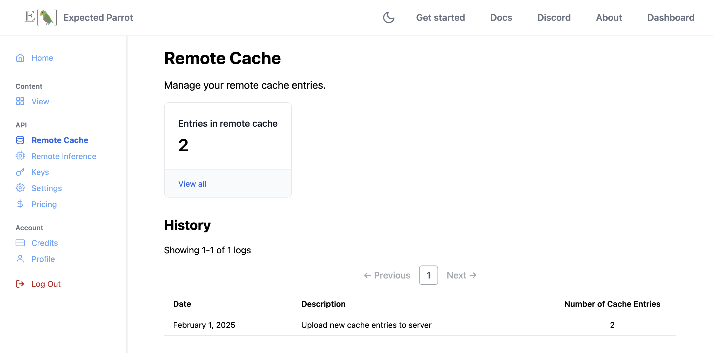
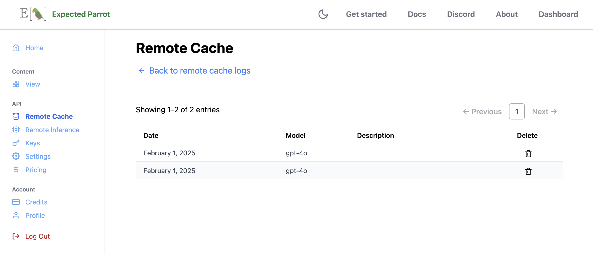
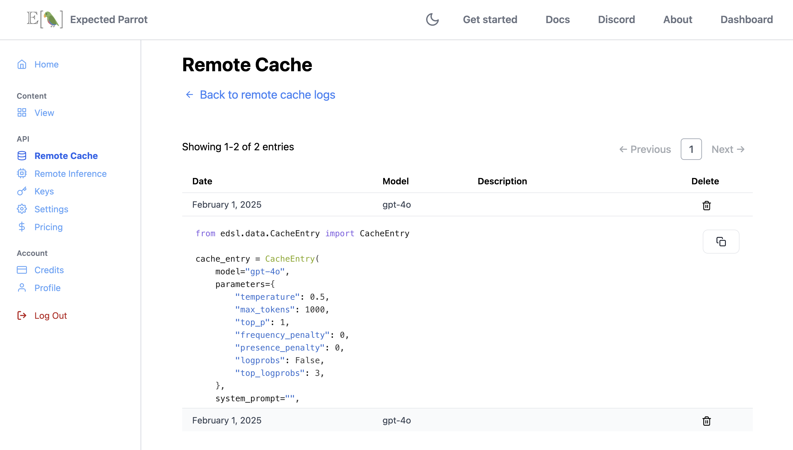

.. _remote_caching:

Remote Caching
===============

Remote caching allows you to store responses from language models at the Expected Parrot server, and retrieve responses to questions that have already been run.
It is automatically activated when remote inference is activated.

How it works 
------------

By default, whenever :ref:`remote_inference` is used to run a survey, a universal remote cache is made available for retrieving responses.
Survey results will draw from responses already stored in the universal remote cache for questions that have been run before, and any new responses will be added to it.
The universal remote cache is available to all users and is automatically updated whenever a survey is run with remote inference.

If you do not want your results to draw from responses in the universal remote cache, you can pass `remote_cache=False` or a different `Cache` object to use instead to the `run()` method. 
Any new responses are automatically added to the cache that is passed, as well as the universal remote cache.

*Note:* You must have a Coop account in order to use remote inference and caching.
By using remote inference you agree to terms of use of service providers, which Expected Parrot may accept on your behalf and enforce in accordance with our `terms of use <https://www.expectedparrot.com/terms>`_.

Activating remote caching
-------------------------

Remote caching is automatically activated when remote inference is activated.
See instructions on activating remote inference at the :ref:`remote_inference` section.

Using remote caching
--------------------

When remote caching is on, the results of any question or survey that you run will be stored automatically on the Expected Parrot server.

You can use remote caching by passing a `Cache` object to the `run` method of a survey.

Example 
^^^^^^^

Here we import the `Cache` module in order to pass a `Cache()` object when we call the `run` method on a survey.
Note that we use an empty in-memory cache for demonstration purposes; the code can also be used with an existing local cache. 
See :ref:`caching` for more details on caching results locally.

.. code-block:: python

  from edsl import QuestionMultipleChoice, QuestionFreeText, Survey, Cache

  survey = Survey(questions=[QuestionMultipleChoice.example(), QuestionFreeText.example()])

  result = survey.run(cache=Cache(), remote_cache_description="Example survey #1")

Remote cache logs
-----------------

We can inspect `Coop remote cache logs <https://www.expectedparrot.com/home/remote-cache>`_ to verify that our results were cached successfully.
The logs will show that we have 2 remote cache entries:

.. raw:: html

   

We can view the details of individual entries by clicking on **View all**, and then inspect each entry individually:

.. raw:: html

   

.. raw:: html

   

Bulk remote cache operations
----------------------------

The remote cache logs page allows you to perform bulk operations on your cache entries:

  * **Send to cache:** This creates unlisted cache objects on Coop that will appear at your `Remote Cache <https://www.expectedparrot.com/home/caches/>`_ page. After an object has been created you can change the visibility to public or private.
  * **Delete:** This deletes entries from your remote cache. This operation is currently irreversible, so use it with caution!

When performing a bulk remote cache operation, you can select from one of three targets:

  * **Selected entries:** The entries you've selected via checkbox.
  * **Search results:** The entries that match your search query. Search queries are case insensitive. They match either the raw model output or the cache entry description. 
  * **Remote cache:** All of the entries in your remote cache. 

Clearing the cache programatically
----------------------------------

You are currently allowed to store a maximum of 50,000 entries in the remote cache.
Trying to exceed this limit will raise an ``APIRemoteCacheError``.

If you need to clear the remote cache, you can do so with the following command:

.. code-block:: python

  # Remove all entries from the remote cache
  coop.remote_cache_clear()

Output:

.. code-block:: python

  {'status': 'success', 'deleted_entry_count': 2}

You can also clear the logs shown on Coop as follows:

.. code-block:: python

  coop.remote_cache_clear_log()

Remote cache methods
--------------------

When remote caching is activated, EDSL will automatically send model responses to the server when you run a job
(i.e., you do not need to execute methods manually).

If you want to interact with the remote cache programatically, you can use the following methods:

Coop class
^^^^^^^^^^

.. autoclass:: edsl.coop.coop.Coop
  :members: remote_cache_create, remote_cache_create_many, remote_cache_get, remote_cache_clear, remote_cache_clear_log
  :undoc-members:
  :show-inheritance:
  :special-members:
  :exclude-members: 
