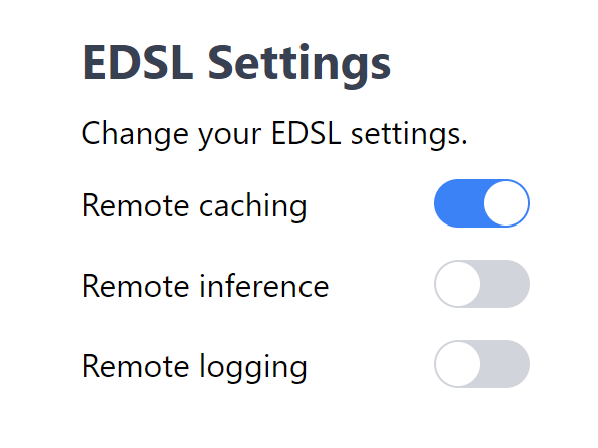

.. _remote_caching:

Remote Caching
===============

Getting started
------------------

Remote caching allows you to store responses from language models on our server.
To get started, you will need to create a Coop account and store your 
Expected Parrot API key in a *.env* file. See  :ref:`coop` for instructions.

When that's done, you can go to the `Coop API <https://www.expectedparrot.com/home/api>`_
page and turn remote caching on:

Now, when you invoke the ``run`` method on EDSL, we will automatically 
cache your language model responses on the server.

Let's try it out. Note that we are using an empty in-memory cache here for 
demonstration purposes, but this code should work with any local cache mentioned
in :ref:`caching`.

.. code-block:: python

  from edsl import Cache, Survey
  from edsl.questions import QuestionMultipleChoice, QuestionFreeText

  survey = Survey(questions=[QuestionMultipleChoice.example(), QuestionFreeText.example()])

  result = survey.run(cache=Cache(), remote_cache_description="Example survey #1")

We can look at the `Coop remote cache logs <https://www.expectedparrot.com/home/remote-cache>`_
to verify that our results were cached successfully:

.. image:: static/coop_remote_cache_logs_1.png
  :alt: Logs showing 2 remote cache entries on the Coop web app
  :align: center
  :width: 650px

If you see more than 2 uploaded entries, it's likely that your local cache
already contained some entries (see :ref:`syncing` for more details).

We can inspect the details of individual entries by clicking on **View entries**.

.. image:: static/coop_remote_cache_entries_1.png
  :alt: Page displaying the code for a remote cache entry on the Coop web app
  :align: center
  :width: 650px

.. raw:: html

   

Bulk remote cache operations
------------------------------

The remote cache entry page allows you to perform bulk operations on your cache entries.
We currently support two bulk operations:

  * **Send to cache:** This creates an unlisted cache object on Coop that will show up on your `My Caches <https://www.expectedparrot.com/home/caches/>`_ page. You can then change the visibility to public to share it with others.
  * **Delete:** This deletes entries from your remote cache. This operation is currently irreversible, so use with caution!

When performing a bulk remote cache operation, you can select from one of three targets:

  * **Selected entries:** The entries you've selected via checkbox.
  * **Search results:** The entries that match your search query. Search queries are case insensitive. They match either the raw model output or the cache entry description. 
  * **Remote cache:** All of the entries in your remote cache. 

Clearing the cache programatically
------------------------------------

You are currently allowed to store a maximum of 50,000 entries in the remote cache.
Trying to exceed this limit will raise an ``APIRemoteCacheError``.

If you need to clear the remote cache, you can do so with the following command:

.. code-block:: python

  # Remove all entries from the remote cache
  coop.remote_cache_clear()

Output:

.. code-block:: python

  {'status': 'success', 'deleted_entry_count': 2}

You can also clear the logs shown on Coop as follows:

.. code-block:: python

  coop.remote_cache_clear_log()

.. _syncing:

Syncing
------------------

Behind the scenes, remote caching involves the following steps:

  * Find out which local cache entries are missing from the remote cache, and vice versa.
  * Update the local cache with entries from the remote cache.
  * Run the EDSL survey.
  * Update the remote cache with entries from the local cache, along with the new entries from the survey.

Let's take a closer look at how syncing works. To start, we'll create a local cache 
with some example entries. We'll also add examples to the remote cache.

.. code-block:: python

  from edsl import CacheEntry, Cache, Coop

  local_entries = [CacheEntry.example(randomize=True) for _ in range(10)]
  remote_entries = [CacheEntry.example(randomize=True) for _ in range(15)]

  # Add entries to local cache
  c = Cache()
  c.add_from_dict({entry.key: entry for entry in local_entries})

  # Add entries to remote cache
  coop = Coop()
  coop.remote_cache_create_many(remote_entries, description="Set of 15 example entries")

We now have 10 entries in the local cache and 15 in the remote cache. We can
verify this by looking at the remote cache logs:

.. image:: static/coop_remote_cache_syncing_logs_1.png
  :alt: Logs showing 15 remote cache entries on the Coop web app
  :align: center
  :width: 650px

Now, let's run a survey:

.. code-block:: python

  from edsl import Survey
  from edsl.questions import QuestionCheckBox, QuestionNumerical

  survey = Survey(questions=[QuestionCheckBox.example(), QuestionNumerical.example()])

  result = survey.run(cache=c, remote_cache_description="Example survey #2", verbose=True)

Setting the ``verbose`` flag to True provides us with some helpful output:

.. code-block::

  Updating local cache with 15 new entries from remote...
  Local cache updated!
  Running job...
  Job completed!
  Updating remote cache with 12 new entries...  # 10 from local, 2 from survey
  Remote cache updated!
  There are 27 entries in the local cache.

We now have 27 entries in both caches:

.. image:: static/coop_remote_cache_syncing_logs_2.png
  :alt: Logs showing 27 remote cache entries on the Coop web app
  :align: center
  :width: 650px

To recap, our 27 entries come from:
 
  * 15 entries in remote cache (from calling ``coop.remote_cache_create_many``)
  * 10 entries in local cache (from calling ``c.add_from_dict``)
  * 2 entries from survey (from calling ``survey.run``)

Remote cache methods
--------------

Once you've activated remote caching on Coop, we will automatically send your LLM responses
to the server when you run a job.

However, if you need to interact with the remote cache programatically, we 
have the following methods.

Coop class
^^^^^^^^^^^^^^

.. autoclass:: edsl.coop.coop.Coop
  :members: remote_cache_create, remote_cache_create_many, remote_cache_get, remote_cache_clear, remote_cache_clear_log
  :undoc-members:
  :show-inheritance:
  :special-members:
  :exclude-members: 
