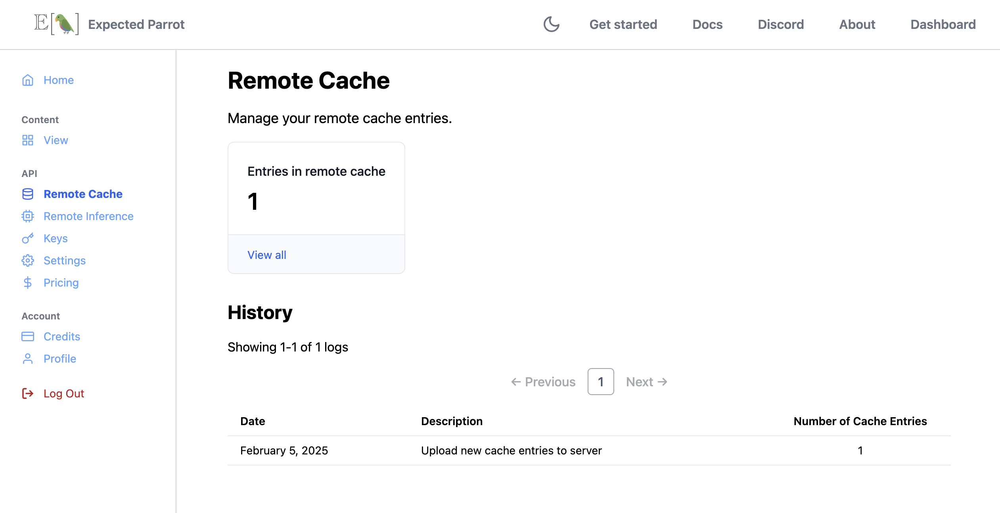

.. _remote_caching:

Remote Caching
==============

Remote caching allows you to store responses from language models at the Expected Parrot server, and retrieve responses to questions that have already been run.
The logs of your remote surveys and results are also automatically stored at the Expected Parrot server, and can be viewed and managed at the `Cache <https://www.expectedparrot.com/home/remote-cache>`_ page of your account.

*Note: You must have a Coop account in order to use remote inference and caching.
By using remote inference you agree to any terms of use of service providers, which Expected Parrot may accept on your behalf and enforce in accordance with our terms of use.*

Activate remote caching
-----------------------

Remote caching is automatically activated with remote inference.
To activate remote inference, navigate to the `Settings <https://www.expectedparrot.com/home/settings>`_ page of your account and toggle on *remote inference*.
Learn more about how remote inference works at the :ref:`remote_inference` section.

When you run a survey remotely at the Expected Parrot server your results are also cached at the server.
You can access them at your `Cache <https://www.expectedparrot.com/home/remote-cache>`_ page or from your workspace (see examples of methods below).

Universal remote cache 
----------------------

The universal remote cache is a collection of all the unique prompts that have been sent to any language models via the Expected Parrot server, and the responses that were returned. 
It is a shared resource that is available to all users for free. 

When you run a survey at the Expected Parrot server your survey results will draw from the universal remote cache by default.
This means that if your survey includes any prompts that have been run before, the stored response to those prompts is retrieved from the universal remote cache and included in your results, at no cost to you.
If a set of prompts has not been run before, then a new response is generated, included in your results and added to the universal remote cache.

(By "prompts" we mean a unique user prompt for a question together with a unique system prompt for an agent, if one was used with the question.)

Fresh responses 
^^^^^^^^^^^^^^^

If you want to draw fresh responses, you can pass a parameter `fresh=True` to the `run()` method. 
Your results object will still have a cache automatically attached to it, and the universal remote cache will be updated with any new responses that are generated.
(There can be multiple stored responses for a set of prompts if fresh responses are specified for a survey.)

Features of the universal remote cache 
^^^^^^^^^^^^^^^^^^^^^^^^^^^^^^^^^^^^^^

The universal remote cache offers the following features:

* **Free access:** It is free to use and available to all users, regardless of whether you are running surveys remotely with your own keys for language models or an Expected Parrot API key.

* **Free storage & retrieval:** There is no limit on the number of responses that you can add to the universal remote cache or retrieve from it.

* **Automatic updates:** It is automatically updated whenever a survey is run remotely.

* **Multiple responses:** If a fresh response is generated for a question that is different from a response already stored in the universal remote cache, the new response is added with an iteration index.

* **No deletions:** You cannot delete entries from the universal remote cache.

* **No manual additions:** You cannot manually add entries. The only way to add responses to the universal remote cache is by running a survey remotely at the Expected Parrot server.

* **Sharing & reproducibility:** A new cache is automatically attached to each results object, which can be posted and shared with other users at the Coop. 

* **Privacy:** It is not queryable, and no user information is available. You must run a survey to retrieve responses from the universal remote cache.

*Note:* The universal remote cache is not available for local inference (surveys run on your own machine).

Frequently asked questions
^^^^^^^^^^^^^^^^^^^^^^^^^^

**How do I add responses to the universal remote cache?** This happens automatically when you run a survey remotely.

**How do I get a stored response?** When you run a question you will retrieve a stored response by default if it exists. If you want to generate a fresh response you can use run(fresh=True).

**How do I know whether I will retrieve a stored response?** Results that were generated at the Expected Parrot server will show a verified checkmark ✓ at Coop. If you rerun a survey with verified results you will retrieve stored responses.

**Is the universal remote cache queryable? Can I check whether there is a stored response for a question?** No, the universal remote cache is not queryable. You will only know that a response is available by rerunning verified results.

**Can I see which user generated a stored response in the universal remote cache?** No, there is no user information in the universal remote cache.

**Is my legacy remote cache in the universal remote cache?** No, your legacy remote cache is only available to you. If you want your existing stored responses (local or remote) to be added to the universal remote cache you need to rerun the questions to regenerate them. Please let us know if you would like free credits to rerun your surveys.

**Can I still access my legacy remote cache?** Yes, your legacy remote cache will be available at your Cache page for 30 days. During this time you can pull the entries at any time. After 30 days the entries will be removed. 

**Why can't I add my existing caches to the universal remote cache?** The purpose of the universal remote cache is to provide a canonical, verified collection of responses to allow researchers to be confident in results and easily reproduce them at no cost. By only allowing responses generated at the Expected Parrot server we can verify the results that are reproduced.

**What if I want to run a survey remotely but do not want my responses added to the universal remote cache?** This is not allowed. Any new or fresh responses generated at the Expected Parrot server are automatically added to the universal remote cache. If you do not want to add responses to the universal remote cache you must run your surveys locally.

**Can I access the universal remote cache when I run a survey locally?** No, the universal remote cache is only available when running a survey remotely. However, you can pull entries from your Cache to use them locally at any time (responses that you generated or retrieved from the universal remote cache).

**Can I delete a response in the universal remote cache?** No, this is not allowed.

**What happens if I delete my account?** Any remote cache entries that you generated will remain in the universal remote cache. All information about your account will be deleted. 

Legacy remote cache
-------------------

Responses to questions that you ran remotely prior to the launch of the universal remote cache are stored in a legacy remote cache that can be found at the `Cache <https://www.expectedparrot.com/home/remote-cache>`_ page of your account.
You can pull these entries to use them locally at any time.

*Note: Your legacy remote cache is not part of the universal remote cache. 
If you would like to have your legacy remote cache entries available in the universal remote cache, please contact us for free credits to rerun your surveys.*

Using your remote cache
-----------------------

You can view and search all of your remote cache entries and logs at your `Cache <https://www.expectedparrot.com/home/remote-cache>`_ page.
These entries include all of the responses to questions that you have run remotely and generated or retrieved from the universal remote cache, and all the logs of your remote surveys. 

For example, here we run a survey with remote caching activated, and pass a description to readily identify the job at Coop:

.. code-block:: python

  from edsl import Model, QuestionFreeText, Survey

  m = Model("gemini-1.5-flash")

  q = QuestionFreeText(
    question_name = "prime",
    question_text = "Is 2 a prime number?"
  )

  survey = Survey(questions = [q])

  results = survey.by(m).run(
    remote_inference_description = "Example survey", # optional
    remote_inference_visibility = "public" # optional
  )

We can see the job has been added:

.. raw:: html

   

Reproducing results 
^^^^^^^^^^^^^^^^^^^

When you share a results object (e.g., post it publicly at Coop or share it privately with other users) the cache attached to it is automatically shared with it.
This can be useful if you want to share a specific historic cache for a survey or project (e.g., to allow other users to reproduce your results).
You can inspect the cache for a results object by calling the `cache` property on a results object.

For example, here we inspect the cache for the survey that we ran above:

.. code-block:: python

  results.cache 

Output:

.. list-table::
   :header-rows: 1

   * - model
     - parameters	
     - system_prompt	
     - user_prompt	
     - output	
     - iteration	
     - timestamp	
     - cache_key
   * - gemini-1.5-flash	
     - {'temperature': 0.5, 'topP': 1, 'topK': 1, 'maxOutputTokens': 2048, 'stopSequences': []}
     - nan
     - Is 2 a prime number?
     -	{"candidates": [{"content": {"parts": [{"text": "Yes, 2 is a prime number. It's the only even prime number.\n"}], "role": "model"}, "finish_reason": 1, "safety_ratings": [{"category": 8, "probability": 1, "blocked": false}, {"category": 10, "probability": 1, "blocked": false}, {"category": 7, "probability": 1, "blocked": false}, {"category": 9, "probability": 1, "blocked": false}], "avg_logprobs": -0.0006228652317076921, "token_count": 0, "grounding_attributions": []}], "usage_metadata": {"prompt_token_count": 7, "candidates_token_count": 20, "total_token_count": 27, "cached_content_token_count": 0}, "model_version": "gemini-1.5-flash"}	
     - 0	
     - 1738759640	
     - b939c0cf262061c7aedbbbfedc540689

See :ref:`caching` for more details on caching results locally.

Remote cache methods
--------------------

When remote caching is activated, EDSL will automatically send responses to the server when you run a job
(i.e., you do not need to execute methods manually).

If you want to interact with the remote cache programatically, you can use the following methods:

Coop class
^^^^^^^^^^

.. autoclass:: edsl.coop.coop.Coop
   :members:
   :undoc-members:
   :show-inheritance:
   :special-members: __init__ 
