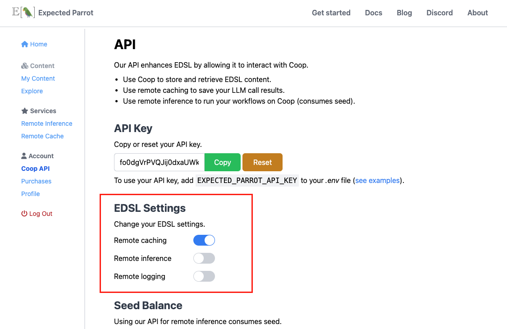
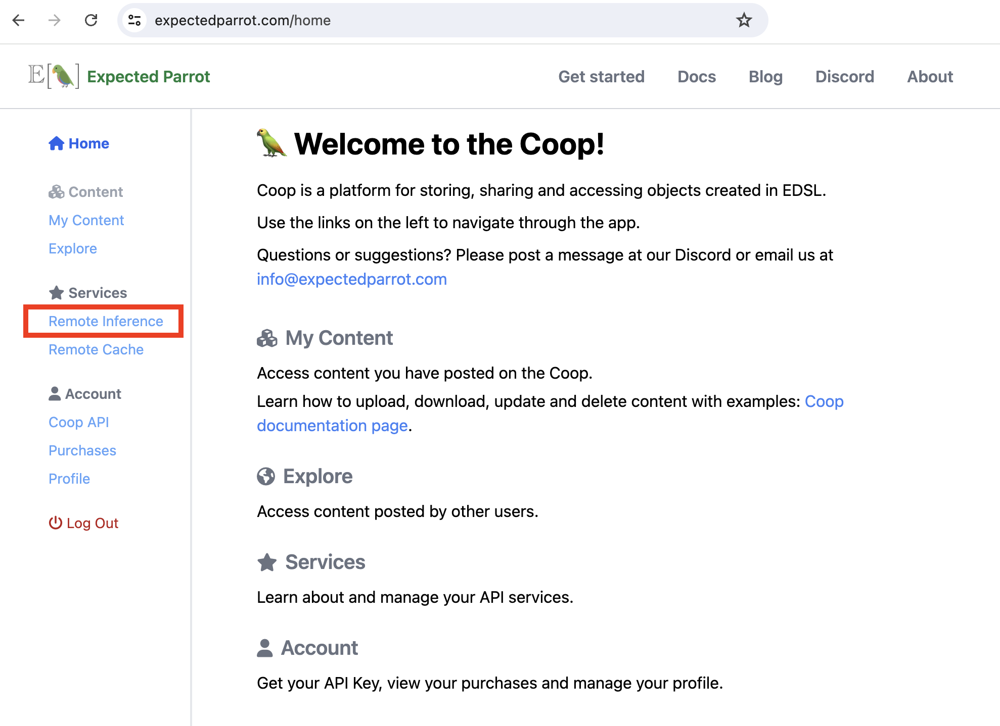
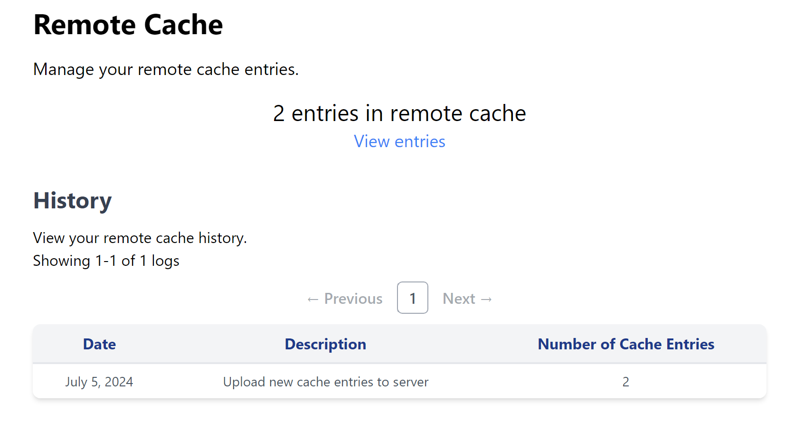
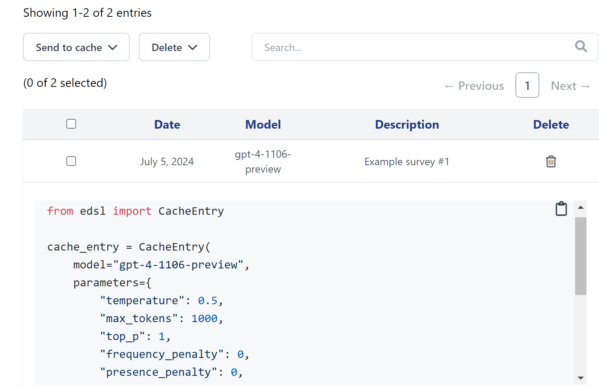
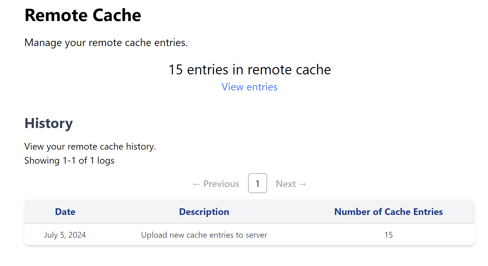
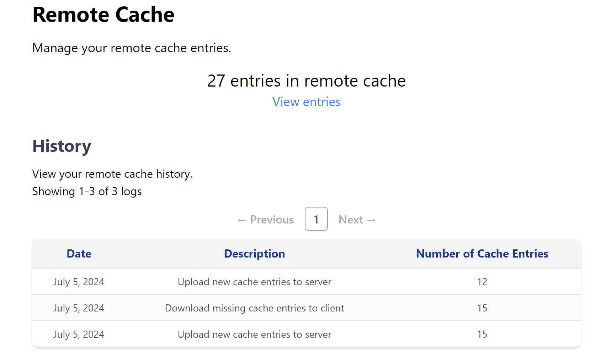

.. _remote_caching:

Remote Caching
===============

Remote caching allows you to store responses from language models on the Expected Parrot server.

Activating remote caching
-------------------------

1. `Create a Coop account <https://www.expectedparrot.com/login>`_.

2. Navigate to your `Coop API <https://www.expectedparrot.com/home/api>`_ settings page:

.. image:: static/coop_main_page.png
  :alt: Coop main page
  :align: center
  :width: 500px

.. raw:: html
  
     

3. Copy your **Expected Parrot API key**:

.. image:: static/coop_ep_key.png
  :alt: Coop main page
  :align: center
  :width: 500px

.. raw:: html
  
     

Save it to a *.env* file in your working directory. Your *.env* file should include the following line (replace `your_key_here` with your actual Expected Parrot API key):

.. code-block:: python

  EXPECTED_PARROT_API_KEY='your_key_here'

4. Locate your **EDSL Settings** and toggle the slider for *Remote caching* to turn it on:

.. raw:: html

     

When remote caching is on, the results of any question or survey that you run will be stored 
automatically on the Expected Parrot server.

Using remote caching
--------------------

We can use remote caching by passing a `Cache` object to the `run` method of a survey.

Example 
^^^^^^^

Here we import the `Cache` module together with `Survey` and `Question` types, create a survey, and pass a `Cache()` object when we call the `run` on the survey.
Note that we use an empty in-memory cache for demonstration purposes; the code can also be used with an existing local cache. 
See :ref:`caching` for more details on caching results locally.

.. code-block:: python

  from edsl import Cache, Survey
  from edsl.questions import QuestionMultipleChoice, QuestionFreeText

  survey = Survey(questions=[QuestionMultipleChoice.example(), QuestionFreeText.example()])

  result = survey.run(cache=Cache(), remote_cache_description="Example survey #1")

Remote cache logs
-----------------

We can inspect `Coop remote cache logs <https://www.expectedparrot.com/home/remote-cache>`_
to verify that our results were cached successfully:

.. raw:: html
  
     
  
The logs will show that we have 2 remote cache entries:

.. raw:: html

   

If you see more than 2 uploaded entries in your own logs, it may be that your local cache
already contained some entries (see details about :ref:`syncing` below).

We can inspect the details of individual entries by clicking on **View entries**.

.. raw:: html

   

Bulk remote cache operations
----------------------------

The remote cache logs page allows you to perform bulk operations on your cache entries.
We currently support two bulk operations:

  * **Send to cache:** This creates unlisted cache objects on Coop that will appear at your `My Caches <https://www.expectedparrot.com/home/caches/>`_ page. After an object has been created you can change the visibility to public.
  * **Delete:** This deletes entries from your remote cache. This operation is currently irreversible, so use with caution!

When performing a bulk remote cache operation, you can select from one of three targets:

  * **Selected entries:** The entries you've selected via checkbox.
  * **Search results:** The entries that match your search query. Search queries are case insensitive. They match either the raw model output or the cache entry description. 
  * **Remote cache:** All of the entries in your remote cache. 

Clearing the cache programatically
----------------------------------

You are currently allowed to store a maximum of 50,000 entries in the remote cache.
Trying to exceed this limit will raise an ``APIRemoteCacheError``.

If you need to clear the remote cache, you can do so with the following command:

.. code-block:: python

  # Remove all entries from the remote cache
  coop.remote_cache_clear()

Output:

.. code-block:: python

  {'status': 'success', 'deleted_entry_count': 2}

You can also clear the logs shown on Coop as follows:

.. code-block:: python

  coop.remote_cache_clear_log()

.. _syncing:

Syncing
-------

When you run a survey with remote caching enabled, the local and remote caches are synced.

How it works
^^^^^^^^^^^^

Behind the scenes, remote caching involves the following steps:

  * Identify local cache entries not present in the remote cache, and vice versa.
  * Update the local cache with entries from the remote cache.
  * Run the EDSL survey.
  * Update the remote cache with entries from the local cache, along with the new entries from the survey.

Let's take a closer look at how syncing works. 
To start, we'll create a local cache with some example entries. 
We'll also add examples to the remote cache.

.. code-block:: python

  from edsl import CacheEntry, Cache, Coop

  local_entries = [CacheEntry.example(randomize=True) for _ in range(10)]
  remote_entries = [CacheEntry.example(randomize=True) for _ in range(15)]

  # Add entries to local cache
  c = Cache()
  c.add_from_dict({entry.key: entry for entry in local_entries})

  # Add entries to remote cache
  coop = Coop()
  coop.remote_cache_create_many(remote_entries, description="Set of 15 example entries")

We now have 10 entries in the local cache and 15 in the remote cache.
We can verify this by looking at the remote cache logs:

.. raw:: html
  
     

Now, let's run a survey:

.. code-block:: python

  from edsl import Survey
  from edsl.questions import QuestionCheckBox, QuestionNumerical

  survey = Survey(questions=[QuestionCheckBox.example(), QuestionNumerical.example()])

  result = survey.run(cache=c, remote_cache_description="Example survey #2", verbose=True)

Setting the ``verbose`` flag to True provides us with some helpful output:

.. code-block::

  Updating local cache with 15 new entries from remote...
  Local cache updated!
  Running job...
  Job completed!
  Updating remote cache with 12 new entries...  # 10 from local, 2 from survey
  Remote cache updated!
  There are 27 entries in the local cache.

We now have 27 entries in both caches:

.. raw:: html

   

To recap, our 27 entries come from:
 
  * 15 entries in remote cache (from calling ``coop.remote_cache_create_many``)
  * 10 entries in local cache (from calling ``c.add_from_dict``)
  * 2 entries from survey (from calling ``survey.run``)

Remote cache methods
--------------------

When remote caching is activated, EDSL will automatically send your LLM responses to the server when you run a job
(i.e., you do not need to execute methods manually).

If you want to interact with the remote cache programatically, you can use the following methods:

Coop class
^^^^^^^^^^

.. autoclass:: edsl.coop.coop.Coop
  :members: remote_cache_create, remote_cache_create_many, remote_cache_get, remote_cache_clear, remote_cache_clear_log
  :undoc-members:
  :show-inheritance:
  :special-members:
  :exclude-members: 
