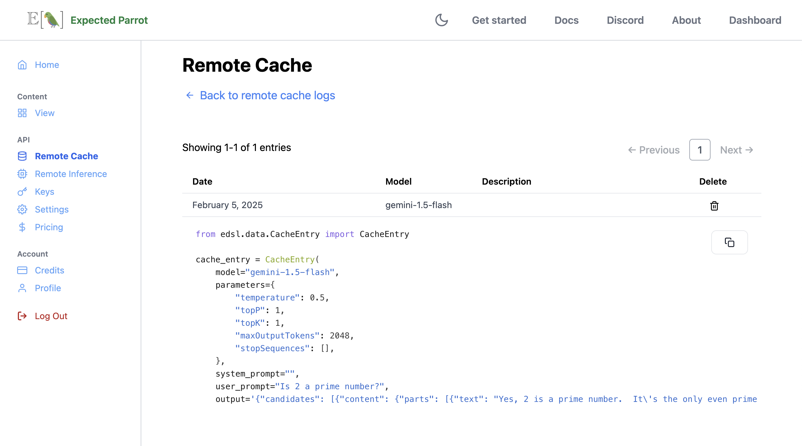

.. _remote_caching:

Remote Caching
==============

*Some of these features are still in development. Please check back for updates or send a message to info@expectedparrot.com to request early access!*

Remote caching allows you to store responses from language models at the Expected Parrot server, and retrieve responses to questions that have already been run.
It is automatically activated with :ref:`remote_inference`.
The logs of your remote surveys and results are also automatically stored at the Expected Parrot server, and can be viewed and managed at the `Remote cache <https://www.expectedparrot.com/home/remote-cache>`_ page of your account.

*Note: You must have an account in order to use remote inference and caching.
By using remote inference you agree to terms of use of service providers, which Expected Parrot may accept on your behalf and enforce in accordance with our terms of use.*

How it works 
------------

Whenever you run a survey remotely at the Expected Parrot server, your results are also cached at the server.
You can access them at the `Remote cache <https://www.expectedparrot.com/home/remote-cache>`_ page of your account or from your workspace (see examples of methods below).

Universal remote cache 
^^^^^^^^^^^^^^^^^^^^^^

By default, your survey results will draw from a universal remote cache of responses to questions that have been run before, by you or other users.
If your survey includes a question that has been run before, the response is retrieved from the universal remote cache.
If a new response is generated, it is automatically added to the universal remote cache for any user to retrieve in the future. 
The universal remote cache is automatically updated whenever a survey is run remotely.
It is free to use and available to all users.
See more details about features below.

Other cache options 
^^^^^^^^^^^^^^^^^^^

If you do not want your results to draw from responses in the universal remote cache, you can pass a parameter `fresh=True` or any `Cache` object to the `run()` method. 

* Using `run(fresh=True)` will generate fresh responses for all the questions in the survey. This is functionally equivalent to using `run(remote_cache=Cache())`.

* Using `run(cache=my_cache_object)` will cause results to be drawn from the cache that is passed instead of the universal remote cache.

In both cases your results object will still have a cache automatically attached to it (this is also true when you run a survey locally), and the universal cache will still be updated with any new responses that are generated.

Features of the universal remote cache 
^^^^^^^^^^^^^^^^^^^^^^^^^^^^^^^^^^^^^^

The universal remote cache offers the following features:

* **Free access:** The universal remote cache is free to use and available to all users, regardless of whether you are running surveys remotely with your own keys or an Expected Parrot API key.

* **Free storage & retrieval:** There is no limit on the number of responses that you can add to the universal remote cache or retrieve from it.

* **Automatic updates:** The universal remote cache is automatically updated whenever a survey is run remotely.

* **Multiple responses:** If a fresh response is generated for a question that is different from a response already stored in the universal remote cache, the new response is added with an incremental identifier (`n=2`, etc.).

* **No deletions:** You cannot delete entries in the universal remote cache.

* **No manual additions:** You cannot manually add entries to the universal remote cache. The only way to add responses is by running a survey remotely at the Expected Parrot server.

* **Sharing & reproducibility:** A new cache is automatically attached to each results object, which can be posted and shared with other users at the Coop. You can also construct new caches from your remote cache entries at your `Remote cache <https://www.expectedparrot.com/home/remote-cache>`_ page.

* **Visibility & cost calculations:** You can check the availability of responses to your survey questions in the universal remote cache by passing a parameter `run(dry_run=True)`. This will return information about existing responses before you run the survey. If you want to check the availability of responses in another cache, you can pass that cache together with the dry run parameter, e.g., `run(cache=my_cache_object, dry_run=True)`. Note that the universal remote cache is not directly searchable.

*Note:* The universal remote cache is not available for local inference (surveys run on your own machine).

Activating remote caching
-------------------------

Remote caching is automatically activated when remote inference is activated.
See instructions on activating remote inference at the :ref:`remote_inference` section.

Using your remote cache
-----------------------

You can view and search all of your remote cache entries and logs at the `Remote cache <https://www.expectedparrot.com/home/remote-cache>`_ page of your account.
These entries include all of the responses to questions that you have run remotely, generated or retrieved from the universal remote cache, and all the logs of your remote surveys. 
You can search and delete entries at this page, and also construct new caches consisting of any of the entries.
(Deleting entries at this page does not impact the universal remote cache.)

For example, here we run a survey with remote caching activated, and pass a description to readily identify the job at the remote inference and remote cache pages:

.. code-block:: python

  from edsl import Model, QuestionFreeText, Survey

  m = Model("gemini-1.5-flash")

  q = QuestionFreeText(
    question_name = "prime",
    question_text = "Is 2 a prime number?"
  )

  survey = Survey(questions = [q])

  results = survey.by(m).run(
    remote_inference_description = "Example survey", # optional
    remote_inference_visibility = "public" # optional
    )

We can see the job has been added:

.. image:: static/home-remote-cache-logs.png
  :alt: Page displaying a remote cache at the Coop web app
  :align: center
  :width: 100%

.. raw:: html

   

The logs show that we have a new remote cache entry:

.. image:: static/home-remote-cache-entries-.png
  :alt: Logs showing 1 remote cache entry at the Coop web app
  :align: center
  :width: 100%

.. raw:: html

   

We can view the details of each entry individually:

.. raw:: html

   

We can also construct a new cache from any existing entries (*this feature is still in development!*).

.. .. image:: static/update_image.png
..   :alt: Page displaying the code for a remote cache entry on the Coop web app
..   :align: center
..   :width: 100%

.. .. raw:: html

..    

.. This can also done at your workspace.
.. Here we create a new cache using the same entry by passing the hash of the entry to a new `Cache()` object:

.. .. code-block:: python

..   from edsl import Cache 

..   my_cache = Cache() # you can also use an existing cache object

..   my_cache.add_entries([1738584721]) # update list with the hashes for cache entries that you want to include

Reproducing results 
^^^^^^^^^^^^^^^^^^^

When you share a results object (e.g., post it publicly at Coop or share it privately with other users) the cache attached to it is automatically shared with it.
This can be useful if you want to share a specific historic cache for a survey or project (e.g., to allow other users to reproduce your results).
You can inspect the cache for a results object by calling the `cache` property on a results object.

For example, here we inspect the cache for the survey that we ran above:

.. code-block:: python

  results.cache 

Output:

.. list-table::
   :header-rows: 1

   * - model
     - parameters	
     - system_prompt	
     - user_prompt	
     - output	
     - iteration	
     - timestamp	
     - cache_key
   * - gemini-1.5-flash	
     - {'temperature': 0.5, 'topP': 1, 'topK': 1, 'maxOutputTokens': 2048, 'stopSequences': []}
     - nan
     - Is 2 a prime number?
     -	{"candidates": [{"content": {"parts": [{"text": "Yes, 2 is a prime number. It's the only even prime number.\n"}], "role": "model"}, "finish_reason": 1, "safety_ratings": [{"category": 8, "probability": 1, "blocked": false}, {"category": 10, "probability": 1, "blocked": false}, {"category": 7, "probability": 1, "blocked": false}, {"category": 9, "probability": 1, "blocked": false}], "avg_logprobs": -0.0006228652317076921, "token_count": 0, "grounding_attributions": []}], "usage_metadata": {"prompt_token_count": 7, "candidates_token_count": 20, "total_token_count": 27, "cached_content_token_count": 0}, "model_version": "gemini-1.5-flash"}	
     - 0	
     - 1738759640	
     - b939c0cf262061c7aedbbbfedc540689

Checking availability of responses
^^^^^^^^^^^^^^^^^^^^^^^^^^^^^^^^^^

*The methods shown below are still in development!*

We can check the availability of cached responses for survey questions by using `run(dry_run=True)`.
This will return information about existing responses without running the survey. 
It can be used to check the availability of responses in the universal remote cache (by default) or in another specified cache (`run(cache=my_cache_object, dry_run=True)`).

For example, here we check for cached responses to a survey that includes the question from above together with a new question:

.. code-block:: python

  from edsl import Model, QuestionFreeText, QuestionList, Survey

  m = Model("gemini-1.5-flash")

  q1 = QuestionFreeText(
    question_name = "prime", # renaming a question does not impact the cache
    question_text = "Is 2 a prime number?"
  )

  q2 = QuestionList(
    question_name = "factors",
    question_text = "What are the factors of 100?"
  )

  survey = Survey(questions = [q1, q2])

  survey.by(m).run(dry_run=True) 

We can see that a response to the first question is available in the universal remote cache; the information is identical to the response that was generated and cached above (the `cached` indicator is `true` and the `estimated_cost_usd` is 0.0).
We can also see that the second question does not have a response available in the universal remote cache; there is an `estimated_cost_usd` to run it and no existing response (`cached` is `false`):

.. list-table::
   :header-rows: 1

   * - cached 
     - model
     - parameters	
     - system_prompt	
     - user_prompt	
     - output	
     - iteration	
     - timestamp	
     - cache_key
     - estimated_cost_usd
   * - true 
     - gemini-1.5-flash	
     - {'temperature': 0.5, 'topP': 1, 'topK': 1, 'maxOutputTokens': 2048, 'stopSequences': []}	
     - nan	
     - Is 2 a prime number?
     - {"candidates": [{"content": {"parts": [{"text": "Yes, 2 is a prime number. It's the only even prime number.\n"}], "role": "model"}, "finish_reason": 1, "safety_ratings": [{"category": 8, "probability": 1, "blocked": false}, {"category": 10, "probability": 1, "blocked": false}, {"category": 7, "probability": 1, "blocked": false}, {"category": 9, "probability": 1, "blocked": false}], "avg_logprobs": -0.0006228652317076921, "token_count": 0, "grounding_attributions": []}], "usage_metadata": {"prompt_token_count": 7, "candidates_token_count": 20, "total_token_count": 27, "cached_content_token_count": 0}, "model_version": "gemini-1.5-flash"}	
     - 0	
     - 1738759640	
     - b939c0cf262061c7aedbbbfedc540689
     - 0.0
   * - false 
     - gemini-1.5-flash	
     - {'temperature': 0.5, 'topP': 1, 'topK': 1, 'maxOutputTokens': 2048, 'stopSequences': []}	
     - nan	
     - What are the factors of 100? Return your answers on one line, in a comma-separated list of your responses, with square brackets and each answer in quotes E.g., ["A", "B", "C"] After the answers, you can put a comment explaining your choice on the next line.	
     - {"candidates": [{"content": {"parts": [{"text": "[\"1\", \"2\", \"4\", \"5\", \"10\", \"20\", \"25\", \"50\", \"100\"]\n# These are all the numbers that divide evenly into 100.\n"}], "role": "model"}, "finish_reason": 1, "safety_ratings": [{"category": 8, "probability": 1, "blocked": false}, {"category": 10, "probability": 1, "blocked": false}, {"category": 7, "probability": 1, "blocked": false}, {"category": 9, "probability": 1, "blocked": false}], "avg_logprobs": -0.005307064056396484, "token_count": 0, "grounding_attributions": []}], "usage_metadata": {"prompt_token_count": 67, "candidates_token_count": 50, "total_token_count": 117, "cached_content_token_count": 0}, "model_version": "gemini-1.5-flash"}	
     - 0	
     - 1738766395	
     - 00b1e0ccff32a044b2b585f3e463dd8e
     - 1.9575e-05

The estimated cost to run the second question can also be estimated using the `estimate_job_cost()` method:

.. code-block:: python

  job = q2.by(m)

  estimated_job_cost = job.estimate_job_cost()
  estimated_job_cost

Output:

.. code-block:: text

  {'estimated_total_cost_usd': 1.9575e-05,
  'estimated_total_input_tokens': 65,
  'estimated_total_output_tokens': 49,
  'model_costs': [{'inference_service': 'google',
    'model': 'gemini-1.5-flash',
    'estimated_cost_usd': 1.9575e-05,
    'estimated_input_tokens': 65,
    'estimated_output_tokens': 49}]}

If we also pass a `Cache()` object to the `run` method, the dry run will check the response in that cache instead of the universal remote cache.
For example, here we create and pass an empty cache object to demonstrate that there is no response available in the cache for either question:

.. code-block:: python

  from edsl import Cache 

  my_cache = Cache() # this can be replaced with any cache object

  survey.by(m).run(cache=my_cache, dry_run=True) # using the same survey as above

Output:

.. list-table::
   :header-rows: 1

   * - cached 
     - model
     - parameters	
     - system_prompt	
     - user_prompt	
     - output	
     - iteration	
     - timestamp	
     - cache_key
     - estimated_cost_usd
   * - true 
     - gemini-1.5-flash	
     - {'temperature': 0.5, 'topP': 1, 'topK': 1, 'maxOutputTokens': 2048, 'stopSequences': []}	
     - nan	
     - Is 2 a prime number?
     - {"candidates": [{"content": {"parts": [{"text": "Yes, 2 is a prime number. It's the only even prime number.\n"}], "role": "model"}, "finish_reason": 1, "safety_ratings": [{"category": 8, "probability": 1, "blocked": false}, {"category": 10, "probability": 1, "blocked": false}, {"category": 7, "probability": 1, "blocked": false}, {"category": 9, "probability": 1, "blocked": false}], "avg_logprobs": -0.0006228652317076921, "token_count": 0, "grounding_attributions": []}], "usage_metadata": {"prompt_token_count": 7, "candidates_token_count": 20, "total_token_count": 27, "cached_content_token_count": 0}, "model_version": "gemini-1.5-flash"}	
     - 0	
     - 1738759640	
     - b939c0cf262061c7aedbbbfedc540689
     - 1.575e-06
   * - false 
     - gemini-1.5-flash	
     - {'temperature': 0.5, 'topP': 1, 'topK': 1, 'maxOutputTokens': 2048, 'stopSequences': []}	
     - nan	
     - What are the factors of 100? Return your answers on one line, in a comma-separated list of your responses, with square brackets and each answer in quotes E.g., ["A", "B", "C"] After the answers, you can put a comment explaining your choice on the next line.	
     - {"candidates": [{"content": {"parts": [{"text": "[\"1\", \"2\", \"4\", \"5\", \"10\", \"20\", \"25\", \"50\", \"100\"]\n# These are all the numbers that divide evenly into 100.\n"}], "role": "model"}, "finish_reason": 1, "safety_ratings": [{"category": 8, "probability": 1, "blocked": false}, {"category": 10, "probability": 1, "blocked": false}, {"category": 7, "probability": 1, "blocked": false}, {"category": 9, "probability": 1, "blocked": false}], "avg_logprobs": -0.005307064056396484, "token_count": 0, "grounding_attributions": []}], "usage_metadata": {"prompt_token_count": 67, "candidates_token_count": 50, "total_token_count": 117, "cached_content_token_count": 0}, "model_version": "gemini-1.5-flash"}	
     - 0	
     - 1738766395	
     - 00b1e0ccff32a044b2b585f3e463dd8e
     - 1.9575e-05

See :ref:`caching` for more details on caching results locally.

Remote cache methods
--------------------

When remote caching is activated, EDSL will automatically send responses to the server when you run a job
(i.e., you do not need to execute methods manually).

If you want to interact with the remote cache programatically, you can use the following methods:

Coop class
^^^^^^^^^^

.. autoclass:: edsl.coop.coop.Coop
  .. :members: remote_cache_create, remote_cache_create_many, remote_cache_get, remote_cache_clear, remote_cache_clear_log
  :undoc-members:
  :show-inheritance:
  :special-members:
  :exclude-members: 
