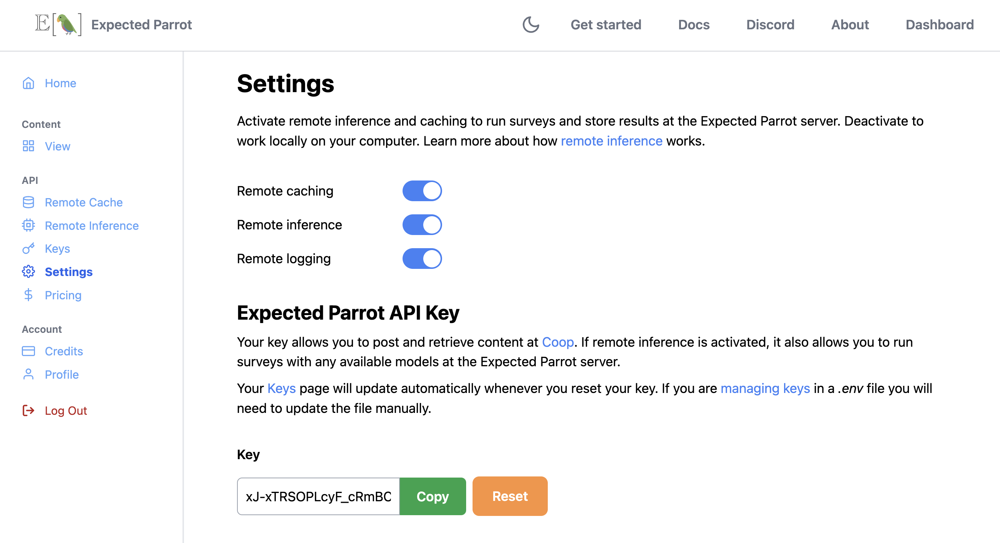
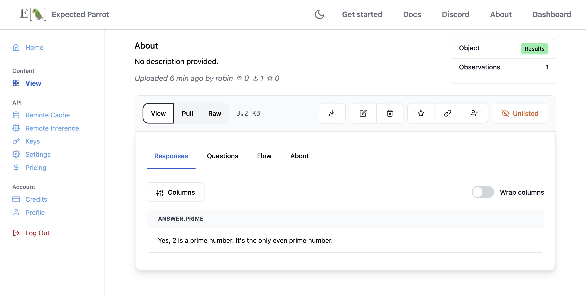

.. _remote_inference:

Remote Inference
================

Remote inference allows you to run surveys at the Expected Parrot server instead of your own machine and to use :ref:`remote_caching` to store survey results and logs.

*Note: You must have an account in order to use remote inference and caching.
By using remote inference you agree to terms of use of service providers, which Expected Parrot may accept on your behalf and enforce in accordance with our terms of use.*

How it works 
------------

When remote inference is activated, calling the `run()` method on a survey will send it to the Expected Parrot server.
Survey results and job details (history, costs, etc.) are automatically stored at the server and accessible from your workspace or at the `Remote inference <https://www.expectedparrot.com/home/remote-inference>`_ page of your account.
By default, a universal remote cache is used to retrieve responses to any questions that have already been run, either by you or other users.
See the :ref:`remote_caching` section for details on the universal remote cache and methods for drawing fresh responses and working with remote caches.

Activating remote inference
---------------------------

`Log into your account <https://www.expectedparrot.com/login>`_ and navigate to your `Settings <a href="https://www.expectedparrot.com/home/settings>`_ page.
Toggle on the slider for *Remote inference*:

  

.. raw:: html

   
  

Managing keys & credits 
-----------------------

You can use remote inference to run surveys with your own keys for language models or your Expected Parrot API key.
Your Expected Parrot API key can be viewed (and reset) at the `Settings <https://www.expectedparrot.com/home/settings>`_ page of your account (where you activate remote inference).
It is automatically stored at your `Keys <https://www.expectedparrot.com/home/keys>`_ page where you can select options for adding keys, sharing them with other users and prioritizing them for use with your surveys.

Running surveys with your Expected Parrot API key requires credits to cover API calls to service providers.
Your account comes with free credits for getting started; you can check your balance and purchase additional credits at the `Credits <https://www.expectedparrot.com/home/credits>`_ page of your account.
Running surveys with your own keys does *not* consume credits.
Learn more about purchasing credits and calculating costs at the :ref:`credits` section.

See instructions and additional options for managing keys in the :ref:`api_keys` section.

Using remote inference
----------------------

When remote inference is activated, calling the `run()` method will send a survey to the Expected Parrot server.
You can access results and all information about the job (history, costs, etc.) from your workspace or your `Remote inference <https://www.expectedparrot.com/home/remote-inference>`_ page.

For example, here we run a simple survey with remote inference activated and inspect the job information that is automatically posted.
We optionally pass description and visibility parameters (these can be edited at any time):

.. code-block:: python

  from edsl import Model, QuestionFreeText, Survey

  m = Model("gemini-1.5-flash")

  q = QuestionFreeText(
    question_name = "prime",
    question_text = "Is 2 a prime number?"
  )

  survey = Survey(questions = [q])

  results = survey.by(m).run(
    remote_inference_description = "Example survey", # optional
    remote_inference_visibility = "public" # optional
    )

Output (details will be unique to your job):

.. code-block:: text

  ✓ Current Status: Job completed and Results stored on Coop: http://www.expectedparrot.com/content/cfc51a12-63fe-41cf-b441-66d78ba47fb0

When the job has finished, it will appear with a status of *Completed*:

.. image:: static/remote_inference_job_completed.png
  :alt: Remote inference page on the Coop web app. There is one job shown, and it has a status of "Completed."
  :align: center
  :width: 100%

.. raw:: html

   

We can select **View all** to access the results of the job:

.. raw:: html

   

Job details and costs 
---------------------

When you run a job using your Expected Parrot API key you are charged credits based on the number of tokens used. 
(When you run a job using your own keys you are charged directly by service providers based on the terms of your accounts.)

Before running a job, you can estimate the cost of the job by calling the `estimate_job_cost()` method on the `Job` object (a survey combined with a model).
This will return information about the estimated total cost, input tokens, output tokens and per-model costs:

For example, here we estimate the cost of running a simple survey with a model:

.. code-block:: python

  from edsl import Model, QuestionFreeText, Survey

  m = Model("gemini-1.5-flash")

  q = QuestionFreeText(
    question_name = "prime",
    question_text = "Is 2 a prime number?"
  )

  survey = Survey(questions = [q])

  job = survey.by(m)

  estimated_job_cost = job.estimate_job_cost()
  estimated_job_cost 

Output:

.. code-block:: text

  {'estimated_total_cost_usd': 1.575e-06,
  'estimated_total_input_tokens': 5,
  'estimated_total_output_tokens': 4,
  'model_costs': [{'inference_service': 'google',
    'model': 'gemini-1.5-flash',
    'estimated_cost_usd': 1.575e-06,
    'estimated_input_tokens': 5,
    'estimated_output_tokens': 4}]}

We can also estimate the cost in credits to run the job remotely by passing the job to the `remote_inference_cost()` method of a `Coop` client object:

.. code-block:: python

  from edsl import Coop 

  coop = Coop()

  estimated_remote_inference_cost = coop.remote_inference_cost(job) # using the job object from above
  estimated_remote_inference_cost

Output:

.. code-block:: text

  {'credits': 0.01, 'usd': 1.575e-06}

Details on these methods can be found in the :ref:`credits` section.

After running a job, you can view the actual cost in your job history or by calling the `remote_inference_cost()` method and passing it the job UUID
(this is distinct from the results UUID, and can be found in your job history page).

You can also check the details of a job using the `remote_inference_get()` method as pass it the job UUID.

*Note:* When you run a job using your own keys, the cost estimates are based on the prices listed in the `model pricing page <https://www.expectedparrot.com/getting-started/coop-pricing>`_.
Your actual charges from service providers may vary based on the terms of your accounts with service providers.

Job history
-----------

You can click on any job to view its history. 
When a job fails, the job history logs will describe the error that caused the failure.

.. image:: static/coop_remote_inference_history_failed.png
  :alt: A screenshot of job history logs on the Coop web app. The job has failed due to insufficient funds.
  :align: center
  :width: 100%

.. raw:: html

   

When you prioritize keys, the job history will show which key was used to run the job:

.. image:: static/coop_remote_inference_history_key.png
  :alt: A screenshot of job history logs on the Coop web app. The job has been run using a key that has been prioritized.
  :align: center
  :width: 100%

Remote inference methods
------------------------

Coop class
^^^^^^^^^^

.. autoclass:: edsl.coop.coop.Coop
  :members: remote_inference_create, remote_inference_get, remote_inference_cost
  :undoc-members:
  :show-inheritance:
  :special-members:
  :exclude-members: 
