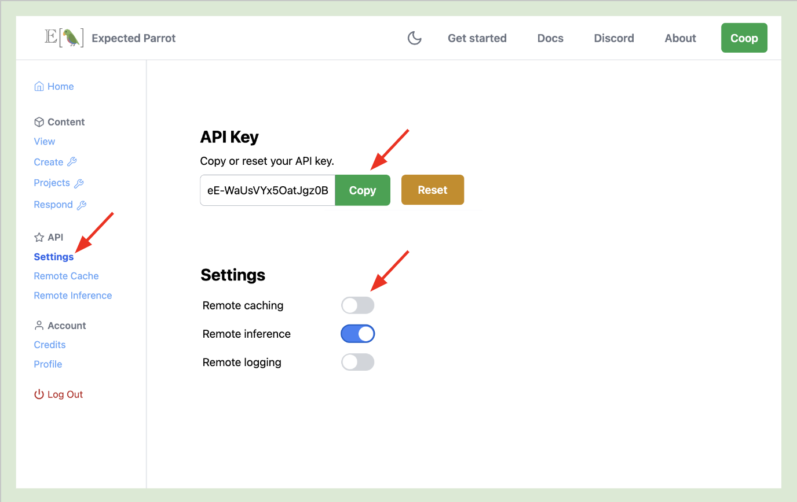

.. _remote_inference:

Remote Inference
================

Remote inference allows you to use a single API key to run surveys with any available language models at the Expected Parrot server, instead of obtaining your own :ref:`api_keys` for models to access on your own machine.

You can also automatically save survey results and API calls on the Expected Parrot server by activating :ref:`remote_caching`.

Activating remote inference
---------------------------

1. Log into your `Coop account <https://www.expectedparrot.com/login>`_. 

2. Navigate to `API Settings <a href="https://www.expectedparrot.com/home/api>`_. Toggle on the slider for *Remote inference* and copy your API key.

  

.. raw:: html

   
  

3. Add the following line to your `.env` file in your `edsl` working directory (replace `your_api_key_here` with your actual API key):

.. code-block:: python

  EXPECTED_PARROT_API_KEY='your_api_key_here'

You can regenerate your key (and update your `.env` file) at any time.

Using remote inference
----------------------

With remote inference activated, calling the `run()` method will send a survey to the Expected Parrot server and allow you to access results and all information about it (job history, costs, etc.).
We can optionally pass a `remote_inference_description` string to identify it at the Coop (or edit it later).

Example:

.. code-block:: python

  from edsl import Survey 

  survey = Survey.example()

  results = survey.run(remote_inference_description="Example survey")

Output (details will be unique to your job):

.. code-block:: text

  Job completed and Results stored on Coop: https://www.expectedparrot.com/content/642809b1-c887-42a9-b6c8-12ed5c6d856b.

If we also have remote caching activated, the results will be stored automatically on the Expected Parrot server.

Viewing the results
-------------------

Navigate to the `Remote inference <https://www.expectedparrot.com/home/remote-inference>`_ section of your Coop account to view the status of your job and the results.
Once your job has finished, it will appear with a status of *Completed*:

.. image:: static/coop_remote_inference_jobs_completed.png
  :alt: Remote inference page on the Coop web app. There is one job shown, and it has a status of "Completed."
  :align: center
  :width: 650px

.. raw:: html

   

You can then select **View** to access the results of the job.
Your results are provided as an EDSL object for you to view, pull and share with others. 

Job details and costs 
---------------------

When you run a job, you will be charged credits based on the number of tokens used. 

You can view the cost of a job in your job history or by calling the `remote_inference_cost()` method and passing it the job UUID 
(this is distinct from the results UUID, and can be found in your job history page).

You can also check the details of a job using the `remote_inference_get()` method as pass it the job UUID.

Job history
-----------

You can click on any job to view its history. 
When a job fails, the job history logs will describe the error that caused the failure:

.. image:: static/coop_remote_inference_history_failed.png
  :alt: A screenshot of job history logs on the Coop web app. The job has failed due to insufficient funds.
  :align: center
  :width: 350px

.. raw:: html

   

Job history can also provide important information about cancellation. 
When you cancel a job, one of two things must be true:

1. **The job hasn't started running yet.** No credits will be deducted from your balance.
2. **The job has started running.** Credits will be deducted.

When a late cancellation has occurred, the credits deduction will be reflected in your job history.

.. image:: static/coop_remote_inference_history_cancelled.png
  :alt: A screenshot of job history logs on the Coop web app. The job has been cancelled late, and 2 credits have been deducted from the user's balance.
  :align: center
  :width: 300px

.. raw:: html

   

Using remote inference with remote caching
------------------------------------------

When remote caching and remote inference are both turned on, your remote jobs will use your remote cache entries when applicable.

.. image:: static/coop_toggle_remote_cache_and_inference.png
  :alt: Remote cache and remote inference toggles on the Coop web app
  :align: center
  :width: 300px

.. raw:: html

   

Here we rerun the survey from above:

.. code-block:: python

  survey.run(remote_inference_description="Example survey rerun")

The remote cache now has a new entry in the remote cache logs:

.. image:: static/coop_remote_inference_cache_logs.png
  :alt: Remote cache logs on the Coop web app. There is one log that reads, "Add 1 new cache entry from remote inference job."
  :align: center
  :width: 650px

.. raw:: html

   

If the remote cache has been used for a particular job, the details will also show up in job history:

.. image:: static/coop_remote_inference_history_cache.png
  :alt: An entry in the job history log on the Coop web app. It shows that 1 new entry was added to the remote cache during this job.
  :align: center
  :width: 300px

.. raw:: html

    

Remote inference methods
------------------------

Coop class
^^^^^^^^^^

.. autoclass:: edsl.coop.coop.Coop
  :members: remote_inference_create, remote_inference_get, remote_inference_cost
  :undoc-members:
  :show-inheritance:
  :special-members:
  :exclude-members: 
