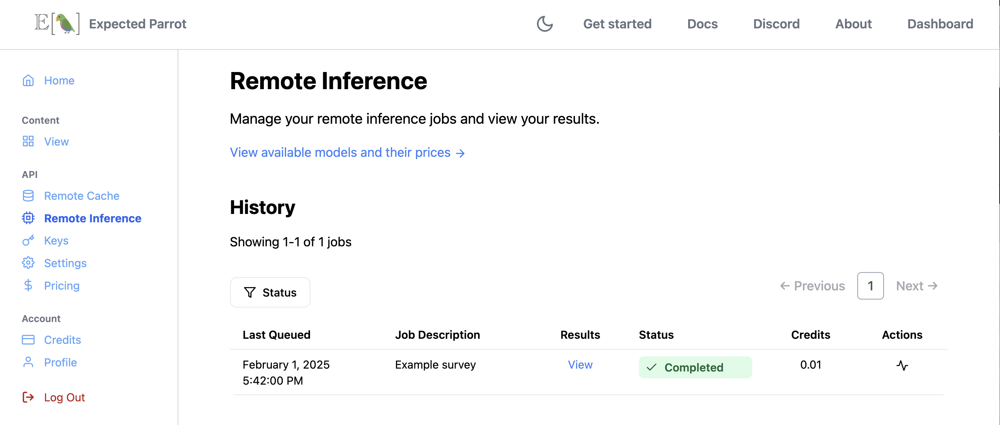
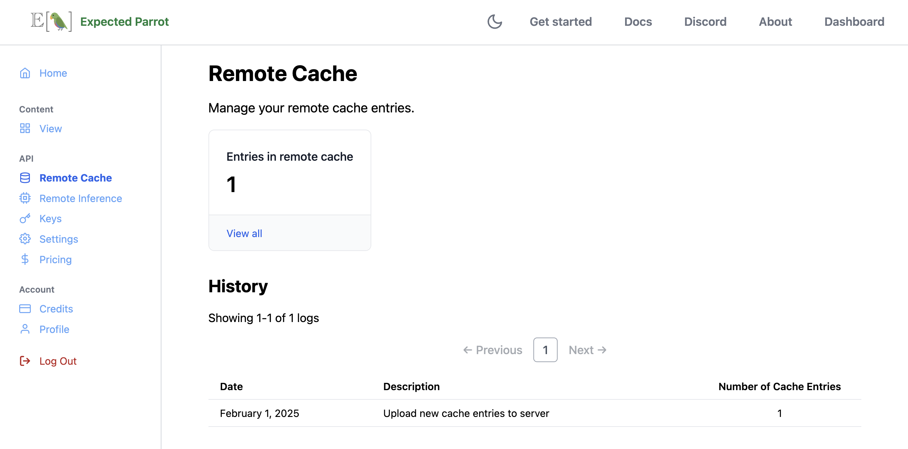
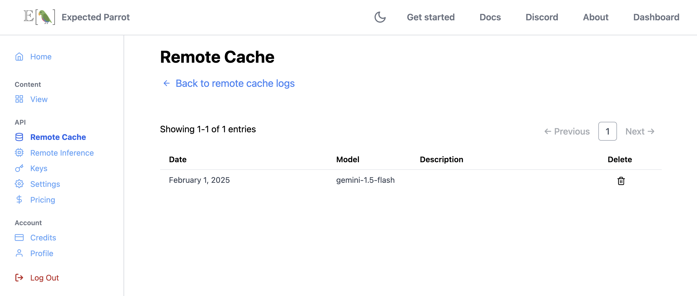

.. _remote_inference:

Remote Inference
================

Remote inference allows you to run surveys at the Expected Parrot server instead of your own machine.
It is typically activated together with :ref:`remote_caching`, which allows you to automatically store responses from language models at the Expected Parrot server as well.

*Note:* You must have a Coop account in order to use remote inference and caching.
By using remote inference you agree to terms of use of service providers, which Expected Parrot may accept on your behalf and enforce in accordance with its own terms of use: https://www.expectedparrot.com/terms.

Activating remote inference
---------------------------

Log into your `Coop account <https://www.expectedparrot.com/login>`_ and navigate to your `Settings <a href="https://www.expectedparrot.com/home/settings>`_ page.
Toggle on the slider for *Remote inference*:

.. image:: static/settings.png
  :alt: Toggle on remote inference
  :align: center
  :width: 100%
  

.. raw:: html

   
  

Your Expected Parrot API key is automatically stored at your `Keys <https://www.expectedparrot.com/home/keys>`_ page.
If you are managing your keys in a local `.env` file instead, copy your key to the file.
See instructions on managing keys in the :ref:`api_keys` section.

You can regenerate your key at any time.

Using remote inference
----------------------

With remote inference activated, calling the `run()` method will send a survey to the Expected Parrot server and allow you to access results and all information about it (job history, costs, etc.) from your workspace or the Coop app.
You can optionally pass a `remote_inference_description` to identify the job at Coop and a visibility setting `remote_inference_visibility` ("private" or "public"; the default setting for all objects is "unlisted").
These can be edited at any time from your workspace or at the Coop web app.

Example:

.. code-block:: python

  from edsl import Model, QuestionFreeText, Survey

  m = Model("gemini-1.5-flash")

  q = QuestionFreeText(
      question_name = "prime",
      question_text = "Is 2 a prime number?"
  )

  survey = Survey(questions = [q])

  results = survey.by(m).run(remote_inference_description="Example survey", remote_inference_visibility="public")

Output (details will be unique to your job):

.. code-block:: text

  ✓ Current Status: Job completed and Results stored on Coop: http://localhost:1234/content/cfc51a12-63fe-41cf-b441-66d78ba47fb0

If remote caching is also activated, the results will be stored automatically at the Expected Parrot server as well.
You can access them from your workspace or at the `Remote cache <https://www.expectedparrot.com/home/remote-cache>`_ page of your Coop account.

Viewing the results
-------------------

Navigate to the `Remote inference <https://www.expectedparrot.com/home/remote-inference>`_ page of your Coop account to view the status of your job and the results.
Once your job has finished, it will appear with a status of *Completed*:

.. raw:: html

   

You can then select **View** to access the results of the job.
Your results are provided as an EDSL object for you to view, pull and share with others:

.. image:: static/remote_inference_results_new.png
  :alt: Remote inference results page on the Coop web app. There is one result shown.
  :align: center
  :width: 650px

.. raw:: html

   

Job details and costs 
---------------------

When you run a job, you are charged credits based on the number of tokens used. 

Before running a job, you can estimate the cost of the job by calling the `estimate_job_cost()` method on the `Job` object (a survey combined with one or more models).
This will return information about the estimated total cost, input tokens, output tokens, and per-model costs:

Example:

.. code-block:: python

  from edsl import Survey, Model

  survey = Survey.example()
  model = Model("gpt-4o")
  job = survey.by(model)

  estimated_job_cost = job.estimate_job_cost()
  estimated_job_cost 

Output:

.. code-block:: text

  {'estimated_total_cost': 0.0018625,
   'estimated_total_input_tokens': 185,
   'estimated_total_output_tokens': 140,
   'model_costs': [{'inference_service': 'openai',
     'model': 'gpt-4o',
     'estimated_cost': 0.0018625,
     'estimated_input_tokens': 185,
     'estimated_output_tokens': 140}]}

You can also estimate the cost in credits to run the job remotely by passing the job to the `remote_inference_cost()` method of a `Coop` client object:

.. code-block:: python

  from edsl import Coop 

  coop = Coop()

  estimated_remote_inference_cost = coop.remote_inference_cost(job) # using the job object from above
  estimated_remote_inference_cost

Output:

.. code-block:: text

  {'credits': 0.19, 'usd': 0.0018625}

Details on these methods can be found in the :ref:`credits` section.

After running a job, you can view the actual cost in your job history or by calling the `remote_inference_cost()` method and passing it the job UUID
(this is distinct from the results UUID, and can be found in your job history page).

You can also check the details of a job using the `remote_inference_get()` method as pass it the job UUID.

Job history
-----------

You can click on any job to view its history. 
When a job fails, the job history logs will describe the error that caused the failure.

.. .. image:: static/coop_remote_inference_history_failed.png
..   :alt: A screenshot of job history logs on the Coop web app. The job has failed due to insufficient funds.
..   :align: center
..   :width: 350px

.. .. raw:: html

..    

Job history can also provide important information about cancellation. 
When you cancel a job, one of two things must be true:

1. **The job hasn't started running yet.** No credits will be deducted from your balance.
2. **The job has started running.** Credits will be deducted.

When a late cancellation has occurred, the credits deduction will be reflected in your job history.

.. .. image:: static/coop_remote_inference_history_cancelled.png
..   :alt: A screenshot of job history logs on the Coop web app. The job has been cancelled late, and 2 credits have been deducted from the user's balance.
..   :align: center
..   :width: 300px

.. .. raw:: html

..    

Using remote inference with remote caching
------------------------------------------

When remote caching and remote inference are both activated your results will be cached remotely and any jobs that you run remotely will use your remote cache entries (existing results will be retrieved when identical questions are rerun).

.. .. image:: static/coop_toggle_remote_cache_and_inference.png
..   :alt: Remote cache and remote inference toggles on the Coop web app
..   :align: center
..   :width: 300px

.. .. raw:: html

..    

.. Here we rerun the survey from above:

.. .. code-block:: python

..   survey.run(remote_inference_description="Example survey rerun")

We can see that the remote cache has an entry for the job that we ran:

.. raw:: html

   

If the remote cache has been used for a particular job, the details will also show up in job history:

.. raw:: html

    

Remote inference methods
------------------------

Coop class
^^^^^^^^^^

.. autoclass:: edsl.coop.coop.Coop
  :members: remote_inference_create, remote_inference_get, remote_inference_cost
  :undoc-members:
  :show-inheritance:
  :special-members:
  :exclude-members: 
