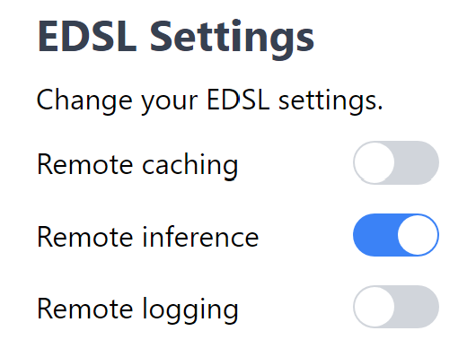

.. _remote_inference:

Remote Inference
=================

Getting started
------------------

Remote inference allows you to run EDSL jobs on our server.
To get started, you will need to create a Coop account and store your 
Expected Parrot API key in a *.env* file. See  :ref:`coop` for instructions.

Then, you can go to the `Coop API <https://www.expectedparrot.com/home/api>`_
page and turn remote inference on:

Now, when you invoke the ``run`` method on EDSL, we will run your survey remotely
instead of on your local machine.

Example
------------------

Let's take a look at how remote inference works. First, we'll create an example survey.

.. code-block:: python

  from edsl import Survey
  from edsl.questions import QuestionMultipleChoice

  q1 = QuestionMultipleChoice.example()

  survey = Survey(questions=[q1])

Cost
^^^^^^^^^^^^^^

Running jobs on our server costs seed. The current exchange rate is 1 seed = $0.01 USD.

To determine the cost of a job before running it, you can do the following:

.. code-block:: python

  from edsl import Coop

  coop = Coop()

  coop.remote_inference_cost(survey)

Output:

.. code-block:: python

  2   # This job costs 2 seed

You can always buy more seed on the `Purchases page <https://www.expectedparrot.com/home/purchases>`_.

Running a job
^^^^^^^^^^^^^^^

Now, let's run the survey:

.. code-block:: python

  survey.run(remote_inference_description="Example survey", verbose=True)

You should see output that looks like this:

.. code-block:: python

  "Remote inference activated. Sending job to server..."
  "Job sent!"

  # Some details about the job
  {
      "uuid": "2dd892a5-dc3d-4f82-ba8c-9aa9ef6b5391",
      "description": "Example survey",
      "status": "queued",
      "visibility": "unlisted",
      "version": "0.1.29.dev4",
  }

On the `Remote Inference page <https://www.expectedparrot.com/home/remote-inference>`_,
you should see your job with a status of "Queued":

.. image:: static/coop_remote_inference_jobs_queued.png
  :alt: Remote inference page on the Coop web app. There is one job shown, and it has a status of "Queued."
  :align: center
  :width: 650px

There are 6 status indicators for a job:

#. **Queued**: Your job has been added to the queue. 
#. **Running**: Your job has started running.
#. **Completed**: Your job has finished running successfully. 
#. **Failed**: Your job threw an error.
#. **Cancelling**: You have sent a cancellation request by pressing the **Cancel** button.
#. **Cancelled**: Your cancellation request has been processed. Your job will no longer run. 

Viewing the results
^^^^^^^^^^^^^^^^^^^^

Once your job has finished, the page should look like this:

.. image:: static/coop_remote_inference_jobs_completed.png
  :alt: Remote inference page on the Coop web app. There is one job shown, and it has a status of "Completed."
  :align: center
  :width: 650px

You can now click on the **View** link to access the results of your job.
Your results are provided as an EDSL object for you to view, pull, and share with others. 

You can also access the results URL from EDSL. Use ``coop.remote_cache_get`` 
with the UUID you got from running the job:

.. code-block:: python

  from edsl import Coop

  coop = Coop()

  coop.remote_cache_get("2dd892a5-dc3d-4f82-ba8c-9aa9ef6b5391")

Output:

.. code-block:: python

  {
    "jobs_uuid": "2dd892a5-dc3d-4f82-ba8c-9aa9ef6b5391",
    "results_uuid": "4442372d-6bc7-4c88-a4b9-da0fbec1de14",
    "results_url": "https://www.expectedparrot.com/content/4442372d-6bc7-4c88-a4b9-da0fbec1de14",
    "status": "completed",
    "reason": None,
    "price": 2,
    "version": "0.1.29.dev4",
  }

Job history
------------------

You can click on any job to view its history. When a job fails, the job history logs
will describe the error that caused the failure:

.. image:: static/coop_remote_inference_history_failed.png
  :alt: A screenshot of job history logs on the Coop web app. The job has failed due to insufficient funds.
  :align: center
  :width: 350px

Job history can also provide important information about cancellation. When you cancel a job, one of two things must be true:

1. **The job hasn't started running yet.** No seed will be deducted from your balance.
2. **The job has started running.** Seed will be deducted.

When a late cancellation has occurred, the seed deduction will be reflected in your job history.

.. image:: static/coop_remote_inference_history_cancelled.png
  :alt: A screenshot of job history logs on the Coop web app. The job has been cancelled late, and 2 seed have been deducted from the user's balance.
  :align: center
  :width: 300px

.. raw:: html

   

Using remote inference with remote caching
---------------------------------------------

If you toggle both remote caching and remote inference on, your remote jobs
will use your remote cache entries when applicable.

.. image:: static/coop_toggle_remote_cache_and_inference.png
  :alt: Remote cache and remote inference toggles on the Coop web app
  :align: center
  :width: 300px

Let's rerun the survey from earlier:

.. code-block:: python

  survey.run(remote_inference_description="Example survey rerun", verbose=True)

After running this survey, you will have a new entry in the remote cache.
This is reflected in your remote cache logs:

.. image:: static/coop_remote_inference_cache_logs.png
  :alt: Remote cache logs on the Coop web app. There is one log that reads, "Add 1 new cache entry from remote inference job."
  :align: center
  :width: 650px

If the remote cache has been used for a particular job, the details will also show up in job history:

.. image:: static/coop_remote_inference_history_cache.png
  :alt: An entry in the job history log on the Coop web app. It shows that 1 new entry was added to the remote cache during this job.
  :align: center
  :width: 300px

.. raw:: html

   

Remote inference methods
-------------------------

The following methods allow you to work with remote jobs manually.

Coop class
^^^^^^^^^^^^^^

.. autoclass:: edsl.coop.coop.Coop
  :members: remote_inference_create, remote_inference_get, remote_inference_cost
  :undoc-members:
  :show-inheritance:
  :special-members:
  :exclude-members: 
