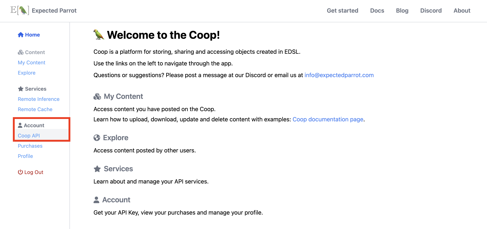
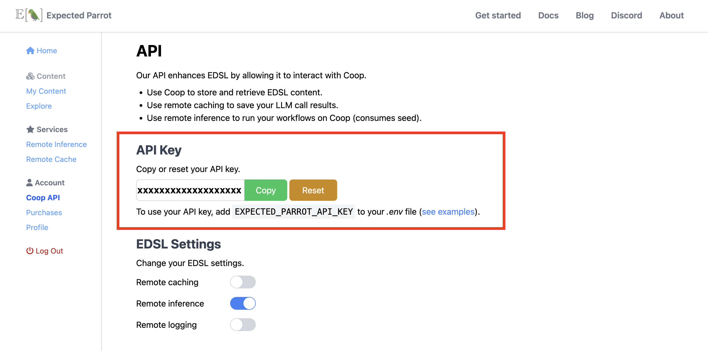
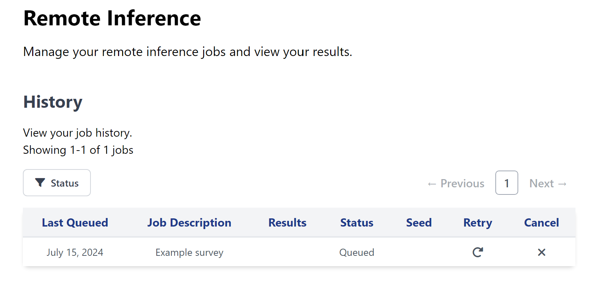
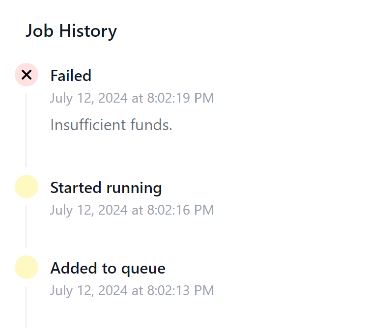
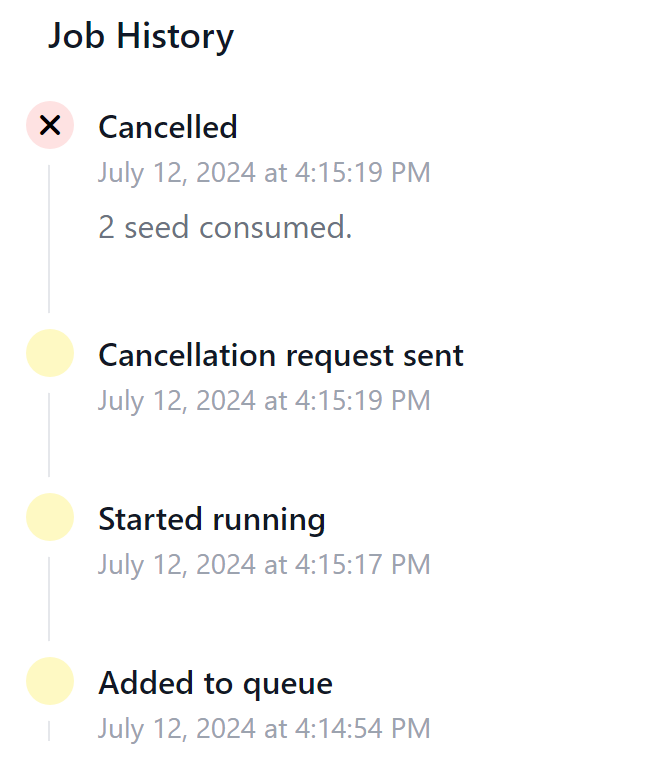
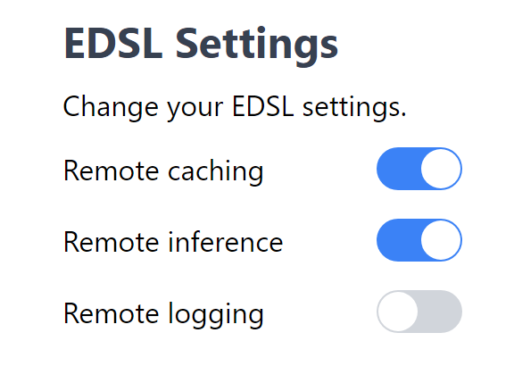
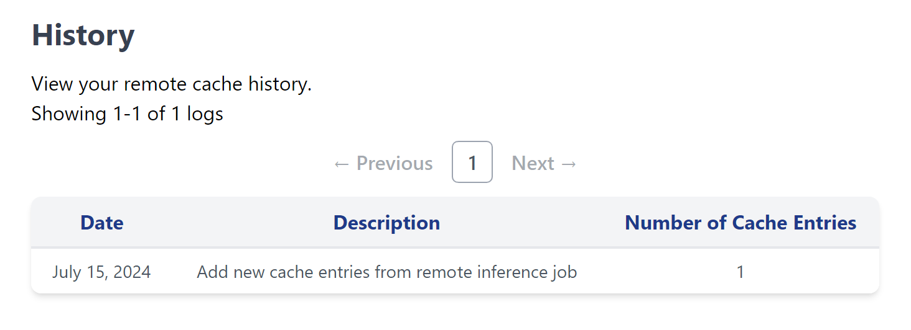
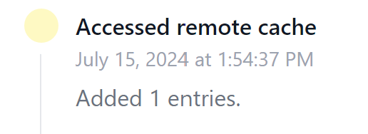

.. _remote_inference:

Remote Inference
=================

Remote inference allows you to run EDSL surveys on the Expected Parrot server instead of your local machine.

Activating remote inference
---------------------------

1. Create a `Coop account <https://www.expectedparrot.com/login>`_. (Learn more about Coop features in the :ref:`coop` section.)

2. Navigate to your `Coop API <https://www.expectedparrot.com/home/api>`_ settings page:

.. raw:: html
  
     

3. Copy your **Expected Parrot API key**:

.. raw:: html
  
     

Save it to a *.env* file in your working directory. Your *.env* file should include the following line (replace `your_key_here` with your actual Expected Parrot API key):

.. code-block:: python

  EXPECTED_PARROT_API_KEY='your_key_here'

4. Locate your **EDSL Settings** and toggle the slider for *Remote inference* to turn it on:

.. image:: static/coop_edsl_settings_remote_inference.png
  :alt: Remote inference toggle on the Coop web app
  :align: center
  :width: 500px

.. raw:: html

     

When remote inference is on, surveys that you run will be sent to the Expected Parrot server for processing.

You can also toggle *Remote cache* to turn on remote caching.
Learn more about using remote caching with remote inference in the :ref:`remote_caching` section.

Using remote inference
----------------------

Use remote inference by passing a `remote_inference_description` string to the `run()` method of a survey.
This string will be used to identify your job on the Expected Parrot server.

Example
^^^^^^^

We start by creating an example survey:

.. code-block:: python

  from edsl import QuestionMultipleChoice, Survey

  q = QuestionMultipleChoice.example()

  survey = Survey(questions=[q])

Estimating cost
^^^^^^^^^^^^^^^

Running jobs on the Expected Parrot server requires seed (1 seed = $0.01 USD).

We can estimate the cost of running a survey by creating a `Coop` client object and passing the survey in the `remote_inference_cost()` method:

.. code-block:: python

  from edsl import Coop

  coop = Coop()

  coop.remote_inference_cost(survey)

Output:

.. code-block:: python

  2   

This survey will cost approximately 2 seed to run.

Additional seed can be purchased at the `Purchases page <https://www.expectedparrot.com/home/purchases>`_.

Running a job
^^^^^^^^^^^^^

We can run the survey remotely by passing a `remote_inference_description` string to the `run` method:

.. code-block:: python

  survey.run(remote_inference_description="Example survey", verbose=True)

Output (actual details will be unique to your job):

.. code-block:: text

  Remote inference activated. Sending job to server...
  Job sent!
  ┏━━━━━━━━━━━━━━━━━━━━┳━━━━━━━━━━━━━━━━━━━━━━━━━━━━━━━━━━━━━━┳━━━━━━━━━┳━━━━━━━━━━━━━┓
  ┃ answer             ┃ answer                               ┃ answer  ┃ answer      ┃
  ┃ .info              ┃ .uuid                                ┃ .status ┃ .version    ┃
  ┡━━━━━━━━━━━━━━━━━━━━╇━━━━━━━━━━━━━━━━━━━━━━━━━━━━━━━━━━━━━━╇━━━━━━━━━╇━━━━━━━━━━━━━┩
  │ Remote job details │ 1234abcd-abcd-1234-abcd-1234abcd1234 │ queued  │ 0.1.31      │
  └────────────────────┴──────────────────────────────────────┴─────────┴─────────────┘

The job will appear at your `Remote Inference page <https://www.expectedparrot.com/home/remote-inference>`_ with a status of "Queued":

.. raw:: html

   

There are 6 status indicators for a job:

#. **Queued**: Your job has been added to the queue. 
#. **Running**: Your job has started running.
#. **Completed**: Your job has finished running successfully. 
#. **Failed**: Your job threw an error.
#. **Cancelling**: You have sent a cancellation request by pressing the **Cancel** button.
#. **Cancelled**: Your cancellation request has been processed. Your job will no longer run. 

Viewing the results
^^^^^^^^^^^^^^^^^^^

Once your job has finished, it will appear at the `Remote Inference page <https://www.expectedparrot.com/home/remote-inference>`_ with a status of "Completed"

.. image:: static/coop_remote_inference_jobs_completed.png
  :alt: Remote inference page on the Coop web app. There is one job shown, and it has a status of "Completed."
  :align: center
  :width: 650px

.. raw:: html

   

You can now click on the **View** link to access the results of your job.
Your results are provided as an EDSL object for you to view, pull, and share with others. 

You can also access the results URL from EDSL by calling `coop.remote_cache_get()` 
and passing the UUID assigned when the job was run:

.. code-block:: python

  from edsl import Coop

  coop = Coop()

  coop.remote_cache_get("1234abcd-abcd-1234-abcd-1234abcd1234")

Output:

.. code-block:: python

  {
    "jobs_uuid": "1234abcd-abcd-1234-abcd-1234abcd1234",
    "results_uuid": "5678wxyz-wxyz-5678-wxyz-5678wxyz5678",
    "results_url": "https://www.expectedparrot.com/content/5678wxyz-wxyz-5678-wxyz-5678wxyz5678",
    "status": "completed",
    "reason": None,
    "price": 2,
    "version": "0.1.31",
  }

Job history
-----------

You can click on any job to view its history. When a job fails, the job history logs
will describe the error that caused the failure:

.. raw:: html

   

Job history can also provide important information about cancellation. When you cancel a job, one of two things must be true:

1. **The job hasn't started running yet.** No seed will be deducted from your balance.
2. **The job has started running.** Seed will be deducted.

When a late cancellation has occurred, the seed deduction will be reflected in your job history.

.. raw:: html

   

Using remote inference with remote caching
------------------------------------------

When remote caching and remote inference are both turned on, your remote jobs will use your remote cache entries when applicable.

.. raw:: html

   

Let's rerun the survey from earlier:

.. code-block:: python

  survey.run(remote_inference_description="Example survey rerun", verbose=True)

After running this survey, you will have a new entry in the remote cache.
This is reflected in your remote cache logs:

.. raw:: html

   

If the remote cache has been used for a particular job, the details will also show up in job history:

.. raw:: html

   

Remote inference methods
------------------------

Coop class
^^^^^^^^^^

.. autoclass:: edsl.coop.coop.Coop
  :members: remote_inference_create, remote_inference_get, remote_inference_cost
  :undoc-members:
  :show-inheritance:
  :special-members:
  :exclude-members: 
