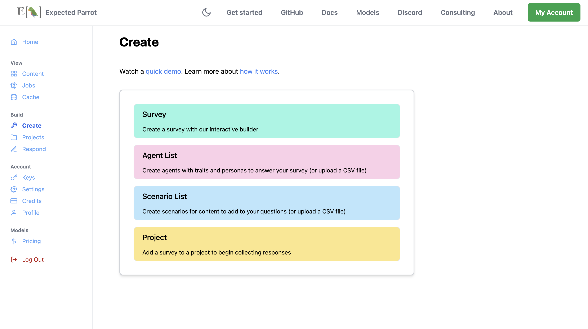
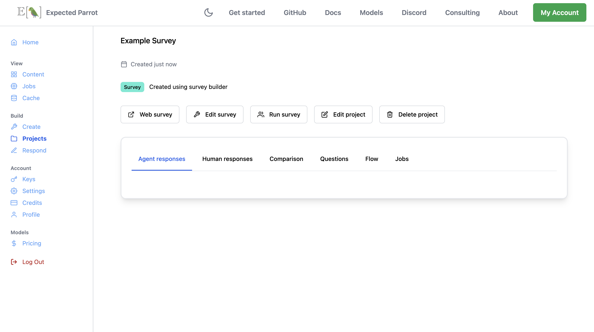

.. _survey_builder:

Survey Builder
==============

Overview
--------

Survey Builder is a user-friendly, no-code application for launching surveys and gathering responses from human respondents and AI agents. 
It is fully integrated with EDSL and available at your Coop account, allowing you to seamlessly design questions and agents, and analyze, visualize and share your results.

See a `clickable demo <https://app.arcade.software/share/MbB0C3UDuZE6JLgB68FL>`_ on how to use it.

Features
--------

- **Survey creation**: Build customized surveys using a wide range of question types, including multiple choice, free text, linear scale, matrix, numerical and more.
- **AI agent design**: Create and configure AI agent personas to respond to your questions. 
- **Dynamic data integration**: Import data from Coop and other sources to dynamically parameterize your surveys.
- **Seamless deployment**: Easily launch surveys with both human and AI respondents.
- **Results analysis**: Leverage built-in tools to visualize and analyze responses, combining human and AI data for greater insights.
- **Team collaboration**: Share surveys, agents, results and projects with your team with tools for streamlined sharing and collaboration.

Getting started 
---------------

1. Log into your Coop account
    Sign in or create an account `here <https://www.expectedparrot.com/login>`_.

2. Create a survey
    Choose whether to create a new survey or start a project using an existing survey at your Coop content.

3. Design AI agents
    Design AI agents with relevant personas to answer your survey questions. 
    You can also send a web-based version to human respondents.

4. Run the survey
    Launch your survey and collect responses.

5. Analyze results
    View and analyze survey responses at your account, and export data for further analysis.

Create a survey
^^^^^^^^^^^^^^^

`Log in <https://www.expectedparrot.com/login>`_ to your Coop account and navigate to the `Create <https://www.expectedparrot.com/create>`_ page.
Click the `Survey <https://www.expectedparrot.com/create/survey>`_ button to design a survey from scratch, or the `Project <https://www.expectedparrot.com/create/project>`_ button to use an existing survey as a template for a new project:

.. raw:: html

    

To create a project with an existing survey you will need the Coop UUID or URL of the survey.
To find it, nevigate to your Coop `Content <https://www.expectedparrot.com/content>`_ page, open the survey, and click the link button to display the UUID and URLs (or copy the URL from the address bar of your browser).
Then paste it into the *Create project* field at the Create page.

At the survey builder interface you can add and edit questions, configure survey logic, and then click the *Create project* button to save the survey to a project:

.. image:: static/sb02.png
   :alt: Create project
   :align: center
   :width: 100%

.. raw:: html

    

You will be prompted to give your project a name and then redirected to the new project page where you will see options to view a web-based version of the survey, edit the survey, run the survey with AI agents, and edit or delete the project.
You will also see a dashboard where human and AI agent responses will be collected and displayed when available, together with details about the survey:

.. raw:: html

     

Human responses
^^^^^^^^^^^^^^^

Click the *Web survey* button to view the web-based version of your survey.
Share the URL with your target audience to collect responses.
Recorded responses will be appear in the *Human responses* tab where you can view and analyze them.

Agent responses 
^^^^^^^^^^^^^^^

To run the survey with AI agents you first need to create agents.
Click the *Agent list* button at the `Create <https://www.expectedparrot.com/create>`_ page to choose whether to use the interface to create agents or to import agents from a CSV file:

.. image:: static/sb04.png
   :alt: Create agents
   :align: center
   :width: 100%

.. raw:: html

     

Click the *Create agent list* button to save the agents to your `Content <https://www.expectedparrot.com/content>`_. 
Open the agent list and copy the UUID or URL to add it to your project.
(You can also edit and give the object a new alias URL and name at any time.)

Run the survey 
^^^^^^^^^^^^^^

To run the survey with AI agents, click the *Run survey* button at the project page.
Tabs for adding agents and scenarios and selecting models to use will be displayed.

You can add agents to the survey by clicking the *Add agents* button.
You will be prompted to provide the agent list to use; paste the URL that you copied from the agent list page and click the *Find* button.
The agent information will be displayed:

.. image:: static/sb05.png
   :alt: Run survey add agents interface
   :align: center
   :width: 100%

.. raw:: html

     

If your survey questions use :ref:`scenarios`, select the *Add scenarios* tab to either construct or import scenarios for a CSV file (the same steps for adding agents).

Select the *Add models* tab to choose the language models to use for generating responses.
If you do not select any models the default model will be used (currently *gpt-4o-mini*).

Then select the *Run* tab to preview the components of the survey and click the *Run* button to start the survey.
Refresh your project dashboard to view the responses that are generated, and select columns of the results to display and analyze.
You can also export the results for further analysis.

*Please let us know if you have any questions or suggestions for improving the survey builder!*