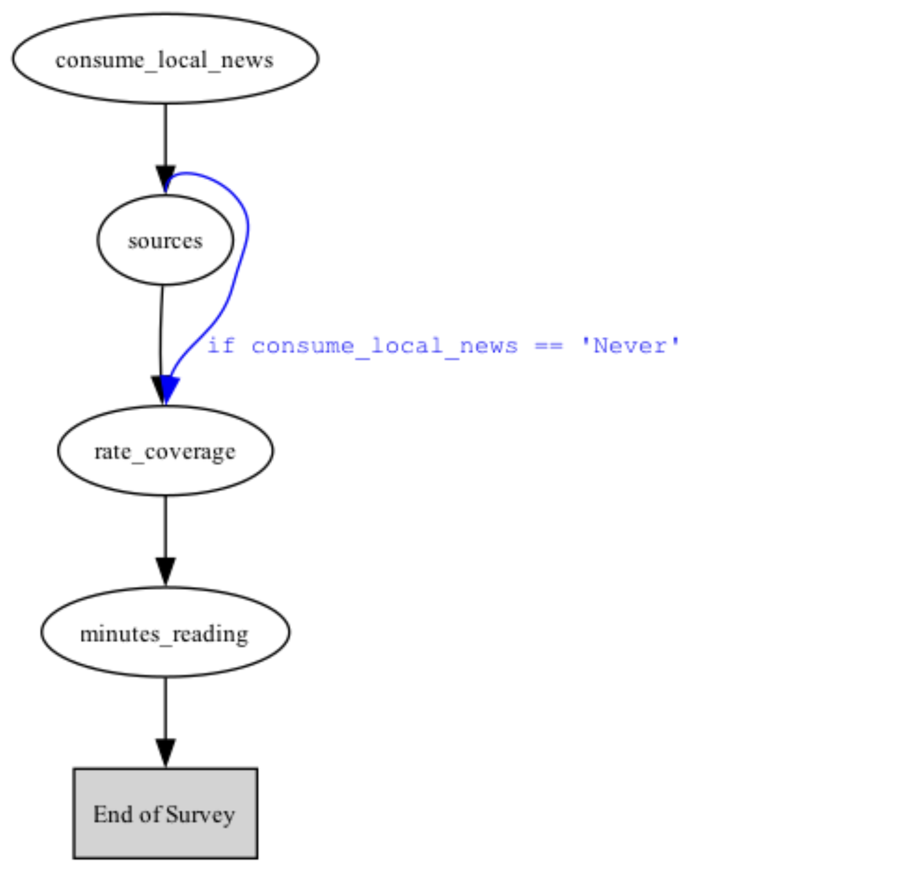
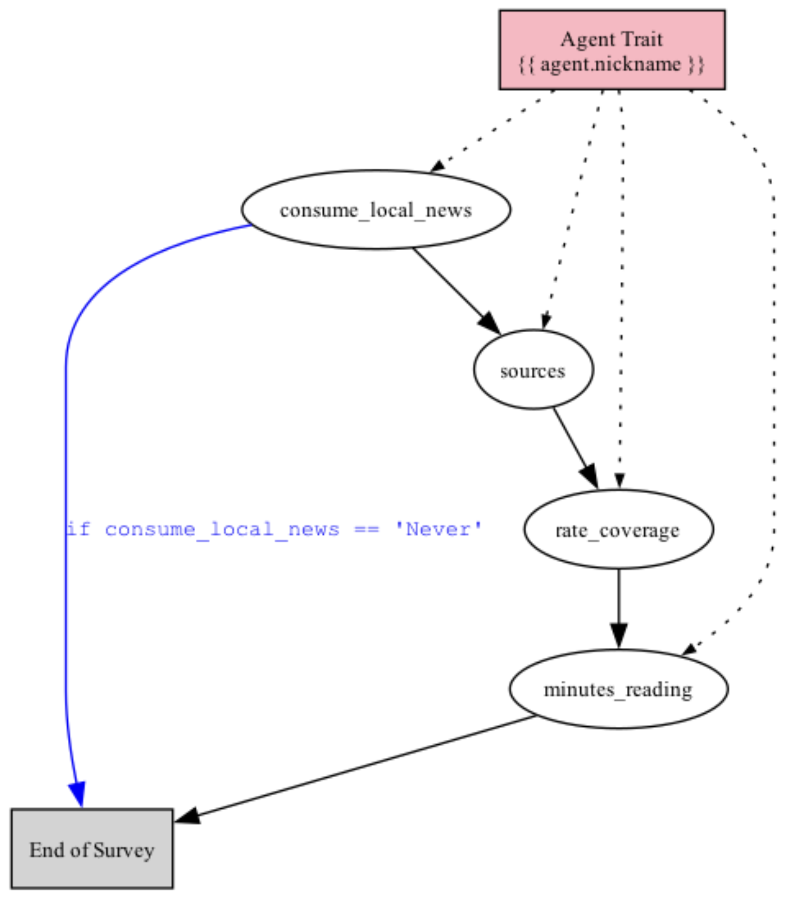

.. _surveys:

Surveys
=======

A `Survey` is collection of :ref:`questions` that can be administered to one or more AI :ref:`agents` and :ref:`language_models` at once.
Survey questions can be administered asynchronously (by default), or according to rules such as skip and stop logic, and with or without context of other questions in a survey.

Surveys can be used to collect data, generate content or perform other tasks.
The results of a survey are stored in a `Results` object, which can be used to analyze the responses and other components of the survey.
By default, the results object also has a cache of the responses that can be reused, which are also added to your local cache or the remote cache if you are running a survey remotely.
Learn more about built-in methods for working with `Results` objects in the :ref:`results` section and caching responses in the sections on :ref:`data` and :ref:`remote_caching`.

Key steps 
---------

The key steps to creating and conducting a survey are:

| 1. Create `Questions` of various types (multiple choice, checkbox, free text, numerical, linear scale, etc.) and combine them in a `Survey` to administer them together. 
| 2. *Optional:* Add rules to skip, stop or administer questions based on conditional logic, or provide context of other questions and answers in the survey.
| 3. *Optional:* Design personas for AI `Agents` to answer the questions.
| 4. Decide whether to use :ref:`remote_inference` or your own :ref:`api_keys` to run the survey.
| 5. Send the survey to language `Models` of your choice to generate the responses.

Sending a survey to a language model generates a dataset of `Results` that includes the responses and other components of the survey. 
Results can be analyzed and visualized using `built-in methods <https://docs.expectedparrot.com/en/latest/results.html>`_ of the `Results` object.

Key methods 
-----------

A survey is administered by calling the `run()` method on the `Survey` object, after adding any agents, scenarios and models with the `by()` method, and any rules or memory with the appropriate methods (see examples of each below):

* `add_skip_rule()` - Skip a question based on a conditional expression (e.g., based on a response to another question).
* `add_stop_rule()` - End the survey based on a conditional expression.
* `add_rule()` - Administer a specified question next based on a conditional expression.
* `set_full_memory_mode()` - Include a memory of all prior questions/answers at each new question in the survey.
* `set_lagged_memory()` - Include a memory of a specified number of prior questions/answers at each new question in the survey.
* `add_targeted_memory()` - Include a memory of a particular question/answer at another question in the survey.
* `add_memory_collection()` - Include memories of a set of prior questions/answers at another question in the survey.

Before running a survey, you can also estimate the cost of running it with the `estimate_job_cost()` method of a `Job` object (a survey combined with one or more models).
The `show_prompts()`, `show_rules()` and `show_flow()` methods can be used to analyze the structure of a survey and the rules that have been applied to it:

* `show_prompts()` - Display the user and system prompts for each question in a survey. This is a companion method to the `prompts()` method of a `Job` object, which returns a dataset containing the prompts together with information about each question, scenario, agent, model and estimated cost.
* `show_rules()` - Display a table of the conditional rules that have been applied to a survey.
* `show_flow()` - Display a graphic of the flow of a survey, showing the order of questions and any rules that have been applied, and any scenarios and/or agent information that has been added.

When you run a survey you can choose to run it remotely at the Expected Parrot server or locally on your own machine. 
See :ref:`remote_inference` for more information. 

*New feature in progress:* When you run a job remotely you automatically have access to a universal remote cache of stored responses.
Learn more about it in the :ref:`remote_caching` section. 

You can also choose to run a remote survey in the background by passing the `background=True` parameter to the `run()` method.
This allows you to continue working (or stop working) while your job completes.
You can check progress at the progress bar page or by calling the `fetch()` method at any time.

Piping
^^^^^^

You can pipe individual components of questions into other questions, such as inserting the answer to a question in the question text of another question.
This is done by using the `{{ question_name.answer }}` syntax in the text of a question, and is useful for creating dynamic surveys that reference prior answers.

Note that this method is different from memory rules, which automatically inlude the full context of a specified question at a new question in the survey:
*"Before the question you are now answering, you already answered the following question(s): Question: <question_text> Answer: <answer>"*.
See examples below.

Constructing a survey
---------------------

In the examples below we construct a simple survey of questions, and then demonstrate how to run it with various rules and memory options, how to add AI agents and language models, and how to analyze the results.

Defining questions
^^^^^^^^^^^^^^^^^^

Questions can be defined as various types, including multiple choice, checkbox, free text, linear scale, numerical and other types.
The formats are defined in the :ref:`questions` module. 
Here we define some questions by importing question types and creating instances of them:

.. code-block:: python

   from edsl import QuestionMultipleChoice, QuestionCheckBox, QuestionLinearScale, QuestionNumerical

   q1 = QuestionMultipleChoice(
      question_name = "consume_local_news",
      question_text = "How often do you consume local news?",
      question_options = ["Daily", "Weekly", "Monthly", "Never"]
   )

   q2 = QuestionCheckBox(
      question_name = "sources",
      question_text = "What are your most common sources of local news? (Select all that apply)",
      question_options = ["Television", "Newspaper", "Online news websites", "Social Media", "Radio", "Other"]
   )

   q3 = QuestionLinearScale(
      question_name = "rate_coverage",
      question_text = "On a scale of 1 to 10, how would you rate the quality of local news coverage in your area?",
      question_options = [1, 2, 3, 4, 5, 6, 7, 8, 9, 10],
      option_labels = {1: "Very poor", 10: "Excellent"}
   )

   q4 = QuestionNumerical(
      question_name = "minutes_reading",
      question_text = "On average, how many minutes do you spend consuming local news each day?",
      min_value = 0, # optional
      max_value = 1440 # optional
   )

Adding questions to a survey
^^^^^^^^^^^^^^^^^^^^^^^^^^^^

Questions are passed to a `Survey` object as a list of question ids:

.. code-block:: python

   from edsl import Survey

   survey = Survey(questions = [q1, q2, q3, q4])

Alternatively, questions can be added to a survey one at a time:

.. code-block:: python

   from edsl import Survey

   survey = Survey().add_question(q1).add_question(q2).add_question(q3).add_question(q4)

Running a survey
----------------

Once constructed, a survey can be administered by calling the `run()` method.
If question :ref:`scenarios`, :ref:`agents` or :ref:`language_models` have been specified, they are added to the survey with the `by` method when running it.
(If no language model is specified, the survey will be run with the default model, which can be inspected by running `Model()`.)

For example, here we run the survey with a simple agent persona and specify that GPT-4o should be used.
Note that the agent and model can be added in either order, so long as each type of component is added at once (e.g., if using multiple agents or models, pass them as a list to the `by()` method):

.. code-block:: python

   from edsl import Agent, Model 

   agent = Agent(traits = {"persona": "You are a teenager who hates reading."})

   model = Model("gpt-4o")

   results = survey.by(agent).by(model).run()

Job status information 
----------------------

When you run a survey, you will see information in the console about the status of the job.
When the job completes, you can access the `Results` object that is generated in your workspace.
If you are running a survey remotely, you will also see a link to the results at Coop.

For example, if we ran the survey above remotely we would see a link to the results in the console:

.. code-block:: text

   Results: https://www.expectedparrot.com/content/4cfcf0c6-6aff-4447-90cb-cd9e01111a28.  

Progress report 
^^^^^^^^^^^^^^^

While a job is running you can view updates in a Progress Report.
If remote inference is activated, a link to a Progress Report will appear automatically.
If you are running a survey locally, you can pass `run(progress_bar=True)` to view a report locally.

Exceptions Report 
^^^^^^^^^^^^^^^^^

If any exceptions are generated you can view details about them in an Exceptions Report, which includes informatoin about the questions, agents, scenarios and models that generated exceptions together with error messages and tracebacks.
If remote inference is activated, a link to an Exceptions Report will appear automatically.
If you are running a survey locally, the report details will appear in your console.

Running jobs in the background 
^^^^^^^^^^^^^^^^^^^^^^^^^^^^^^

If you are running a survey remotely, you can choose to run it in the background by passing the `background=True` parameter to the `run()` method:

.. code-block:: python

   results = survey.by(agent).by(model).run(background=True)

This allows you to continue working (or stop working) while your job completes.
You can check progress at any time at the progress bar page or by calling the `fetch()` method, which checks for the results every 1.0 seconds by default or a specified interval:

.. code-block:: python

   results = survey.by(agent).by(model).run(background=True)

   # check progress every 5 seconds
   results.fetch(polling_interval = 5.0)

Optional parameters
^^^^^^^^^^^^^^^^^^^

There are optional parameters that can be passed to the `run()` method, including:

* `fresh=False` - A boolean value to indicate whether to run the survey with fresh responses (default is False). Example: `run(fresh=True)` will generate fresh responses for each question.
* `n` - The number of responses to generate for each question (default is 1). Example: `run(n=5)` will administer the same exact question (and scenario, if any) to an agent and model 5 times.
* `cache` - A `Cache` object to use for caching responses (default is None). Example: `run(cache=my_cache)` will use the specified cache to store responses.
* `disable_remote_inference` - A boolean value to indicate whether to run the survey locally while remote inference is activated (default is False). Example: `run(disable_remote_inference=True)`.
* `remote_cache_description` - A string value to describe the entries in the remote cache when the survey is run remotely. This description will be displayed on the Expected Parrot server and can be used to provide context for the survey. Example: `run(remote_cache_description="This is a survey about local news consumption.")`.
* `remote_inference_description` - A string value to describe the survey when it is run remotely. This description will be displayed on the Expected Parrot server and can be used to provide context for the survey. Example: `run(remote_inference_description="This is a survey about local news consumption.")`.
* `remote_inference_results_visibility` - A string value to indicate the visibility of the results on the Expected Parrot server, when a survey is being run remotely. Possible values are "public", "unlisted" or "private" (default is "unlisted"). Visibility can also be modified at the Coop web app. Example: `run(remote_inference_results_visibility="public")`.
* `progress_bar=True` - This parameter can be used to view a Progress Report locally. A link to a Progress Report will automatically be provided when you run a survey remotely.
* `background=True` - This parameter can be used to run a survey in the background, allowing you to continue working (or stop working) while your job completes. 
* `polling_interval` - This parameter can be used to specify the interval (in seconds) at which to check for results when running a survey in the background. The default is 1.0 seconds. Example: `run(polling_interval=5.0)` will check for results every 5 seconds.
* `verbose=True` - A boolean value to indicate whether to enable verbose logging (including a table of information about the job that is running) (default is True). Example: `run(verbose=False)` will disable verbose logging.

Survey rules & logic
--------------------

Rules can be applied to a survey with the `add_skip_rule()`, `add_stop_rule()` and `add_rule()` methods, which take a logical expression and the relevant questions.

Skip rules
^^^^^^^^^^

The `add_skip_rule()` method skips a question if a condition is met. 
The (2) required parameters are the question to skip and the condition to evaluate.

Here we use `add_skip_rule()` to skip q2 if the response to "consume_local_news" is "Never".
Note that we can refer to the question to be skipped using either the id ("q2") or question_name ("consume_local_news"):

.. code-block:: python

   from edsl import Survey 

   survey = Survey(questions = [q1, q2, q3, q4])
   survey = survey.add_skip_rule(q2, "consume_local_news == 'Never'")

This is equivalent:

.. code-block:: python

   from edsl import Survey 

   survey = Survey(questions = [q1, q2, q3, q4])
   survey = survey.add_skip_rule("sources", "consume_local_news == 'Never'")

We can run the survey and verify that the rule was applied:

.. code-block:: python

   results = survey.by(agent).by(model).run() # using the agent and model from the previous example
   results.select("consume_local_news", "sources", "rate_coverage", "minutes_reading")

This will print the answers, showing "None" for a skipped question (your own results for answers may vary):

.. list-table::
   :header-rows: 1

   * - answer.consume_local_news
     - answer.sources
     - answer.rate_coverage
     - answer.minutes_reading
   * - Never
     - None
     - 4
     - 0

Stop rules
^^^^^^^^^^

The `add_stop_rule()` method stops the survey if a condition is met.
The (2) required parameters are the question to stop at and the condition to evaluate.

Here we use `add_stop_rule()` to end the survey at q1 if the response is "Never"
(note that we recreate the survey to demonstrate the stop rule alone):

.. code-block:: python

   survey = Survey(questions = [q1, q2, q3, q4])
   survey = survey.add_stop_rule(q1, "consume_local_news == 'Never'")

This time we see that the survey ended when the response to "consume_local_news" was "Never":

.. code-block:: python
    
   results = survey.by(agent).run()
   results.select("consume_local_news", "sources", "rate_coverage", "minutes_reading")

Output:

.. list-table::
   :header-rows: 1

   * - answer.consume_local_news
     - answer.sources
     - answer.rate_coverage
     - answer.minutes_reading
   * - Never
     - None
     - None
     - None

Other rules
^^^^^^^^^^^

The generalizable `add_rule()` method is used to specify the next question to administer based on a condition.
The (3) required parameters are the question to evaluate, the condition to evaluate, and the question to administer next.

Here we use `add_rule()` to specify that if the response to "color" is "Blue" then q4 should be administered next:

.. code-block:: python
   
   survey = Survey(questions = [q1, q2, q3, q4])
   survey = survey.add_rule(q1, "consume_local_news == 'Never'", q4)

We can run the survey and verify that the rule was applied:

.. code-block:: python
    
   results = survey.by(agent).run()
   results.select("consume_local_news", "sources", "rate_coverage", "minutes_reading")

We can see that both q2 and q3 were skipped but q4 was administered (and the response makes sense for the agent):

.. list-table::
   :header-rows: 1

   * - answer.consume_local_news
     - answer.sources
     - answer.rate_coverage
     - answer.minutes_reading
   * - Never
     - None
     - None
     - 0

Show flow
^^^^^^^^^

We can call the `show_flow()` method to display a graphic of the flow of the survey, and verify how any rules were applied.
For example, here we show the flow of the survey above with the skip rule applied:

.. code-block:: python

   survey = Survey(questions = [q1, q2, q3, q4])

   survey = survey.add_skip_rule(q2, "consume_local_news == 'Never'")

   survey.show_flow()

Output:

If we add agent or scenario details to the survey questions, the flow diagram will also show this information.
Here we modify the survey questions from above to include an agent trait:

.. code-block:: python

   from edsl import QuestionMultipleChoice, QuestionCheckBox, QuestionLinearScale, QuestionNumerical, Survey, Agent

   agent = Agent(traits = {
      "nickname": "Robin",
      "persona": "You are a teenager who hates reading."
   })

   # Adding the nickname to the question texts
   q1 = QuestionMultipleChoice(
      question_name = "consume_local_news",
      question_text = "Hey {{ agent.nickname }}, how often do you consume local news?",
      question_options = ["Daily", "Weekly", "Monthly", "Never"]
   )

   q2 = QuestionCheckBox(
      question_name = "sources",
      question_text = "{{ agent.nickname }}, what are your most common sources of local news? (Select all that apply)",
      question_options = ["Television", "Newspaper", "Online news websites", "Social Media", "Radio", "Other"]
   )

   q3 = QuestionLinearScale(
      question_name = "rate_coverage",
      question_text = "{{ agent.nickname }}, on a scale of 1 to 10, how would you rate the quality of local news coverage in your area?",
      question_options = [1, 2, 3, 4, 5, 6, 7, 8, 9, 10],
      option_labels = {1: "Very poor", 10: "Excellent"}
   )

   q4 = QuestionNumerical(
      question_name = "minutes_reading",
      question_text = "{{ agent.nickname }}, on average, how many minutes do you spend consuming local news each day?",
      min_value = 0, # optional
      max_value = 1440 # optional
   )

   survey = Survey(questions = [q1, q2, q3, q4]).add_stop_rule(q1, "consume_local_news == 'Never'")

   job = survey.by(agent)

   job.show_flow()

Output:

Conditional expressions
^^^^^^^^^^^^^^^^^^^^^^^

The rule expressions themselves (`"consume_local_news == 'Never'"`) are written in Python.
An expression is evaluated to True or False, with the answer substituted into the expression. 
The placeholder for this answer is the name of the question itself. 
In the examples, the answer to q1 is substituted into the expression `"consume_local_news == 'Never'"`, as the name of q1 is "consume_local_news".

Piping 
------

Piping is a method of explicitly referencing components of a question in a later question.
For example, here we use the answer to q0 in the prompt for q1:

.. code-block:: python

   from edsl import QuestionFreeText, QuestionList, Survey, Agent

   q0 = QuestionFreeText(
      question_name = "color",
      question_text = "What is your favorite color?", 
   )

   q1 = QuestionList(
      question_name = "examples",
      question_text = "Name some things that are {{ color.answer }}.", 
   )

   survey = Survey([q0, q1])

   agent = Agent(traits = {"persona": "You are a botanist."})

   results = survey.by(agent).run()

   results.select("color", "examples")

In this example, q0 will be administered before q1 and the response to q0 is piped into q1.
Output:

.. list-table::
   :header-rows: 1

   * - answer.color
     - answer.examples
   * - As a botanist, I find myself drawn to the vibrant greens of nature. Green is a color that symbolizes growth, life, and the beauty of plants, which are central to my work and passion.
     - ['Leaves', 'Grass', 'Ferns', 'Moss', 'Green algae']

If an answer is a list, we can use the list as the `question_options` in another question, or index items individually.
Here we demonstrate examples of both:

.. code-block:: python

   from edsl import QuestionList, QuestionFreeText, QuestionMultipleChoice, Survey, Agent

   q_colors = QuestionList(
      question_name = "colors",
      question_text = "What are your 3 favorite colors?", 
      max_list_items = 3
   )

   q_examples = QuestionFreeText(
      question_name = "examples",
      question_text = "Name some things that are {{ colors.answer }}", 
   )

   q_favorite = QuestionMultipleChoice(
      question_name = "favorite",
      question_text = "Which is your #1 favorite color?", 
      question_options = [
         "{{ colors.answer[0] }}",
         "{{ colors.answer[1] }}",
         "{{ colors.answer[2] }}",
      ]
   )

   survey = Survey([q_colors, q_examples, q_favorite])

   agent = Agent(traits = {"persona": "You are a botanist."})

   results = survey.by(agent).run()

   results.select("colors", "examples", "favorite")

Output:

.. list-table::
   :header-rows: 1
   :widths: 30 50 20

   * - answer.colors
     - answer.examples
     - answer.favorite
   * - ['Green', 'Brown', 'Yellow']
     - Certainly! Here are some things that can be green, brown, or yellow:

       **Green:**
       1. Leaves - Many plants have green leaves due to chlorophyll, which is essential for photosynthesis.
       2. Grass - Typically green, especially when healthy and well-watered.
       3. Green Apples - Varieties like Granny Smith are known for their green color.

       **Brown:**
       1. Tree Bark - The outer layer of trees is often brown, providing protection.
       2. Soil - Many types of soil appear brown, indicating organic matter.
       3. Acorns - These seeds from oak trees are generally brown when mature.

       **Yellow:**
       1. Sunflowers - Known for their bright yellow petals.
       2. Bananas - Yellow when ripe and ready to eat.
       3. Daffodils - These flowers are often a vibrant yellow, heralding spring.
     - Green

This can also be done with agent traits. For example:

.. code-block:: python

   from edsl import Agent, QuestionFreeText

   a = Agent(traits = {'first_name': 'John'})

   q = QuestionFreeText(
      question_text = 'What is your last name, {{ agent.first_name }}?', 
      question_name = "last_name"
   )

   job = q.by(a)
   
   job.prompts().select('user_prompt')

This code will output the text of the prompt for the question:

.. code-block:: text

   What is your last name, John?

We can also show both system and user prompts together with information about the question, agent and model by calling the `show_prompts()` method:

.. code-block:: python

   job.show_prompts()

Output:

.. list-table::
   :header-rows: 1
   :widths: 20 20 20 20 20 20 20 20

   * - user_prompt
     - system_prompt
     - interview_index
     - question_name
     - scenario_index
     - agent_index
     - model
     - estimated_cost
   * - What is your last name, John?
     - You are answering questions as if you were a human. Do not break character. You are an agent with the following persona: {'first_name': 'John'}
     - 0
     - last_name
     - 0
     - 0
     - gpt-4o
     - 0.0005375

Question memory
---------------

When an agent is taking a survey, they can be prompted to "remember" answers to previous questions.
This can be done in several ways:

Full memory
^^^^^^^^^^^

The method `set_full_memory_mode()` gives the agent all of the prior questions and answers at each new question in the survey,
i.e., the first question and answer are included in the memory when answering the second question, both the first and second questions and answers are included in the memory when answering the third question, and so on.
The method is called on the survey object:

.. code-block:: python

   survey = Survey(questions = [q1, q2, q3, q4])
   survey = survey.set_full_memory_mode()

In the results, we can inspect the `_user_prompt` for each question to see that the agent was prompted to remember all of the prior questions:

.. code-block:: python

   results = survey.by(agent).run()

   (
      results
      .select("consume_local_news_user_prompt", "sources_user_prompt", "rate_coverage_user_prompt", "minutes_reading_user_prompt")
   )

This will print the prompt that was used for each question, and we can see that each successive prompt references all prior questions and answers that were given:

.. list-table::
   :header-rows: 1
   :widths: 50 50 50 50

   * - prompt.consume_local_news_user_prompt
     - prompt.sources_user_prompt
     - prompt.rate_coverage_user_prompt
     - prompt.minutes_reading_user_prompt
   * - How often do you consume local news?

       Daily  
       Weekly  
       Monthly  
       Never  

       Only 1 option may be selected.

       Respond only with a string corresponding to one of the options.

       After the answer, you can put a comment explaining why you chose that option on the next line.
     - What are your most common sources of local news?

       0: Television  
       1: Newspaper  
       2: Online news websites  
       3: Social Media  
       4: Radio  
       5: Other  

       Please respond only with a comma-separated list of the code of the options that apply, with square brackets.  
       E.g., [0, 1, 3]

       After the answer, you can put a comment explaining your choice on the next line.
     - On a scale of 1 to 10, how would you rate the quality of local news coverage in your area?

       1 : Very poor  
       10 : Excellent  

       Only 1 option may be selected.  

       Respond only with the code corresponding to one of the options.  
       E.g., "1" or "10" by itself.  

       After the answer, you can put a comment explaining why you chose that option on the next line.
     - On average, how many minutes do you spend consuming local news each day?

       Minimum answer value: 0  
       Maximum answer value: 1440  

       This question requires a numerical response in the form of an integer or decimal (e.g., -12, 0, 1, 2, 3.45, ...).  
       Respond with just your number on a single line.  

       If your response is equivalent to zero, report '0'.

       After the answer, put a comment explaining your choice on the next line.

Note that this is slow and token-intensive, as the questions must be answered serially and requires the agent to remember all of the answers to the questions in the survey.
In contrast, if the agent does not need to remember all of the answers to the questions in the survey, execution can proceed in parallel.
    

Lagged memory
^^^^^^^^^^^^^

The method `set_lagged_memory()` gives the agent a specified number of prior questions and answers at each new question in the survey;
we pass it the number of prior questions and answers to remember.
Here we use it to give the agent just 1 prior question/answer at each question:

.. code-block:: python

   survey = Survey(questions = [q1, q2, q3, q4])
   survey = survey.set_lagged_memory(1)

We can inspect each `_user_prompt` again and see that the agent is only prompted to remember the last prior question/answer:

.. code-block:: python

   results = survey.by(agent).run()

   (
      results
      .select("consume_local_news_user_prompt", "sources_user_prompt", "rate_coverage_user_prompt", "minutes_reading_user_prompt")
   )

This will print the prompts for each question:

.. list-table::
   :header-rows: 1
   :widths: 50 50 50 50

   * - prompt.consume_local_news_user_prompt
     - prompt.sources_user_prompt
     - prompt.rate_coverage_user_prompt
     - prompt.minutes_reading_user_prompt
   * - How often do you consume local news?

       Daily  
       Weekly  
       Monthly  
       Never  

       Only 1 option may be selected.  

       Respond only with a string corresponding to one of the options.  

       After the answer, you can put a comment explaining why you chose that option on the next line.
     - What are your most common sources of local news?

       0: Television  
       1: Newspaper  
       2: Online news websites  
       3: Social Media  
       4: Radio  
       5: Other  

       Please respond only with a comma-separated list of the code of the options that apply, with square brackets (e.g., [0, 1, 3]).  

       After the answer, you can put a comment explaining your choice on the next line.
     - On a scale of 1 to 10, how would you rate the quality of local news coverage in your area?

       1 : Very poor  
       10 : Excellent  

       Only 1 option may be selected.  

       Respond only with the code corresponding to one of the options (e.g., "1" or "10").  

       After the answer, you can put a comment explaining why you chose that option on the next line.
     - On average, how many minutes do you spend consuming local news each day?

       Minimum answer value: 0  
       Maximum answer value: 1440  

       This question requires a numerical response in the form of an integer or decimal (e.g., -12, 0, 1, 2, 3.45, ...).  

       Respond with just your number on a single line.  

       If your response is equivalent to zero, report '0'.  

       After the answer, put a comment explaining your choice on the next line.

Targeted memory 
^^^^^^^^^^^^^^^

The method `add_targeted_memory()` gives the agent a targeted prior question and answer when answering another specified question.
We pass it the question to answer and the prior question/answer to remember when answering it.
Here we use it to give the agent the question/answer to q1 when prompting it to answer q4:

.. code-block:: python

   survey = Survey(questions = [q1, q2, q3, q4])
   survey = survey.add_targeted_memory(q4, q1)

   results = survey.by(agent).run()

   (
      results
      .select("consume_local_news_user_prompt", "sources_user_prompt", "rate_coverage_user_prompt", "minutes_reading_user_prompt")
   )

Output:

.. list-table::
   :header-rows: 1
   :widths: 50 50 50 50

   * - prompt.consume_local_news_user_prompt
     - prompt.sources_user_prompt
     - prompt.rate_coverage_user_prompt
     - prompt.minutes_reading_user_prompt
   * - How often do you consume local news?

       Daily  
       Weekly  
       Monthly  
       Never  

       Only 1 option may be selected.  

       Respond only with a string corresponding to one of the options.  

       After the answer, you can put a comment explaining why you chose that option on the next line.
     - What are your most common sources of local news?

       0: Television  
       1: Newspaper  
       2: Online news websites  
       3: Social Media  
       4: Radio  
       5: Other  

       Please respond only with a comma-separated list of the code of the options that apply, with square brackets (e.g., [0, 1, 3]).  

       After the answer, you can put a comment explaining your choice on the next line.
     - On a scale of 1 to 10, how would you rate the quality of local news coverage in your area?

       1 : Very poor  
       10 : Excellent  

       Only 1 option may be selected.  

       Respond only with the code corresponding to one of the options (e.g., "1" or "10").  

       After the answer, you can put a comment explaining why you chose that option on the next line.
     - On average, how many minutes do you spend consuming local news each day?

       Minimum answer value: 0  
       Maximum answer value: 1440  

       This question requires a numerical response in the form of an integer or decimal (e.g., -12, 0, 1, 2, 3.45, ...).  

       Respond with just your number on a single line.  

       If your response is equivalent to zero, report '0'.  

       After the answer, put a comment explaining your choice on the next line.

Memory collection 
^^^^^^^^^^^^^^^^^

The `add_memory_collection()` method is used to add sets of prior questions and answers to a given question.
We pass it the question to be answered and the list of questions/answers to be remembered when answering it.
For example, we can add the questions/answers for both q1 and q2 when prompting the agent to answer q4:

.. code-block:: python

   survey = Survey(questions = [q1, q2, q3, q4])
   survey = survey.add_memory_collection(q4, [q1, q2])

   results = survey.by(agent).run()

   (
      results
      .select("consume_local_news_user_prompt", "sources_user_prompt", "rate_coverage_user_prompt", "minutes_reading_user_prompt")
   )

Output:

.. list-table::
   :header-rows: 1
   :widths: 50 50 50 50

   * - prompt.consume_local_news_user_prompt
     - prompt.sources_user_prompt
     - prompt.rate_coverage_user_prompt
     - prompt.minutes_reading_user_prompt
   * - How often do you consume local news?

       Daily  
       Weekly  
       Monthly  
       Never  

       Only 1 option may be selected.  

       Respond only with a string corresponding to one of the options.  

       After the answer, you can put a comment explaining why you chose that option on the next line.
     - What are your most common sources of local news?

       0: Television  
       1: Newspaper  
       2: Online news websites  
       3: Social Media  
       4: Radio  
       5: Other  

       Please respond only with a comma-separated list of the code of the options that apply, with square brackets (e.g., [0, 1, 3]).  

       After the answer, you can put a comment explaining your choice on the next line.
     - On a scale of 1 to 10, how would you rate the quality of local news coverage in your area?

       1 : Very poor  
       10 : Excellent  

       Only 1 option may be selected.  

       Respond only with the code corresponding to one of the options (e.g., "1" or "10").  

       After the answer, you can put a comment explaining why you chose that option on the next line.
     - On average, how many minutes do you spend consuming local news each day?

       Minimum answer value: 0  
       Maximum answer value: 1440  

       This question requires a numerical response in the form of an integer or decimal (e.g., -12, 0, 1, 2, 3.45, ...).  

       Respond with just your number on a single line.  

       If your response is equivalent to zero, report '0'.  

       After the answer, put a comment explaining your choice on the next line.
   

Costs 
-----

Before running a survey, you can estimate the cost of running the survey in USD and the number of credits needed to run it remotely at the Expected Parrot server.
After running a survey, you can see details on the actual cost of each response in the results.
The costs are calculated based on the estimated and actual number of tokens used in the survey and the model(s) used to generate the prompts.
 

Estimated costs 
^^^^^^^^^^^^^^^

Before running a survey, you can estimate the cost in USD of running the survey by calling the `estimate_job_cost()` method on a `Job` object (a survey combined with one or more models).
This method returns a dictionary with the estimated costs and tokens for each model used with the survey.
You can also estimate credits needed to run a survey remotely at the Expected Parrot server by passing the job to the `remote_inference_cost()` method of a `Coop` client object.

Example:

.. code-block:: python

    from edsl import QuestionFreeText, Survey, Agent, Model

    q0 = QuestionFreeText(
        question_name = "favorite_flower",
        question_text = "What is the name of your favorite flower?"
    )
    q1 = QuestionFreeText(
        question_name = "flower_color",
        question_text = "What color is {{ favorite_flower.answer }}?"
    )

    survey = Survey(questions = [q0, q1])

    a = Agent(traits = {"persona":"You are a botanist on Cape Cod."})

    m = Model("gpt-4o")

    job = survey.by(a).by(m)

    estimated_job_cost = job.estimate_job_cost()
    estimated_job_cost

Output:

.. code-block:: text

   {'estimated_total_cost_usd': 0.0008625000000000001,
   'estimated_total_input_tokens': 85,
   'estimated_total_output_tokens': 65,
   'model_costs': [{'inference_service': 'openai',
      'model': 'gpt-4o',
      'estimated_cost_usd': 0.0008625000000000001,
      'estimated_input_tokens': 85,
      'estimated_output_tokens': 65}]}

To get the estimated cost in credits to run the job remotely:

.. code-block:: python

   from edsl import Coop

   coop = Coop()

   estimated_remote_inference_cost = coop.remote_inference_cost(job) # using the job object from above
   estimated_remote_inference_cost

Output:

.. code-block:: text

   {'credits': 0.09, 'usd': 0.0008650000000000001}

Details of the calculations for these methods can be found in the :ref:`credits` section.

Actual costs 
^^^^^^^^^^^^

The actual costs of running a survey are stored in the survey results.
Details about the cost of each response can be accessed in the `raw_model_response` fields of the results dataset.
For each question that was run, the following columns will appear in results:

* **raw_model_response.<question_name>_cost**: The cost in USD for the API call to a language model service provider. 
* **raw_model_response.<question_name>_one_usd_buys**: The number of tokens that can be purchased with 1 USD (for reference).
* **raw_model_response.<question_name>_raw_model_response**: A dictionary containing the raw response for the question, which includes the input text and tokens, output text and tokens, and other information about the API call. This dictionary is specific to the language model service provider and may contain additional information about the response.

The cost in credits of a response is calculated as follows:

- The number of input tokens is multiplied by the input token rate set by the language model service provider.
- The number of output tokens is multiplied by the output token rate set by the language model service provider.
- The total cost in USD is converted to credits (1 USD = 100 credits).
- The total cost in credits is rounded up to the nearest 1/100th of a credit.

To learn more about these methods and calculations, please see the :ref:`credits` section.

Survey class
------------

.. automodule:: edsl.surveys.Survey
   :members: 
   :undoc-members:
   :show-inheritance:
   :special-members: __init__
   :exclude-members:
