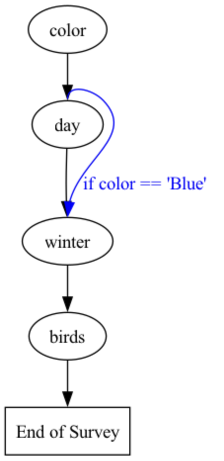

.. _surveys:

Surveys
=======

A `Survey` is collection of :ref:`questions` that can be administered to one or more :ref:`agents` and :ref:`language_models` at once.
Survey questions can be administered asynchronously (by default), or according to rules such as skip and stop logic, and with or without context of other questions in a survey.

Surveys can be used to collect data, generate content or perform other tasks.
The results of a survey are stored in a `Results` object, which can be used to analyze the responses and other components of the survey.
Learn more about built-in methods for working with `Results` objects in the :ref:`results` section.

Key steps 
---------

The key steps to creating and conducting a survey are:

| 1. Create `Questions` of various types (multiple choice, checkbox, free text, numerical, linear scale, etc.) and combine them in a `Survey` to administer them together. 
| 2. *Optional:* Add rules to skip, stop or administer questions based on conditional logic, or provide context of other questions and answers in the survey.
| 3. *Optional:* Design personas for AI `Agents` to answer the questions.
| 4. Send the survey to language `Models` to generate the responses.
| 5. Analyze the `Results` of the survey as a formatted dataset that includes the responses and other components of the survey. 

Key methods 
-----------

A survey is administered by calling the `run()` method on the `Survey` object, after adding any agents, scenarios and models with the `by()` method, and any rules or memory with the appropriate methods (see detailed examples of each below):

* `add_skip_rule()` - Skip a question based on a conditional expression (e.g., based on a response to another question).
* `add_stop_rule()` - End the survey based on a conditional expression.
* `add_rule()` - Administer a specified question next based on a conditional expression.
* `set_full_memory_mode()` - Include a memory of all prior questions/answers at each new question in the survey.
* `set_lagged_memory()` - Include a memory of a specified number of prior questions/answers at each new question in the survey.
* `add_targeted_memory()` - Include a memory of a particular question/answer at another question in the survey.
* `add_memory_collection()` - Include memories of a set of prior questions/answers at another question in the survey.

Piping
^^^^^^

You can also pipe components of questions into other questions (e.g., use just the response to a question as an input in another question).
(See examples below.)

Flow
^^^^

The `show_flow()` method displays the flow of the survey, showing the order of questions and any rules that have been applied.
(See example below.)

Rules 
^^^^^

The `show_rules()` method displays a table of the conditional rules that have been applied to the survey, and the questions they apply to.
(See example below.)

Prompts
^^^^^^^

The `show_prompts()` method displays the user and system prompts for each question. 
This is a companion method to the `prompts()` method of a `Job` object, which returns a dataset containing the prompts together with information about each question, scenario, agent, model and estimated cost.
(A `Job` is created by adding a `Model` to a `Survey` or `Question`.)
(See example below.)

Constructing a survey
---------------------

In the examples below we construct a simple survey of questions, and then demonstrate how to run it with various rules and memory options, how to add AI agents and language models, and how to analyze the results.

Defining questions
^^^^^^^^^^^^^^^^^^

Questions can be defined as various types, including multiple choice, checkbox, free text, linear scale, numerical and other types.
The formats are defined in the :ref:`questions` module. 
Here we define some questions by importing question types and creating instances of them:

.. code-block:: python

   from edsl import QuestionMultipleChoice, QuestionCheckBox, QuestionLinearScale, QuestionNumerical

   q1 = QuestionMultipleChoice(
      question_name = "consume_local_news",
      question_text = "How often do you consume local news?",
      question_options = ["Daily", "Weekly", "Monthly", "Never"]
   )

   q2 = QuestionCheckBox(
      question_name = "sources",
      question_text = "What are your most common sources of local news? (Select all that apply)",
      question_options = ["Television", "Newspaper", "Online news websites", "Social Media", "Radio", "Other"]
   )

   q3 = QuestionLinearScale(
      question_name = "rate_coverage",
      question_text = "On a scale of 1 to 10, how would you rate the quality of local news coverage in your area?",
      question_options = [1, 2, 3, 4, 5, 6, 7, 8, 9, 10],
      option_labels = {1: "Very poor", 10: "Excellent"}
   )

   q4 = QuestionNumerical(
      question_name = "minutes_reading",
      question_text = "On average, how many minutes do you spend consuming local news each day?",
      min_value = 0, # optional
      max_value = 1440 # optional
   )

Adding questions to a survey
^^^^^^^^^^^^^^^^^^^^^^^^^^^^

Questions are passed to a `Survey` object as a list of question ids:

.. code-block:: python

   from edsl import Survey

   survey = Survey(questions = [q1, q2, q3, q4])

Alternatively, questions can be added to a survey one at a time:

.. code-block:: python

   from edsl import Survey

   survey = Survey().add_question(q1).add_question(q2).add_question(q3).add_question(q4)

Running a survey
----------------

Once constructed, a survey can be administered by calling the `run()` method.

a Survey can be `run`, generating a `Results` object:

.. code-block:: python

   results = survey.run()

If question scenarios, agents or language models have been specified, they are added to the survey with the `by` method when running it.
(If no model is specified, the survey will be run with the default model, which can be inspected by running `Model()`.)

For example, here we run the survey with a simple agent persona and specify that GPT-4o should be used:

.. code-block:: python

   from edsl import Agent, Model 

   agent = Agent(traits = {"persona": "You are a teenager who hates reading."})

   model = Model("gpt-4o")

   results = survey.by(agent).by(model).run()

Note that these survey components can be chained in any order, so long as each type of component is chained at once (e.g., if adding multiple agents, use `by.(agents)` once where agents is a list of all Agent objects).

Survey rules & logic
--------------------

Rules can be applied to a survey with the `add_skip_rule()`, `add_stop_rule()` and `add_rule()` methods, which take a logical expression and the relevant questions.

Skip rules
^^^^^^^^^^

The `add_skip_rule()` method skips a question if a condition is met. 
The (2) required parameters are the question to skip and the condition to evaluate.

Here we use `add_skip_rule()` to skip q2 if the response to "consume_local_news" is "Never".
Note that we can refer to the question to be skipped using either the id ("q2") or question_name ("consume_local_news"):

.. code-block:: python

   from edsl import Survey 

   survey = Survey(questions = [q1, q2, q3, q4])
   survey = survey.add_skip_rule(q2, "consume_local_news == 'Never'")

This is equivalent:

.. code-block:: python

   from edsl import Survey 

   survey = Survey(questions = [q1, q2, q3, q4])
   survey = survey.add_skip_rule("sources", "consume_local_news == 'Never'")

We can run the survey and verify that the rule was applied:

.. code-block:: python

   from edsl import Agent

   agent = Agent(traits = {"persona": "You are a teenager who hates reading."})

   results = survey.by(agent).run()
   results.select("consume_local_news", "sources", "rate_coverage", "minutes_reading").print(format="rich")

This will print the answers, showing "None" for a skipped question:

.. code-block:: text
    
   ┏━━━━━━━━━━━━━━━━━━━━━┳━━━━━━━━━━┳━━━━━━━━━━━━━━━━┳━━━━━━━━━━━━━━━━━━┓
   ┃ answer              ┃ answer   ┃ answer         ┃ answer           ┃
   ┃ .consume_local_news ┃ .sources ┃ .rate_coverage ┃ .minutes_reading ┃
   ┡━━━━━━━━━━━━━━━━━━━━━╇━━━━━━━━━━╇━━━━━━━━━━━━━━━━╇━━━━━━━━━━━━━━━━━━┩
   │ Never               │ None     │ 5              │ 0                │
   └─────────────────────┴──────────┴────────────────┴──────────────────┘

Show flow
^^^^^^^^^

We can call the `show_flow()` method to display a graphic of the flow of the survey, and verify how the skip rule was applied:

.. code-block:: python

   survey.show_flow()

  

.. raw:: html

    

Stop rules
^^^^^^^^^^

The `add_stop_rule()` method stops the survey if a condition is met.
The (2) required parameters are the question to stop at and the condition to evaluate.

Here we use `add_stop_rule()` to end the survey at q1 if the response is "Never":

.. code-block:: python

   survey = Survey(questions = [q1, q2, q3, q4])
   survey = survey.add_stop_rule(q1, "consume_local_news == 'Never'")

This time we see that the survey ended when the response to "color" was "Blue":

.. code-block:: python
    
   results = survey.by(agent).run()
   results.select("consume_local_news", "sources", "rate_coverage", "minutes_reading").print(format="rich")

.. code-block:: text
    
   ┏━━━━━━━━━━━━━━━━━━━━━┳━━━━━━━━━━┳━━━━━━━━━━━━━━━━┳━━━━━━━━━━━━━━━━━━┓
   ┃ answer              ┃ answer   ┃ answer         ┃ answer           ┃
   ┃ .consume_local_news ┃ .sources ┃ .rate_coverage ┃ .minutes_reading ┃
   ┡━━━━━━━━━━━━━━━━━━━━━╇━━━━━━━━━━╇━━━━━━━━━━━━━━━━╇━━━━━━━━━━━━━━━━━━┩
   │ Never               │ None     │ None           │ None             │
   └─────────────────────┴──────────┴────────────────┴──────────────────┘

Other rules
^^^^^^^^^^^

The generalizable `add_rule()` method is used to specify the next question to administer based on a condition.
The (3) required parameters are the question to evaluate, the condition to evaluate, and the question to administer next.

Here we use `add_rule()` to specify that if the response to "color" is "Blue" then q4 should be administered next:

.. code-block:: python
   
   survey = Survey(questions = [q1, q2, q3, q4])
   survey = survey.add_rule(q1, "consume_local_news == 'Never'", q4)

We can run the survey and verify that the rule was applied:

.. code-block:: python
    
   results = survey.by(agent).run()
   results.select("consume_local_news", "sources", "rate_coverage", "minutes_reading").print(format="rich")

We can see that both q2 and q3 were skipped but q4 was administered:

.. code-block:: text
    
   ┏━━━━━━━━━━━━━━━━━━━━━┳━━━━━━━━━━┳━━━━━━━━━━━━━━━━┳━━━━━━━━━━━━━━━━━━┓
   ┃ answer              ┃ answer   ┃ answer         ┃ answer           ┃
   ┃ .consume_local_news ┃ .sources ┃ .rate_coverage ┃ .minutes_reading ┃
   ┡━━━━━━━━━━━━━━━━━━━━━╇━━━━━━━━━━╇━━━━━━━━━━━━━━━━╇━━━━━━━━━━━━━━━━━━┩
   │ Never               │ None     │ None           │ 0                │
   └─────────────────────┴──────────┴────────────────┴──────────────────┘

Conditional expressions
^^^^^^^^^^^^^^^^^^^^^^^

The rule expressions themselves (`"consume_local_news == 'Never'"`) are written in Python.
An expression is evaluated to True or False, with the answer substituted into the expression. 
The placeholder for this answer is the name of the question itself. 
In the examples, the answer to q1 is substituted into the expression `"consume_local_news == 'Never'"`, as the name of q1 is "consume_local_news".

Piping 
------

Piping is a method of explicitly referencing components of a question in a later question.
For example, here we use the answer to q0 in the prompt for q1:

.. code-block:: python

   from edsl import QuestionFreeText, QuestionList, Survey, Agent

   q0 = QuestionFreeText(
      question_name = "color",
      question_text = "What is your favorite color?", 
   )

   q1 = QuestionList(
      question_name = "examples",
      question_text = "Name some things that are {{ color.answer }}.", 
   )

   survey = Survey([q0, q1])

   agent = Agent(traits = {"persona": "You are a botanist."})

   results = survey.by(agent).run()

   results.select("color", "examples").print(format="rich")

In this example, q0 will be administered before q1 and the response to q0 is piped into q1.
Output:

.. code-block:: text

   ┏━━━━━━━━━━━━━━━━━━━━━━━━━━━━━━━━━━━━━━━━━━━━━━━━━━━━━━━━━━━┳━━━━━━━━━━━━━━━━━━━━━━━━━━━━━━━━━━━━━━━━━━━━━━━━━━━━━┓
   ┃ answer                                                    ┃ answer                                              ┃
   ┃ .color                                                    ┃ .examples                                           ┃
   ┡━━━━━━━━━━━━━━━━━━━━━━━━━━━━━━━━━━━━━━━━━━━━━━━━━━━━━━━━━━━╇━━━━━━━━━━━━━━━━━━━━━━━━━━━━━━━━━━━━━━━━━━━━━━━━━━━━━┩
   │ As a botanist, I find myself drawn to the vibrant greens  │ ['Leaves', 'Grass', 'Ferns', 'Moss', 'Green algae'] │
   │ of nature. Green is a color that symbolizes growth, life, │                                                     │
   │ and the beauty of plants, which are central to my work    │                                                     │
   │ and passion.                                              │                                                     │
   └───────────────────────────────────────────────────────────┴─────────────────────────────────────────────────────┘

If an answer is a list, we can index the items to use them as inputs.
Here we use an answer in question options:

.. code-block:: python

   from edsl import QuestionList, QuestionFreeText, QuestionMultipleChoice, Survey, Agent

   q_colors = QuestionList(
      question_name = "colors",
      question_text = "What are your 3 favorite colors?", 
      max_list_items = 3
   )

   q_examples = QuestionFreeText(
      question_name = "examples",
      question_text = "Name some things that are {{ colors.answer }}", 
   )

   q_favorite = QuestionMultipleChoice(
      question_name = "favorite",
      question_text = "Which is your #1 favorite color?", 
      question_options = [
         "{{ colors.answer[0] }}",
         "{{ colors.answer[1] }}",
         "{{ colors.answer[2] }}",
      ]
   )

   survey = Survey([q_colors, q_examples, q_favorite])

   agent = Agent(traits = {"persona": "You are a botanist."})

   results = survey.by(agent).run()

   results.select("colors", "examples", "favorite").print(format="rich")

Output:

.. code-block:: text

   ┏━━━━━━━━━━━━━━━━━━━━━━━━━━━━━━┳━━━━━━━━━━━━━━━━━━━━━━━━━━━━━━━━━━━━━━━━━━━━━━━━━━━━━━━━━━━━━━━━━━━━━━┳━━━━━━━━━━━┓
   ┃ answer                       ┃ answer                                                               ┃ answer    ┃
   ┃ .colors                      ┃ .examples                                                            ┃ .favorite ┃
   ┡━━━━━━━━━━━━━━━━━━━━━━━━━━━━━━╇━━━━━━━━━━━━━━━━━━━━━━━━━━━━━━━━━━━━━━━━━━━━━━━━━━━━━━━━━━━━━━━━━━━━━━╇━━━━━━━━━━━┩
   │ ['Green', 'Brown', 'Yellow'] │ Certainly! Here are some things that can be green, brown, or yellow: │ Green     │
   │                              │                                                                      │           │
   │                              │ **Green:**                                                           │           │
   │                              │ 1. Leaves - Many plants have green leaves due to chlorophyll, which  │           │
   │                              │ is essential for photosynthesis.                                     │           │
   │                              │ 2. Grass - Typically green, especially when healthy and              │           │
   │                              │ well-watered.                                                        │           │
   │                              │ 3. Green Apples - Varieties like Granny Smith are known for their    │           │
   │                              │ green color.                                                         │           │
   │                              │                                                                      │           │
   │                              │ **Brown:**                                                           │           │
   │                              │ 1. Tree Bark - The outer layer of trees is often brown, providing    │           │
   │                              │ protection.                                                          │           │
   │                              │ 2. Soil - Many types of soil appear brown, indicating organic        │           │
   │                              │ matter.                                                              │           │
   │                              │ 3. Acorns - These seeds from oak trees are generally brown when      │           │
   │                              │ mature.                                                              │           │
   │                              │                                                                      │           │
   │                              │ **Yellow:**                                                          │           │
   │                              │ 1. Sunflowers - Known for their bright yellow petals.                │           │
   │                              │ 2. Bananas - Yellow when ripe and ready to eat.                      │           │
   │                              │ 3. Daffodils - These flowers are often a vibrant yellow, heralding   │           │
   │                              │ spring.                                                              │           │
   └──────────────────────────────┴──────────────────────────────────────────────────────────────────────┴───────────┘

This can also be done with agent traits. For example:

.. code-block:: python

   from edsl import Agent, QuestionFreeText

   a = Agent(traits = {'first_name': 'John'})

   q = QuestionFreeText(
      question_text = 'What is your last name, {{ agent.first_name }}?', 
      question_name = "last_name"
   )

   job = q.by(a)
   
   job.prompts().select('user_prompt').print(format="rich")

This code will output the text of the prompt for the question:

.. code-block:: text

   What is your last name, John?

We can also show both system and user prompts together with information about the question, agent and model by calling the `show_prompts()` method:

.. code-block:: python

   job.show_prompts()

.. code-block:: text

   ┏━━━━━━━━━━━━━━┳━━━━━━━━━━━━━━┳━━━━━━━━━━━━━━┳━━━━━━━━━━━━━━┳━━━━━━━━━━━━━━━┳━━━━━━━━━━━━━┳━━━━━━━━┳━━━━━━━━━━━━━━┓
   ┃ user_prompt  ┃ system_prom… ┃ interview_i… ┃ question_na… ┃ scenario_ind… ┃ agent_index ┃ model  ┃ estimated_c… ┃
   ┡━━━━━━━━━━━━━━╇━━━━━━━━━━━━━━╇━━━━━━━━━━━━━━╇━━━━━━━━━━━━━━╇━━━━━━━━━━━━━━━╇━━━━━━━━━━━━━╇━━━━━━━━╇━━━━━━━━━━━━━━┩
   │ What is your │ You are      │ 0            │ last_name    │ 0             │ 0           │ gpt-4o │ 0.0005375    │
   │ last name,   │ answering    │              │              │               │             │        │              │
   │ John?        │ questions as │              │              │               │             │        │              │
   │              │ if you were  │              │              │               │             │        │              │
   │              │ a human. Do  │              │              │               │             │        │              │
   │              │ not break    │              │              │               │             │        │              │
   │              │ character.   │              │              │               │             │        │              │
   │              │ You are an   │              │              │               │             │        │              │
   │              │ agent with   │              │              │               │             │        │              │
   │              │ the          │              │              │               │             │        │              │
   │              │ following    │              │              │               │             │        │              │
   │              │ persona:     │              │              │               │             │        │              │
   │              │ {'first_nam… │              │              │               │             │        │              │
   │              │ 'John'}      │              │              │               │             │        │              │
   └──────────────┴──────────────┴──────────────┴──────────────┴───────────────┴─────────────┴────────┴──────────────┘

Question memory
---------------

When an agent is taking a survey, they can be prompted to "remember" answers to previous questions.
This can be done in several ways:

Full memory
^^^^^^^^^^^

The method `set_full_memory_mode()` gives the agent all of the prior questions and answers at each new question in the survey,
i.e., the first question and answer are included in the memory when answering the second question, both the first and second questions and answers are included in the memory when answering the third question, and so on.
The method is called on the survey object:

.. code-block:: python

   survey = Survey(questions = [q1, q2, q3, q4])
   survey = survey.set_full_memory_mode()

In the results, we can inspect the `_user_prompt` for each question to see that the agent was prompted to remember all of the prior questions:

.. code-block:: python

   results = survey.by(agent).run()

   (
      results
      .select("consume_local_news_user_prompt", "sources_user_prompt", "rate_coverage_user_prompt", "minutes_reading_user_prompt")
      .print(format="rich")
   )

This will print the prompt that was used for each question, and we can see that each successive prompt references all prior questions and answers that were given:

.. code-block:: text

   ┏━━━━━━━━━━━━━━━━━━━━━━━━━━━━┳━━━━━━━━━━━━━━━━━━━━━━━━━━━┳━━━━━━━━━━━━━━━━━━━━━━━━━━━━┳━━━━━━━━━━━━━━━━━━━━━━━━━━━┓
   ┃ prompt                     ┃ prompt                    ┃ prompt                     ┃ prompt                    ┃
   ┃ .consume_local_news_user_… ┃ .sources_user_prompt      ┃ .rate_coverage_user_prompt ┃ .minutes_reading_user_pr… ┃
   ┡━━━━━━━━━━━━━━━━━━━━━━━━━━━━╇━━━━━━━━━━━━━━━━━━━━━━━━━━━╇━━━━━━━━━━━━━━━━━━━━━━━━━━━━╇━━━━━━━━━━━━━━━━━━━━━━━━━━━┩
   │                            │ What are your most common │ On a scale of 1 to 10, how │ On average, how many      │
   │ How often do you consume   │ sources of local news?    │ would you rate the quality │ minutes do you spend      │
   │ local news?                │ (Select all that apply)   │ of local news coverage in  │ consuming local news each │
   │                            │                           │ your area?                 │ day?                      │
   │                            │                           │                            │                           │
   │ Daily                      │ 0: Television             │ 1 : Very poor              │     Minimum answer value: │
   │                            │                           │                            │ 0                         │
   │ Weekly                     │ 1: Newspaper              │ 2 :                        │                           │
   │                            │                           │                            │                           │
   │ Monthly                    │ 2: Online news websites   │ 3 :                        │     Maximum answer value: │
   │                            │                           │                            │ 1440                      │
   │ Never                      │ 3: Social Media           │ 4 :                        │ This question requires a  │
   │                            │                           │                            │ numerical response in the │
   │                            │ 4: Radio                  │ 5 :                        │ form of an integer or     │
   │ Only 1 option may be       │                           │                            │ decimal (e.g., -12, 0, 1, │
   │ selected.                  │ 5: Other                  │ 6 :                        │ 2, 3.45, ...).            │
   │                            │                           │                            │ Respond with just your    │
   │ Respond only with a string │                           │ 7 :                        │ number on a single line.  │
   │ corresponding to one of    │                           │                            │ If your response is       │
   │ the options.               │                           │ 8 :                        │ equivalent to zero,       │
   │                            │                           │                            │ report '0'                │
   │                            │                           │ 9 :                        │                           │
   │ After the answer, you can  │                           │                            │                           │
   │ put a comment explaining   │ Please respond only with  │ 10 : Excellent             │ After the answer, put a   │
   │ why you chose that option  │ a comma-separated list of │                            │ comment explaining your   │
   │ on the next line.          │ the code of the options   │ Only 1 option may be       │ choice on the next line.  │
   │                            │ that apply, with square   │ selected.                  │         Before the        │
   │                            │ brackets. E.g., [0, 1, 3] │                            │ question you are now      │
   │                            │                           │ Respond only with the code │ answering, you already    │
   │                            │                           │ corresponding to one of    │ answered the following    │
   │                            │ After the answer, you can │ the options. E.g., "1" or  │ question(s):              │
   │                            │ put a comment explaining  │ "5" by itself.             │                 Question: │
   │                            │ your choice on the next   │                            │ How often do you consume  │
   │                            │ line.                     │ After the answer, you can  │ local news?               │
   │                            │         Before the        │ put a comment explaining   │         Answer: Weekly    │
   │                            │ question you are now      │ why you chose that option  │                           │
   │                            │ answering, you already    │ on the next line.          │  Prior questions and      │
   │                            │ answered the following    │         Before the         │ answers:   Question: What │
   │                            │ question(s):              │ question you are now       │ are your most common      │
   │                            │                 Question: │ answering, you already     │ sources of local news?    │
   │                            │ How often do you consume  │ answered the following     │ (Select all that apply)   │
   │                            │ local news?               │ question(s):               │         Answer: ['Online  │
   │                            │         Answer: Weekly    │                 Question:  │ news websites', 'Social   │
   │                            │                           │ How often do you consume   │ Media']                   │
   │                            │                           │ local news?                │                           │
   │                            │                           │         Answer: Weekly     │  Prior questions and      │
   │                            │                           │                            │ answers:   Question: On a │
   │                            │                           │  Prior questions and       │ scale of 1 to 10, how     │
   │                            │                           │ answers:   Question: What  │ would you rate the        │
   │                            │                           │ are your most common       │ quality of local news     │
   │                            │                           │ sources of local news?     │ coverage in your area?    │
   │                            │                           │ (Select all that apply)    │         Answer: 6         │
   │                            │                           │         Answer: ['Online   │                           │
   │                            │                           │ news websites', 'Social    │                           │
   │                            │                           │ Media']                    │                           │
   └────────────────────────────┴───────────────────────────┴────────────────────────────┴───────────────────────────┘

Note that this is slow and token-intensive, as the questions must be answered serially and requires the agent to remember all of the answers to the questions in the survey.
In contrast, if the agent does not need to remember all of the answers to the questions in the survey, execution can proceed in parallel.
    

Lagged memory
^^^^^^^^^^^^^

The method `set_lagged_memory()` gives the agent a specified number of prior questions and answers at each new question in the survey;
we pass it the number of prior questions and answers to remember.
Here we use it to give the agent just 1 prior question/answer at each question:

.. code-block:: python

   survey = Survey(questions = [q1, q2, q3, q4])
   survey = survey.set_lagged_memory(1)

We can inspect each `_user_prompt` again and see that the agent is only prompted to remember the last prior question/answer:

.. code-block:: python

   results = survey.by(agent).run()

   (
      results
      .select("consume_local_news_user_prompt", "sources_user_prompt", "rate_coverage_user_prompt", "minutes_reading_user_prompt")
      .print(format="rich")
   )

This will print the prompts for each question:

.. code-block:: text

   ┏━━━━━━━━━━━━━━━━━━━━━━━━━━━━┳━━━━━━━━━━━━━━━━━━━━━━━━━━━┳━━━━━━━━━━━━━━━━━━━━━━━━━━━━┳━━━━━━━━━━━━━━━━━━━━━━━━━━━┓
   ┃ prompt                     ┃ prompt                    ┃ prompt                     ┃ prompt                    ┃
   ┃ .consume_local_news_user_… ┃ .sources_user_prompt      ┃ .rate_coverage_user_prompt ┃ .minutes_reading_user_pr… ┃
   ┡━━━━━━━━━━━━━━━━━━━━━━━━━━━━╇━━━━━━━━━━━━━━━━━━━━━━━━━━━╇━━━━━━━━━━━━━━━━━━━━━━━━━━━━╇━━━━━━━━━━━━━━━━━━━━━━━━━━━┩
   │                            │ What are your most common │ On a scale of 1 to 10, how │ On average, how many      │
   │ How often do you consume   │ sources of local news?    │ would you rate the quality │ minutes do you spend      │
   │ local news?                │ (Select all that apply)   │ of local news coverage in  │ consuming local news each │
   │                            │                           │ your area?                 │ day?                      │
   │                            │                           │                            │                           │
   │ Daily                      │ 0: Television             │ 1 : Very poor              │     Minimum answer value: │
   │                            │                           │                            │ 0                         │
   │ Weekly                     │ 1: Newspaper              │ 2 :                        │                           │
   │                            │                           │                            │                           │
   │ Monthly                    │ 2: Online news websites   │ 3 :                        │     Maximum answer value: │
   │                            │                           │                            │ 1440                      │
   │ Never                      │ 3: Social Media           │ 4 :                        │ This question requires a  │
   │                            │                           │                            │ numerical response in the │
   │                            │ 4: Radio                  │ 5 :                        │ form of an integer or     │
   │ Only 1 option may be       │                           │                            │ decimal (e.g., -12, 0, 1, │
   │ selected.                  │ 5: Other                  │ 6 :                        │ 2, 3.45, ...).            │
   │                            │                           │                            │ Respond with just your    │
   │ Respond only with a string │                           │ 7 :                        │ number on a single line.  │
   │ corresponding to one of    │                           │                            │ If your response is       │
   │ the options.               │                           │ 8 :                        │ equivalent to zero,       │
   │                            │                           │                            │ report '0'                │
   │                            │                           │ 9 :                        │                           │
   │ After the answer, you can  │                           │                            │                           │
   │ put a comment explaining   │ Please respond only with  │ 10 : Excellent             │ After the answer, put a   │
   │ why you chose that option  │ a comma-separated list of │                            │ comment explaining your   │
   │ on the next line.          │ the code of the options   │ Only 1 option may be       │ choice on the next line.  │
   │                            │ that apply, with square   │ selected.                  │         Before the        │
   │                            │ brackets. E.g., [0, 1, 3] │                            │ question you are now      │
   │                            │                           │ Respond only with the code │ answering, you already    │
   │                            │                           │ corresponding to one of    │ answered the following    │
   │                            │ After the answer, you can │ the options. E.g., "1" or  │ question(s):              │
   │                            │ put a comment explaining  │ "5" by itself.             │                 Question: │
   │                            │ your choice on the next   │                            │ On a scale of 1 to 10,    │
   │                            │ line.                     │ After the answer, you can  │ how would you rate the    │
   │                            │         Before the        │ put a comment explaining   │ quality of local news     │
   │                            │ question you are now      │ why you chose that option  │ coverage in your area?    │
   │                            │ answering, you already    │ on the next line.          │         Answer: 6         │
   │                            │ answered the following    │         Before the         │                           │
   │                            │ question(s):              │ question you are now       │                           │
   │                            │                 Question: │ answering, you already     │                           │
   │                            │ How often do you consume  │ answered the following     │                           │
   │                            │ local news?               │ question(s):               │                           │
   │                            │         Answer: Weekly    │                 Question:  │                           │
   │                            │                           │ What are your most common  │                           │
   │                            │                           │ sources of local news?     │                           │
   │                            │                           │ (Select all that apply)    │                           │
   │                            │                           │         Answer: ['Online   │                           │
   │                            │                           │ news websites', 'Social    │                           │
   │                            │                           │ Media']                    │                           │
   └────────────────────────────┴───────────────────────────┴────────────────────────────┴───────────────────────────┘

Targeted memory 
^^^^^^^^^^^^^^^

The method `add_targeted_memory()` gives the agent a targeted prior question and answer when answering another specified question.
We pass it the question to answer and the prior question/answer to remember when answering it.
Here we use it to give the agent the question/answer to q1 when prompting it to answer q4:

.. code-block:: python

   survey = Survey(questions = [q1, q2, q3, q4])
   survey = survey.add_targeted_memory(q4, q1)

   results = survey.by(agent).run()

   (
      results
      .select("consume_local_news_user_prompt", "sources_user_prompt", "rate_coverage_user_prompt", "minutes_reading_user_prompt")
      .print(format="rich")
   )

.. code-block:: text

   ┏━━━━━━━━━━━━━━━━━━━━━━━━━━━━┳━━━━━━━━━━━━━━━━━━━━━━━━━━━┳━━━━━━━━━━━━━━━━━━━━━━━━━━━━┳━━━━━━━━━━━━━━━━━━━━━━━━━━━┓
   ┃ prompt                     ┃ prompt                    ┃ prompt                     ┃ prompt                    ┃
   ┃ .consume_local_news_user_… ┃ .sources_user_prompt      ┃ .rate_coverage_user_prompt ┃ .minutes_reading_user_pr… ┃
   ┡━━━━━━━━━━━━━━━━━━━━━━━━━━━━╇━━━━━━━━━━━━━━━━━━━━━━━━━━━╇━━━━━━━━━━━━━━━━━━━━━━━━━━━━╇━━━━━━━━━━━━━━━━━━━━━━━━━━━┩
   │                            │ What are your most common │ On a scale of 1 to 10, how │ On average, how many      │
   │ How often do you consume   │ sources of local news?    │ would you rate the quality │ minutes do you spend      │
   │ local news?                │ (Select all that apply)   │ of local news coverage in  │ consuming local news each │
   │                            │                           │ your area?                 │ day?                      │
   │                            │                           │                            │                           │
   │ Daily                      │ 0: Television             │ 1 : Very poor              │     Minimum answer value: │
   │                            │                           │                            │ 0                         │
   │ Weekly                     │ 1: Newspaper              │ 2 :                        │                           │
   │                            │                           │                            │                           │
   │ Monthly                    │ 2: Online news websites   │ 3 :                        │     Maximum answer value: │
   │                            │                           │                            │ 1440                      │
   │ Never                      │ 3: Social Media           │ 4 :                        │ This question requires a  │
   │                            │                           │                            │ numerical response in the │
   │                            │ 4: Radio                  │ 5 :                        │ form of an integer or     │
   │ Only 1 option may be       │                           │                            │ decimal (e.g., -12, 0, 1, │
   │ selected.                  │ 5: Other                  │ 6 :                        │ 2, 3.45, ...).            │
   │                            │                           │                            │ Respond with just your    │
   │ Respond only with a string │                           │ 7 :                        │ number on a single line.  │
   │ corresponding to one of    │                           │                            │ If your response is       │
   │ the options.               │                           │ 8 :                        │ equivalent to zero,       │
   │                            │                           │                            │ report '0'                │
   │                            │                           │ 9 :                        │                           │
   │ After the answer, you can  │                           │                            │                           │
   │ put a comment explaining   │ Please respond only with  │ 10 : Excellent             │ After the answer, put a   │
   │ why you chose that option  │ a comma-separated list of │                            │ comment explaining your   │
   │ on the next line.          │ the code of the options   │ Only 1 option may be       │ choice on the next line.  │
   │                            │ that apply, with square   │ selected.                  │         Before the        │
   │                            │ brackets. E.g., [0, 1, 3] │                            │ question you are now      │
   │                            │                           │ Respond only with the code │ answering, you already    │
   │                            │                           │ corresponding to one of    │ answered the following    │
   │                            │ After the answer, you can │ the options. E.g., "1" or  │ question(s):              │
   │                            │ put a comment explaining  │ "5" by itself.             │                 Question: │
   │                            │ your choice on the next   │                            │ How often do you consume  │
   │                            │ line.                     │ After the answer, you can  │ local news?               │
   │                            │                           │ put a comment explaining   │         Answer: Weekly    │
   │                            │                           │ why you chose that option  │                           │
   │                            │                           │ on the next line.          │                           │
   └────────────────────────────┴───────────────────────────┴────────────────────────────┴───────────────────────────┘

Memory collection 
^^^^^^^^^^^^^^^^^

The `add_memory_collection()` method is used to add sets of prior questions and answers to a given question.
We pass it the question to be answered and the list of questions/answers to be remembered when answering it.
For example, we can add the questions/answers for both q1 and q2 when prompting the agent to answer q4:

.. code-block:: python

   survey = Survey(questions = [q1, q2, q3, q4])
   survey = survey.add_memory_collection(q4, [q1, q2])

   results = survey.by(agent).run()

   (
      results
      .select("consume_local_news_user_prompt", "sources_user_prompt", "rate_coverage_user_prompt", "minutes_reading_user_prompt")
      .print(format="rich")
   )

.. code-block:: text

   ┏━━━━━━━━━━━━━━━━━━━━━━━━━━━━┳━━━━━━━━━━━━━━━━━━━━━━━━━━━┳━━━━━━━━━━━━━━━━━━━━━━━━━━━━┳━━━━━━━━━━━━━━━━━━━━━━━━━━━┓
   ┃ prompt                     ┃ prompt                    ┃ prompt                     ┃ prompt                    ┃
   ┃ .consume_local_news_user_… ┃ .sources_user_prompt      ┃ .rate_coverage_user_prompt ┃ .minutes_reading_user_pr… ┃
   ┡━━━━━━━━━━━━━━━━━━━━━━━━━━━━╇━━━━━━━━━━━━━━━━━━━━━━━━━━━╇━━━━━━━━━━━━━━━━━━━━━━━━━━━━╇━━━━━━━━━━━━━━━━━━━━━━━━━━━┩
   │                            │ What are your most common │ On a scale of 1 to 10, how │ On average, how many      │
   │ How often do you consume   │ sources of local news?    │ would you rate the quality │ minutes do you spend      │
   │ local news?                │ (Select all that apply)   │ of local news coverage in  │ consuming local news each │
   │                            │                           │ your area?                 │ day?                      │
   │                            │                           │                            │                           │
   │ Daily                      │ 0: Television             │ 1 : Very poor              │     Minimum answer value: │
   │                            │                           │                            │ 0                         │
   │ Weekly                     │ 1: Newspaper              │ 2 :                        │                           │
   │                            │                           │                            │                           │
   │ Monthly                    │ 2: Online news websites   │ 3 :                        │     Maximum answer value: │
   │                            │                           │                            │ 1440                      │
   │ Never                      │ 3: Social Media           │ 4 :                        │ This question requires a  │
   │                            │                           │                            │ numerical response in the │
   │                            │ 4: Radio                  │ 5 :                        │ form of an integer or     │
   │ Only 1 option may be       │                           │                            │ decimal (e.g., -12, 0, 1, │
   │ selected.                  │ 5: Other                  │ 6 :                        │ 2, 3.45, ...).            │
   │                            │                           │                            │ Respond with just your    │
   │ Respond only with a string │                           │ 7 :                        │ number on a single line.  │
   │ corresponding to one of    │                           │                            │ If your response is       │
   │ the options.               │                           │ 8 :                        │ equivalent to zero,       │
   │                            │                           │                            │ report '0'                │
   │                            │                           │ 9 :                        │                           │
   │ After the answer, you can  │                           │                            │                           │
   │ put a comment explaining   │ Please respond only with  │ 10 : Excellent             │ After the answer, put a   │
   │ why you chose that option  │ a comma-separated list of │                            │ comment explaining your   │
   │ on the next line.          │ the code of the options   │ Only 1 option may be       │ choice on the next line.  │
   │                            │ that apply, with square   │ selected.                  │         Before the        │
   │                            │ brackets. E.g., [0, 1, 3] │                            │ question you are now      │
   │                            │                           │ Respond only with the code │ answering, you already    │
   │                            │                           │ corresponding to one of    │ answered the following    │
   │                            │ After the answer, you can │ the options. E.g., "1" or  │ question(s):              │
   │                            │ put a comment explaining  │ "5" by itself.             │                 Question: │
   │                            │ your choice on the next   │                            │ How often do you consume  │
   │                            │ line.                     │ After the answer, you can  │ local news?               │
   │                            │                           │ put a comment explaining   │         Answer: Weekly    │
   │                            │                           │ why you chose that option  │                           │
   │                            │                           │ on the next line.          │  Prior questions and      │
   │                            │                           │                            │ answers:   Question: What │
   │                            │                           │                            │ are your most common      │
   │                            │                           │                            │ sources of local news?    │
   │                            │                           │                            │ (Select all that apply)   │
   │                            │                           │                            │         Answer: ['Online  │
   │                            │                           │                            │ news websites', 'Social   │
   │                            │                           │                            │ Media']                   │
   └────────────────────────────┴───────────────────────────┴────────────────────────────┴───────────────────────────┘
    

Survey class
------------

.. automodule:: edsl.surveys.Survey
   :members: 
   :undoc-members:
   :show-inheritance:
   :special-members: __init__
   :exclude-members:
