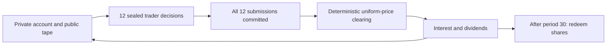

# Building Traders: asset markets in EDSL

This example reconstructs the asset-market design in **Ngo, Chen, Manning,
Avery, and Camerer, “Building Traders: Persona Construction for LLM Agents in
Experimental Asset Markets”**, slides dated September 18, 2026. The supplied
`140926.pdf` has 40 pages; its checksum and page references are in `source.json`.

The experiment runs through this branch's `edsl.workflows` and
`edsl.sharedstate` APIs. It is a **design reconstruction**, not a claim to
reproduce the paper's numerical findings. It substitutes the selected model,
reconstructs unspecified exchange rules, and runs a bounded pilot by default.

## Native workflow version

For new experiments, start with [typed_market_experiment.py](typed_market_experiment.py)
and the [typed configuration guide](TYPED_MARKET.md). Validated economic rules
generate settlement parameters, trader instructions, and fundamental-value
benchmarks. Population and model choices are separate treatment settings.

The earlier [`portable.py`](portable.py) preserves the self-contained pilot experiment:
full prompts, native `call_market` settlement, workflow pause rules, and a
serializable `WorkflowExperiment`. The [guide](PORTABLE_EXPERIMENT.md) explains
building, replaying, and running it. The updated [LaTeX note](latex-note/note.pdf)
walks through the code in its appendix. The rewrite reproduces the archived
17-round GPT-5 mini market from saved answers; the original executed files remain
unchanged.

## Full 30-round native market

### V3: another fresh run

The [new LaTeX report](v3-note/report.pdf) visualizes all decisions and fills,
compares the three full sessions, and prints the complete experiment and core
implementation with new or modified lines highlighted in green. The
[source and data bundle](v3-note/v3-report.zip) includes the report, code diffs,
figures, archived results, and recovery records.

The [v3 comparison report](runs/gpt5-v3-30-typed/report/comparison.html) shows
sustained overpricing: transactions rose from $22 in round 5 to $29.50 in
round 25, then one share traded at $23.75 in round 29. Total turnover was 107
shares over 17 trading rounds. The same settings and seeds were used as v2,
with fresh GPT-5 mini responses. The final accounting and prompt audit passed.
One null result in the final round required a single-trader retry; the other
359 decisions were preserved. The [recovery record](runs/gpt5-v3-30-typed/recovery.json)
documents backups, checks, and the null-result guard added to the executor.
Recorded model cost was $1.29; the failed result returned no usage data.

### V2: fresh run with typed configuration

The [v2 comparison report](runs/gpt5-v2-30-typed/report/comparison.html) compares
the new typed-configured run with the original. It completed 360 fresh GPT-5 mini
decisions in 30 paired EDSL jobs, with no failed attempts. It traded 69 shares
over 19 rounds. One share traded at $26 in round 3; subsequent transactions
stayed between $14.75 and $15, without the original run's sustained price rise.
All 48 shares were redeemed at $14. Recorded cost was $1.20; model jobs averaged
31 seconds per round, and the full run took 17.2 minutes including workflow work.
The [full trading ledger and audit](runs/gpt5-v2-30-typed/report/index.html)
preserve all decisions and rationales. Rules, agents, model settings, question
templates, and realized dividends match the original; responses are fresh.

### Original full run

The [completed market report](runs/gpt5-full-30-native/report/index.html) covers
360 fresh GPT-5 mini decisions and all 30 settlements. Trading reached $31
against $14 fundamental value, with 114 shares traded; all 48 outstanding
shares were redeemed after round 30. The accounting and prompt audit passed.
Recorded model cost was $1.26.

The [LaTeX report](full-market-note/report.pdf) presents the results in six
pages, followed by the complete EDSL experiment, workflow executor, and market
settlement code. The [source and data bundle](full-market-note/full-market-report.zip)
includes every decision, plotting inputs, and replay instructions. The
[standalone experiment](full_market_experiment.py) contains all prompts inline;
its saved-answer replay reproduces the entire archived final market state.

After 140 serial decisions, execution resumed with paired agent/scenario jobs
using `zip_assign()` from PR #2622. Full batched rounds averaged 30.5 seconds.
The transition preserved all accepted answers and the pinned specification;
its provenance is in the run's `batch-runner-transition.json`.

## Completed pilot

The saved [full interactive report](report/index.html) and
[printable PDF](report/full-report.pdf) cover three completed 30-period markets
using `gpt-4o-mini`: **1,080 actual LLM decisions**, with recorded model cost
approximately **$0.87**. Every workflow attempt succeeded.

| Condition | Shares traded | Periods with trades | Observed price range |
|---|---:|---:|---|
| Baseline | 0 | 0 | No transactions |
| BT + OC + PC | 4 | 2 | $14.00–$14.25 |
| Evolved | 0 | 0 | No transactions |

**This pilot did not reproduce bubbles.** The baseline mostly held; the evolved
population submitted buys and holds but no sells. The theory mix had both sides
but very few crossing orders. This is evidence about this model and reconstruction,
not a refutation of the source's results. The exact order counts and forecast
paths are in the report. In particular, the $14 initial reference, reconstructed
theory prompts, common profit instruction, and substituted model are material
choices for subsequent robustness work.

Six example-specific tests and nine existing workflow simulation tests passed.
The independent audit passed for all three LLM sessions and all three scripted
mechanism sessions, checking accounting, collateral, uniform pricing, terminal
redemption, exact settlement counts, private observations, raw persona prompts,
and saved Results row counts. Recovery tests include an interruption after state
commit but before workflow acknowledgement.

## Follow-up prompt experiments

The [all-six archetype follow-up](paper-six-report/index.html) completed three
30-period sessions with the original prompts: 39 shares traded, all at $14.
It changed the population composition, not the wording.

The separate [speculative-v1 design](SPECULATIVE_PROMPTS.md) removes the supplied
fundamental-value answer and opening reference, clarifies monetary units, and
strengthens speculative resale framing. It preserves the original exchange,
endowments, dividends, interest, terminal redemption, and all previous artifacts.
These are newly authored exploratory prompts, not the paper's prompts.
The [complete prompt design](speculative-report/prompt-design.md) and an
[actual trader presentation](speculative-report/trader-example.md) are saved.

The completed [speculative-v1 report](speculative-report/index.html) contains
1,080 decisions and 100 shares traded, at a recorded model cost of $0.72.
The three peak transaction prices were $1.80, $2.60, and $3.35: no bubbles above
the $14 fundamental value. Opening rationales showed valuation and constraint
misunderstandings, including using a one-period dividend as the share-price
quote. All three full execution and prompt audits passed; all 1,170 workflow
attempts succeeded. The three intervention-specific tests also passed.

```bash
python -m examples.asset_market.run_speculative --backend llm --workers 3 \
  --output examples/asset_market/runs/speculative-v1
python -m examples.asset_market.speculative_report
```

New configurations separately fingerprint `speculative_prompts.py` and
`run_speculative.py`, as well as the original implementation. The report audit
checks every rendered question against the actual saved state and verifies
the new system instruction. Preserve these files when resuming a saved run.

## Model comprehension diagnostic

The [saved-state diagnostic report](comprehension-report/index.html) compares
GPT-4o-mini and GPT-5 mini on four selected situations, with three responses per
model and separate trade-replay and explicit-comprehension tasks. All 48 calls
completed; all replay prompts matched the actual original prompts exactly.
Recorded total cost was approximately $0.14.

GPT-4o-mini answered 128/156 factual items correctly; GPT-5 mini answered
155/156. In the unanchored opening Rational Arbitrageur replays, the former bid
$0.70 in all three repeats, while the latter derived $14 and held. In the
zero-inventory case, GPT-4o-mini attempted to sell ten shares in every replay;
GPT-5 mini respected the constraint. Both correctly answered the explicit
inventory questions. The prior ten-share buy had filled zero, indicating a
failure to distinguish intended orders from executed holdings during trading.

These are selected diagnostic cases and different supported model settings,
not a broad benchmark. GPT-5 mini still made one small valuation arithmetic
error and sometimes invented a previously stated precommitment schedule.
The [design and answer-key rules](COMPREHENSION_CHECK.md), durable Jobs/Results,
full prompts, explanations, and per-item scores are preserved. No market state
was changed by this diagnostic.

## GPT-5 mini short market pilot

The market now also has a [portable serialized specification](portable/experiment.json)
using standard EDSL call-market operations and workflow pause rules. See the
[portability guide](PORTABLE_EXPERIMENT.md) for replay commands and the
fresh-process comparison against all 204 archived decisions.

The [LaTeX note and detailed code appendix](latex-note/note.pdf) give a short
account of this run with trading figures, full speculative prompts, and
line-numbered EDSL code. The [source](latex-note/note.tex) and
[build instructions](latex-note/README.md) are included.

The [short pilot report](gpt5-pilot-report/index.html) observes the unchanged
speculative-v1 market with GPT-5 mini. The economic horizon remains 30 periods.
The initial observation paused after 12 rounds with no trades. Under the
documented conditional extension, it resumed to reach the first planned sales
at round 16, then stopped after two consecutive prices above $17.50:

| Round | Actual clearing price | Shares traded |
|---|---:|---:|
| 1–15 | No transactions | 0 |
| 16 | $17.53 | 2 |
| 17 | $17.67 | 19 |

This is early above-fundamental trading in one exploratory market, with only
two observed transaction-price rounds. The 204 model responses and 17 atomic
settlements passed the prefix audit, including no early redemption and exact
private-state/prompt checks. Recorded cost: about $0.57. The round-12 checkpoint
is retained, and all current holdings remain live at the round-17 pause.

The resumed runner hit an EDSL Results-package immutability error during the
final export, after the market had already paused successfully. The 204 saved
raw responses were archived with `allow_new_commit=True`, preserving the earlier
12-round Results commit; CSV exports were refreshed. Recovery made no model
calls or market commands. The recovery record is saved with the run. The runner
source used for execution remains frozen for the audit; subsequent resumed
exports likewise need the `allow_new_commit=True` save option.

## What comes from the PDF

| Feature | Implementation | PDF page |
|---|---|---|
| Market population | 12 traders | 6, 36–38 |
| Horizon | 30 periods by default | 10 |
| Endowments | $100 cash and 4 shares each | 10 |
| Interest | 5% each period | 10 |
| Dividends | $0.40 or $1.00 with equal probability | 10 |
| Terminal value | Redeem shares for $14, retain cash | 10 |
| Fundamental value | $14 throughout | 10 |
| Trading | Call auction with one price for every fill | 11 |
| Observations | Own persona, cash, shares, past prices, periods remaining | 11 |
| Elicitation | Forecasts at 0, +2, +5, +10; side, price, quantity | 11, 36–38 |
| Theory design | All 63 nonempty subsets of RA/MC/BT/PC/NT/OC | 14, 32 |
| Highlighted theory mix | BT + OC + PC | 16, 25 |
| Evolved population | 7 Trend Readers, 3 Noise, 2 Reversion Riders | 36–38 |
| Evolved prompts | Extracted verbatim into `personas/*.txt` | 36–38 |

The six theory prompts are **new reconstructions from the brief descriptions
on page 14**, not the unavailable original prompts. The evolved texts are
already the outputs of the authors' search. The human microdata, regression
implementation, optimizer prompts, and search trajectories are unavailable in
the supplied slides, so this example does not re-fit or re-evolve those texts.

## Explicit reconstruction choices

* One sealed buy/sell order per trader per period, with an optional hold.
  No borrowing or short selling. Quantities are capped at affordable cash at
  the limit price or available shares. Buy orders cannot exceed the market's
  48 outstanding shares. Both submitted and admitted quantities are saved.
* Maximize crossing volume by sorting unit bids high-to-low and asks low-to-high.
  The single price is the midpoint of the last matched bid and ask, rounded
  half up to cents. Price priority and a seeded period-specific lottery allocate
  scarce fills. Completion order cannot influence the clearing result.
* Unmatched orders expire each period. Invalid orders are recorded and receive
  zero fills; they do not silently become another valid order. Malformed
  forecasts fail validation. There is no scripted fallback for LLM failures.
* The initial reference quote is $14. This is an anchor, **not an observed
  transaction**. No-trade periods have `price: null`; the last observed price
  remains available as a reference. Charts leave no-trade gaps rather than
  invent transactions. This initialization can materially affect price paths.
* All holders receive the same independently seeded dividend draw each period.
  Post-trade cash earns interest first, rounded per account to cents; dividends
  are then paid on post-trade holdings. Final redemption follows final income.
  These ordering/rounding details are not specified in the slides.
* Each trader sees its own full decision/fill history, including its earlier
  rationale, so precommitments and purchase-price memories can persist.
  No trader sees another trader's forecasts, holdings, persona, or open orders.
* Forecast horizons past the market end are reported as $14 redemption values.
  They are excluded from forecast-accuracy comparisons in the report.
* Theory types are allocated as equally as possible, with remainders assigned
  in the specified composition order. Seeded seat shuffling removes fixed seat
  positions. The chosen three-type condition has exactly four of each type.
* Pilot model: `gpt-4o-mini`, temperature 0.7, maximum 650 output tokens per
  decision. One joint structured response collects forecasts and the order.
  The PDF shows a different model; behavior may depend strongly on the model,
  wording, reference quote, and mechanism assumptions.

## Architecture



`build_experiment()` authors a serializable `HumanWorkflow` with two steps per
period. Order steps fan out to the trader role; the exchange step waits for all
12 completions. The following period depends on the completed exchange step.
Participant answers are visible only to the exchange; private memories are
projected from shared state for their owner.

`SharedStateMap` holds one scoped `AssetCallMarket` machine. Its view exposes
only the public tape and the current trader's account. Submit does not change
any other trader's observation. Two versioned runtime algorithms perform order
admission and atomic clearing/accounting inside `SQLiteStateBackend`
transactions. This uses the branch's extension mechanism without adding an
example-specific algorithm to EDSL's default runtime.

`WorkflowSimulation` delivers work. `ExecutionPlan` routes traders to
`EDSLAgentAnswerer` and the exchange to a deterministic script. The scripted
backend is only a plumbing check; its prices are not evidence about LLM behavior.

Both SQLite databases are durable. On resume, the coordinator restores the
pinned serialized workflow, completes accepted pending effects without another
model call, and retries eligible failed work. Operation IDs make effect replay
idempotent. Configuration and code/persona hashes must match. The default retry
budget is three workflow attempts; underlying model transport may also retry.

## Run from the repository root

Use the Python interpreter containing the checked-out EDSL. In this workspace,
`python -m pytest` uses that interpreter; the standalone `pytest` executable can
point to an older installation.

```bash
# No model calls: all three conditions, full horizon, scripted accounting check.
python -m examples.asset_market.run --backend scripted \
  --output examples/asset_market/runs/mechanism-check

# Actual LLM pilot: one market per condition (1,080 trader decisions).
# EDSL executes locally and calls the configured hosted model directly.
python -m examples.asset_market.run --backend llm --workers 3 \
  --output examples/asset_market/runs/gpt-4o-mini-pilot

# On-device alternative: use an already running OpenAI-compatible model server.
python -m examples.asset_market.run --backend llm \
  --service openai_compatible --model YOUR_INSTALLED_MODEL \
  --base-url http://127.0.0.1:11434/v1 \
  --output examples/asset_market/runs/on-device

# Resume using exactly the original options and output directory.
python -m examples.asset_market.run --backend llm --workers 3 --resume \
  --output examples/asset_market/runs/gpt-4o-mini-pilot

# Inspect the complete theory grid without making calls: 315 markets,
# 113,400 trader decisions. Omit --plan-only to actually execute it.
python -m examples.asset_market.run --backend llm --all-compositions \
  --replicates 5 --plan-only --output examples/asset_market/runs/theory-grid

# Five replications of the three main conditions: 5,400 decisions.
python -m examples.asset_market.run --backend llm --replicates 5 --workers 3 \
  --output examples/asset_market/runs/main-replications

python -m examples.asset_market.full_report \
  --runs examples/asset_market/runs/gpt-4o-mini-pilot \
  --output examples/asset_market/report

python -m examples.asset_market.print_report examples/asset_market/report/index.html

python -m examples.asset_market.audit \
  --runs examples/asset_market/runs/gpt-4o-mini-pilot \
  --output examples/asset_market/runs/gpt-4o-mini-pilot/audit.json

python -m pytest -q tests/workflows/test_asset_market.py
```

The normal runner does not enable Expected Parrot remote inference or remote
caching. A local server is optional. `.env` is loaded for configured provider
credentials; credentials are never stored in the experiment configuration.
No workflow is delivered to humans or published to a remote service.
The large `runs/` archives stay on disk and are excluded from Git. Transfer them
separately when sharing the results; the source code, persona texts, source
checksum, and portable theory-grid plan are versionable.

## Artifacts and interpretation

Each session saves:

* `workflow.json`, `execution-plan.json`, and `shared-state-definition.json`;
* `traders.ep`, including the actual persona instructions;
* `workflow.sqlite`, `shared-state.sqlite`, and `workflow-events.json`;
* `model-calls.jsonl`, with raw EDSL Results, prompts, response usage, observed
  state versions, participant IDs, work-item IDs, and elapsed times;
* `results.ep`, with accepted completed trader responses, queryable using
  `ep results columns --file ...` and `ep results select --file ...`;
* `orders.json`, `decisions.csv`, `periods.csv`, and `summary.json`.

`results.ep` carries the first-period survey as the common answer schema.
Per-call actual prompts and period-specific text are in each Result and the
JSONL audit. The workflow, not running that representative survey alone,
recreates the experiment.

The report includes transaction prices, volume, forecasts, terminal wealth,
and per-session peak timing and relative deviations. RAD is mean
`abs(price - 14) / 14`, RD is mean `(price - 14) / 14`, **over traded periods
only**; the report lists no-trade counts. Peak period is the earliest maximum
among observed trades. A flat price series can therefore have an early peak
statistic without a bubble. The auxiliary `above_1_25F` flag follows the threshold
used in the appendix on page 31; post-peak drawdown is reported continuously.
The slides do not give a quantitative crash definition, so we do not invent a
binary replication-success criterion.

The source reports mean peak fractions 0.628 for its same-market human benchmark,
0.627 for its highlighted theory mix, and 0.633 for evolved personas (page 25).
Those are external summary benchmarks, not observations collected here. A
single market per condition does not identify treatment effects or support a
statistical claim of replication. The full grid and additional independent
market replications are explicit opt-in runs.
