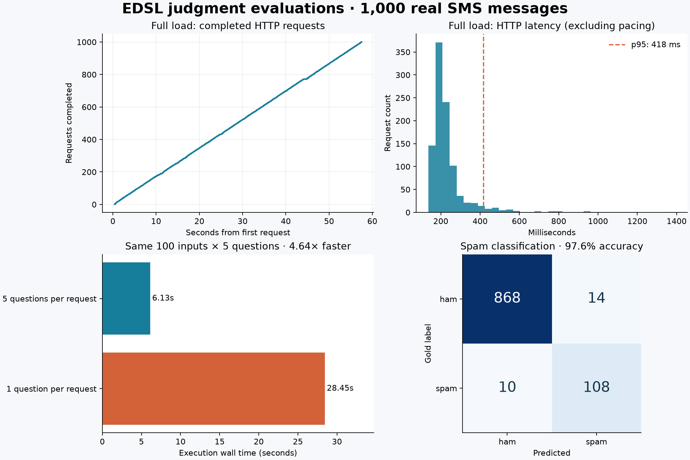

# Judgment evaluation load benchmark

**1,000 real inputs × 5 judgments: 57.52 seconds execution,
60.28 seconds including workload construction and compilation.**
The full load returned 5,000 judgments in 1,000 HTTP attempts.



## Measurements

| Run | Inputs | HTTP attempts | Compile (s) | Execute (s) | Build + compile + execute (s) | Input tokens | Estimated cost |
| --- | ---: | ---: | ---: | ---: | ---: | ---: | ---: |
| batched_1000 | 1000 | 1000 | 2.752 | 57.524 | 60.277 | 745,363 | $0.03131 |
| matched_batched | 100 | 100 | 0.279 | 6.126 | 6.411 | 74,578 | $0.00313 |
| matched_single | 100 | 500 | 0.304 | 28.454 | 28.758 | 204,490 | $0.00859 |
| cache_replay | 1000 | 0 | 2.829 | 0.132 | 2.962 | 0 | $0.00000 |

Full-load throughput was **17.38 inputs/s** or
**86.92 judgments/s**. HTTP latency was
**206 ms median**,
**418 ms p95**, and
**816 ms p99**.
There were **0 retries** and **0 failed batches**;
HTTP statuses: `{"200": 1000}`.
Saving the main evaluation/results packages took another 0.30 seconds.
File saving and dataset preparation are excluded from the timing table.

On the same 100 messages, batching was **4.64× faster** and used
**63.5% fewer input tokens** than sending one question per request.
Answer agreement by question: `{"spam": 1.0, "urgent": 1.0, "commercial": 1.0, "intent": 0.99, "pressure": 1.0}`.
Maximum probability difference: 0.13.
The persisted-cache replay made **0 HTTP requests**.

## Task and quality

The dataset is the [UCI SMS Spam Collection](https://archive.ics.uci.edu/dataset/228/sms%2Bspam%2Bcollection),
by Almeida and Hidalgo (2011), [DOI 10.24432/C5CC84](https://doi.org/10.24432/C5CC84), licensed CC BY 4.0.
We sampled 1,000 messages without replacement after exact-text deduplication, using seed 20260918.
The sample contains 882 ham and 118 spam messages. Only message text and its source-row ID
were sent to the model; labels were held separately. Questions cover spam classification,
urgency, commercial content, intent, and pressure (a three-level descriptive rubric).

Only spam classification has a gold label. Accuracy was **97.6%**, versus
an **88.2%** majority-class baseline. Spam precision was
**88.5%**, recall **91.5%**, and binary Brier
score **0.0181**. There were 14 false positives and
10 missed spam messages. Misclassified source IDs and probabilities are
in `batched_1000/metrics.json`. The other four judgments are workload and consistency
checks, not validated accuracy measurements. This is an old public dataset and is not
a contamination-controlled test of generalization.

## Execution and interpretation

The first comparison was interrupted by transport errors: batched completed 96/100 inputs and single-question completed 69/100. Those timings are not used for the speedup. The matched comparison was repeated with the same dataset, model, prompts, concurrency, and pacing in `run-20260918T131418Z`; the original failures remain in `run-20260918T130250Z`.

- Model: `jev-1.13.0`; provider-reported versions: `['jev-1.13.0']`.
- Concurrency: 8; a shared pacer permits at most 18 request starts/s,
  below TypeSafe's published 1,200 requests/minute limit. Pacing also covers retries.
- The warmup, full load, and two matched runs use independent empty EDSL caches.
  Cache replay reloads the saved full-load cache and checks identical answers.
- Matched runs use identical inputs, instructions, concurrency, and pacing. They are single,
  sequential trials (batched first), not randomized repetitions. Provider-side caching is uncontrolled.
- The measured speedup includes reduced rate-limit pressure. This is sustainable client
  throughput at the chosen cap, not a measurement of maximum server capacity or model compute speed.
- HTTP latency excludes client pacing, but includes network time; logical request durations
  including pacing/retries are recorded separately. Instrumentation/checkpoint overhead is included.
- Price estimate uses the [published $0.042/million input tokens](https://docs.typesafe.ai/models),
  output free, checked September 18, 2026. Total for the successful benchmark phases:
  **$0.04318**. Including earlier diagnostic runs, the total
  across 4,314 recorded HTTP attempts is approximately
  **$0.09575**. These are estimates, not invoices.

## Integration issues found by the load test

The first five-input warmup exposed independently reported Score/probability values that
failed an overly strict mean-equality check. Two valid HTTP responses differed by 0.01.
The backend now validates score bounds and probability distributions independently,
resolves EDSL answers from the distribution, and preserves the provider score plus
`score_from_distribution` and `score_difference` for audit. A regression test covers the
observed response. Full-load score differences: 230 nonzero;
maximum absolute difference 0.01.

The first full run also found seven batches with probability vectors totaling 0.99.
The TypeSafe adapter now normalizes vectors only when every entry is valid and the
mass discrepancy is at most 0.01. It preserves `reported_probabilities` and explicit
`probability_normalization` metadata. Larger discrepancies still fail validation.
The corrected full run normalized 8 vectors. All 1,000 saved
responses from the first full run also passed offline revalidation after the fix.
Cache replay is now explicitly forbidden from issuing inference calls; the earlier
incomplete-cache check correctly attempted to refill seven missing batches and was
not a pure cache benchmark. Earlier runs remain available in sibling run directories.

## Reproduce

From the repository root, set `TYPESAFE_API_KEY` in your gitignored `.env`, then:

```sh
mkdir -p examples/judgment_load_benchmark
curl -L --fail --silent --show-error 'https://archive.ics.uci.edu/static/public/228/sms%2Bspam%2Bcollection.zip' -o examples/judgment_load_benchmark/source.zip
.venv/bin/python scripts/judgment_load_benchmark.py --execute
.venv/bin/python scripts/render_judgment_benchmark.py <run-directory>
```

Omit `--execute` to prepare the sample without inference. The manifest records the dataset
checksum, source revision, implementation file hashes, runtime, seed, and model. Each phase
contains its Evaluation and Results packages, a separately persisted cache, predictions,
and metrics. `http-responses.jsonl` checkpoints successful raw responses and timings;
`attempts.json` and `calls.json` separate HTTP attempts from logical calls. Credentials and
HTTP headers are never logged.

To repeat only the comparison, add `--comparison-only` to the benchmark command.
Pass `--comparison-run <repeat-directory>` to the report renderer to use it;
the report records both the failed comparison and the repeat explicitly.
